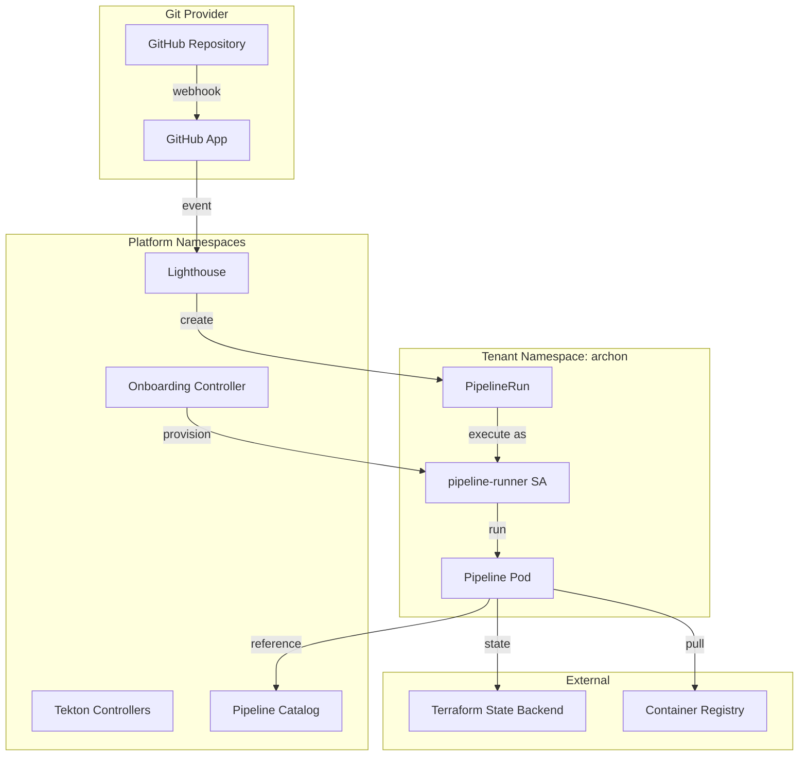
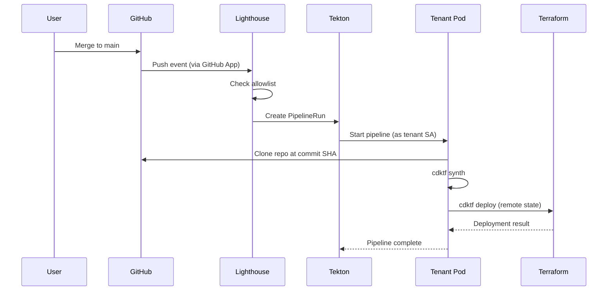

# Architecture

## System Design

The Arbiter Pipeline Infrastructure is a Jenkins X-based CI/CD platform designed for homelab deployment. The system provides shared pipeline infrastructure for multiple product teams with strong tenant isolation through Kubernetes namespaces, RBAC, and network policies.



## Components

### 1. Jenkins X Platform Components

**Namespace**: `pipeline-system`

**Components**:
- **Lighthouse**: Git event handler that receives webhooks and triggers pipelines
- **Tekton Pipelines**: Kubernetes-native pipeline execution engine
- **Tekton Triggers**: Event-driven pipeline triggering (used by Lighthouse)
- **jx-build-controller**: Jenkins X controller for managing builds

**Installation Method**: Helm charts

**Responsibilities**:
- Process GitHub webhooks
- Validate repository allowlist
- Create PipelineRuns in tenant namespaces
- Manage pipeline execution lifecycle

### 2. GitHub App Integration

**Purpose**: Centralized webhook delivery at organization level

**Required Permissions**:
- Repository: Read access to code
- Repository: Read and write access to pull requests
- Repository: Read and write access to checks
- Organization: Read access to members

**Webhook Events**:
- Push
- Pull request
- Check run
- Check suite

**Webhook URL**: `https://<lighthouse-ingress>/hook`

**Configuration**:
```yaml
apiVersion: v1
kind: ConfigMap
metadata:
  name: lighthouse-config
  namespace: pipeline-system
data:
  config.yaml: |
    github:
      app_id: "${GITHUB_APP_ID}"
      app_installation_id: "${GITHUB_APP_INSTALLATION_ID}"
```

### 3. Repository Allowlist

**Implementation**: ConfigMap in `pipeline-system` namespace

**Structure**:
```yaml
apiVersion: v1
kind: ConfigMap
metadata:
  name: repo-allowlist
  namespace: pipeline-system
data:
  allowlist.yaml: |
    repos:
      - org: "your-github-org"
        name: "archon-agent"
        tenant: "archon"
      - org: "your-github-org"
        name: "another-repo"
        tenant: "another"
```

**Reload Mechanism**: Lighthouse watches ConfigMap for changes and reloads automatically

### 4. Onboarding Controller

**Purpose**: Reconcile RepoBinding resources and provision tenant infrastructure

**Reconciliation Logic**:
1. Validate request (org allowlist, namespace pattern, permission profile)
2. Create tenant namespace with labels
3. Create tenant service account
4. Create RBAC (Role + RoleBinding)
5. Create ResourceQuota and LimitRange
6. Create NetworkPolicy
7. Create Terraform backend secret references
8. Update repository allowlist ConfigMap
9. Update RepoBinding status

**RBAC for Controller**:
- ClusterRole with permissions to create namespaces, roles, rolebindings
- ServiceAccount in `pipeline-system` namespace
- ClusterRoleBinding associating SA with ClusterRole

**Implementation Language**: Go (using controller-runtime framework)

### 5. RepoBinding Custom Resource Definition

**CRD Definition**:
```yaml
apiVersion: apiextensions.k8s.io/v1
kind: CustomResourceDefinition
metadata:
  name: repobindings.platform.arbiter.io
spec:
  group: platform.arbiter.io
  names:
    kind: RepoBinding
    plural: repobindings
    singular: repobinding
  scope: Namespaced
  versions:
    - name: v1alpha1
      served: true
      storage: true
      schema:
        openAPIV3Schema:
          type: object
          properties:
            spec:
              type: object
              required:
                - repoOrg
                - repoName
                - tenantName
              properties:
                repoOrg:
                  type: string
                  pattern: '^[a-z0-9-]+$'
                repoName:
                  type: string
                  pattern: '^[a-z0-9-]+$'
                tenantName:
                  type: string
                  pattern: '^[a-z0-9-]+$'
                permissionProfile:
                  type: string
                  enum: ["standard", "elevated"]
                  default: "standard"
            status:
              type: object
              properties:
                phase:
                  type: string
                  enum: ["Pending", "Provisioning", "Ready", "Failed"]
                message:
                  type: string
                namespaceCreated:
                  type: boolean
                serviceAccountCreated:
                  type: boolean
                rbacConfigured:
                  type: boolean
                allowlistUpdated:
                  type: boolean
```

### 6. Tenant Namespace Resources

**Namespace Template**:
```yaml
apiVersion: v1
kind: Namespace
metadata:
  name: ${TENANT_NAME}
  labels:
    platform.arbiter.io/tenant: "${TENANT_NAME}"
    platform.arbiter.io/repo: "${REPO_ORG}/${REPO_NAME}"
    platform.arbiter.io/managed-by: "onboarding-controller"
```

**Service Account**:
```yaml
apiVersion: v1
kind: ServiceAccount
metadata:
  name: pipeline-runner
  namespace: ${TENANT_NAME}
```

**Role (Standard Profile)**:
```yaml
apiVersion: rbac.authorization.k8s.io/v1
kind: Role
metadata:
  name: pipeline-runner
  namespace: ${TENANT_NAME}
rules:
  - apiGroups: [""]
    resources: ["pods", "pods/log", "configmaps", "secrets"]
    verbs: ["get", "list", "create", "update", "delete"]
  - apiGroups: ["tekton.dev"]
    resources: ["pipelineruns", "taskruns"]
    verbs: ["get", "list", "create"]
```

**ResourceQuota**:
```yaml
apiVersion: v1
kind: ResourceQuota
metadata:
  name: tenant-quota
  namespace: ${TENANT_NAME}
spec:
  hard:
    requests.cpu: "4"
    requests.memory: "8Gi"
    limits.cpu: "8"
    limits.memory: "16Gi"
    persistentvolumeclaims: "5"
    pods: "20"
```

**NetworkPolicy**:
```yaml
apiVersion: networking.k8s.io/v1
kind: NetworkPolicy
metadata:
  name: tenant-isolation
  namespace: ${TENANT_NAME}
spec:
  podSelector: {}
  policyTypes:
    - Ingress
    - Egress
  ingress:
    - from:
        - podSelector: {}
  egress:
    - to:
        - podSelector: {}
    - to:
        - namespaceSelector:
            matchLabels:
              kubernetes.io/metadata.name: kube-system
      ports:
        - protocol: UDP
          port: 53
    - to:
        - ipBlock:
            cidr: 0.0.0.0/0
```

### 7. Golden Pipeline Catalog

**Namespace**: `pipeline-catalog`

**Shared Tekton Tasks**:
- `git-clone`: Clone repository at specific commit
- `cdktf-synth`: Run cdktf synth
- `cdktf-deploy`: Run cdktf deploy with remote state
- `upload-artifacts`: Upload logs/outputs to external storage

**Shared Tekton Pipeline**:
```yaml
apiVersion: tekton.dev/v1beta1
kind: Pipeline
metadata:
  name: cdktf-deploy-pipeline
  namespace: pipeline-catalog
spec:
  params:
    - name: repo-url
      type: string
    - name: commit-sha
      type: string
    - name: tenant-name
      type: string
  workspaces:
    - name: source
    - name: terraform-state
  tasks:
    - name: clone
      taskRef:
        name: git-clone
        kind: Task
      params:
        - name: url
          value: $(params.repo-url)
        - name: revision
          value: $(params.commit-sha)
      workspaces:
        - name: output
          workspace: source
    
    - name: synth
      taskRef:
        name: cdktf-synth
        kind: Task
      runAfter:
        - clone
      workspaces:
        - name: source
          workspace: source
    
    - name: deploy
      taskRef:
        name: cdktf-deploy
        kind: Task
      runAfter:
        - synth
      params:
        - name: tenant-name
          value: $(params.tenant-name)
      workspaces:
        - name: source
          workspace: source
        - name: terraform-state
          workspace: terraform-state
```

### 8. OIDC Authentication

**Identity Provider**: Self-hosted OIDC provider (Dex recommended for homelab)

**Dex Configuration**:
```yaml
apiVersion: v1
kind: ConfigMap
metadata:
  name: dex-config
  namespace: auth-system
data:
  config.yaml: |
    issuer: https://dex.homelab.local
    storage:
      type: kubernetes
      config:
        inCluster: true
    staticClients:
      - id: kubernetes
        name: Kubernetes
        secret: kubernetes-client-secret
        redirectURIs:
          - http://localhost:8000
    connectors:
      - type: github
        id: github
        name: GitHub
        config:
          clientID: $GITHUB_OAUTH_CLIENT_ID
          clientSecret: $GITHUB_OAUTH_CLIENT_SECRET
          orgs:
            - name: your-github-org
              teams:
                - engineering
    staticPasswords:
      - email: "admin@homelab.local"
        hash: "$2a$10$..."
        username: "admin"
        userID: "admin"
        groups:
          - engineering
```

**RBAC for Onboarding**:
```yaml
apiVersion: rbac.authorization.k8s.io/v1
kind: ClusterRole
metadata:
  name: repo-onboarder
rules:
  - apiGroups: ["platform.arbiter.io"]
    resources: ["repobindings"]
    verbs: ["create", "get", "list", "watch"]
---
apiVersion: rbac.authorization.k8s.io/v1
kind: ClusterRoleBinding
metadata:
  name: engineering-onboarders
roleRef:
  apiGroup: rbac.authorization.k8s.io
  kind: ClusterRole
  name: repo-onboarder
subjects:
  - kind: Group
    name: "system:authenticated:engineering"
    apiGroup: rbac.authorization.k8s.io
```

### 9. Terraform State Backend

**Backend Type**: Kubernetes backend (simplest for homelab)

**Secret Structure**:
```yaml
apiVersion: v1
kind: Secret
metadata:
  name: terraform-backend-config
  namespace: ${TENANT_NAME}
type: Opaque
stringData:
  backend.tf: |
    terraform {
      backend "kubernetes" {
        secret_suffix    = "${TENANT_NAME}"
        namespace        = "${TENANT_NAME}"
        in_cluster_config = true
      }
    }
```

**Alternative**: MinIO for S3-compatible storage with versioning

## Technology Stack

### Infrastructure
- **Kubernetes**: Container orchestration platform (1.24+)
- **Helm**: Kubernetes package manager
- **kubectl**: Kubernetes CLI

### CI/CD Platform
- **Jenkins X**: Kubernetes-native CI/CD platform
- **Lighthouse**: Git event handler
- **Tekton Pipelines**: Pipeline execution engine
- **Tekton Triggers**: Event-driven triggering

### Authentication
- **Dex**: Self-hosted OIDC provider
- **OIDC**: OpenID Connect authentication

### Development Tools
- **Go**: Onboarding controller implementation
- **CDKTF**: Cloud Development Kit for Terraform
- **Terraform**: Infrastructure as code

### Container Runtime
- **Docker**: Container image format
- **containerd**: Container runtime

## Architectural Patterns

### 1. Event-Driven Architecture
Lighthouse listens for GitHub webhooks and triggers Tekton Workflows, enabling automated deployments on code changes.

### 2. Multi-Tenancy with Isolation
Multiple tenants share the cluster but are isolated through:
- Kubernetes namespaces (one per tenant)
- Network policies (restrict inter-namespace traffic)
- Resource quotas (prevent resource exhaustion)
- RBAC (separate service accounts and roles)

### 3. Operator Pattern
The onboarding controller follows the Kubernetes operator pattern, reconciling RepoBinding resources to provision tenant infrastructure.

### 4. Immutable Infrastructure
Container images are versioned and immutable. Infrastructure changes are deployed through GitOps, not manual modifications.

### 5. GitOps
All configuration is stored in Git. Changes are applied by merging to main, triggering automated pipelines.

## Component Interaction Flow



**Source**
- `.kiro/specs/jenkinsx-platform/design.md`
- `.kiro/specs/jenkinsx-platform/requirements.md`
- `platform/bootstrap/README.md`
- `platform/crds/README.md`
- `platform/onboarding/README.md`
- `platform/catalog/README.md`
- `platform/tenancy/README.md`
- `platform/lighthouse/README.md`
