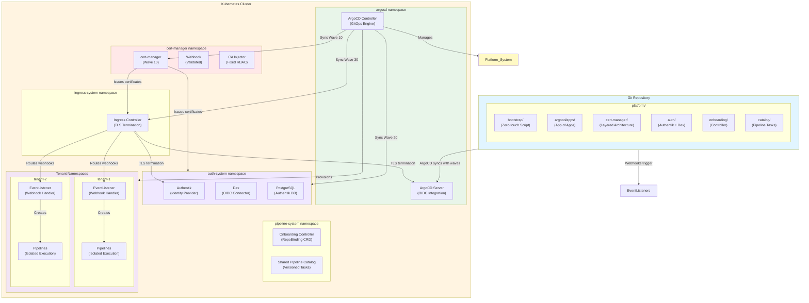
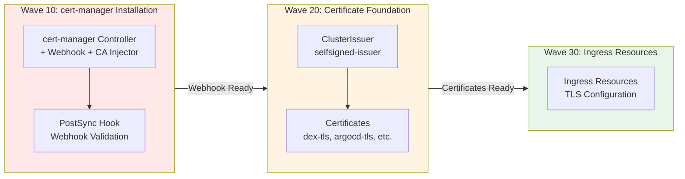
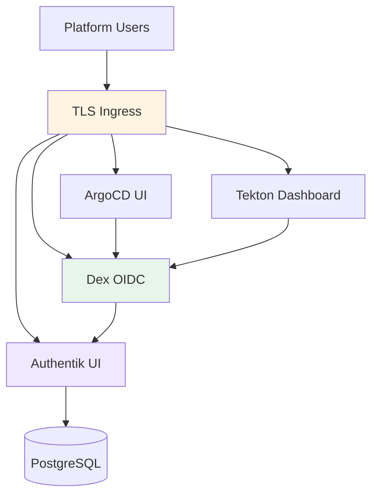
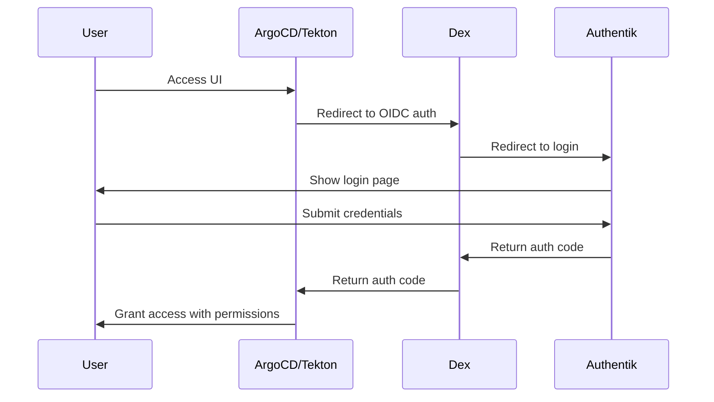
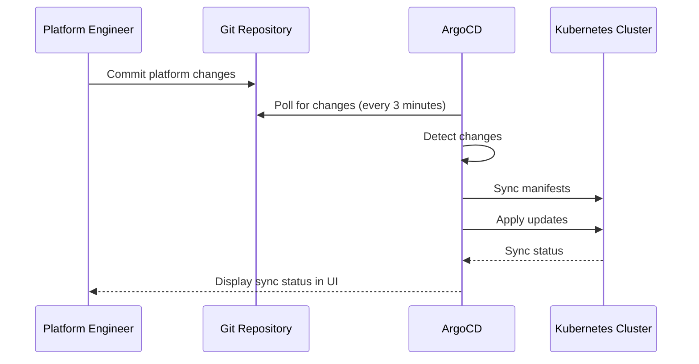
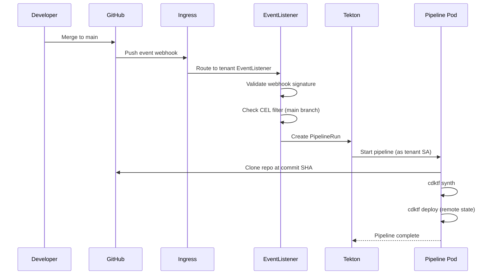
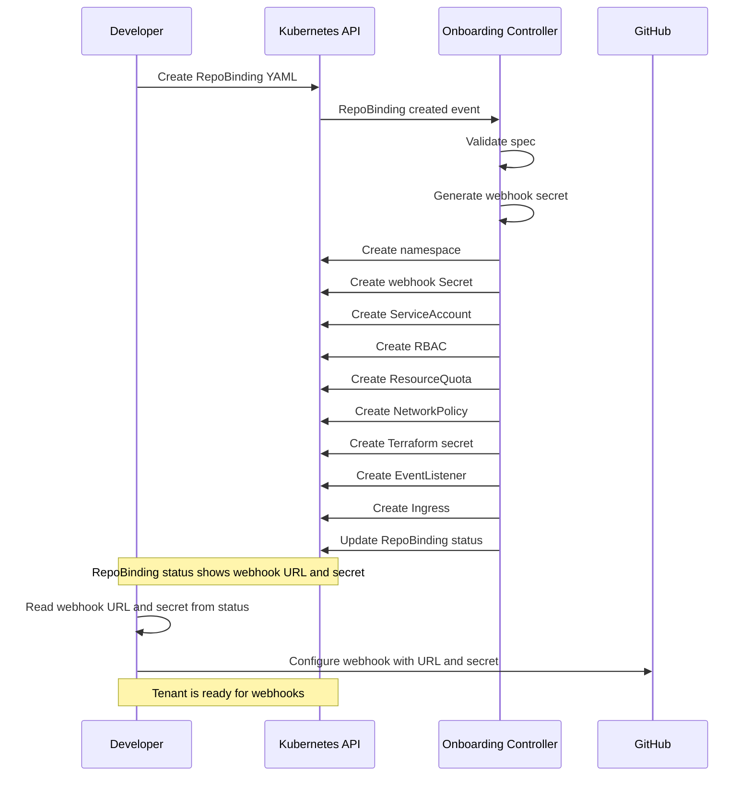

# Architecture

## System Design

The Arbiter Pipeline Infrastructure is a production-ready GitOps platform built on ArgoCD and Tekton with a revolutionary layered cert-manager architecture. The system provides bulletproof certificate management, centralized authentication, self-service repository onboarding, and complete platform automation.

The platform follows a **"Bootstrap Once, GitOps Forever"** pattern with **zero-touch convergence**: a one-time bootstrap script achieves complete platform deployment automatically, then ArgoCD manages all components declaratively with self-healing capabilities.

## High-Level Architecture



## Layered cert-manager Architecture

The platform implements a revolutionary **layered cert-manager architecture** that eliminates the classic "webhook chicken-and-egg" problem through proper dependency ordering and validation.

### cert-manager Deployment Waves



### PostSync Webhook Validation

The PostSync hook validates cert-manager webhook functionality before allowing certificate creation:

**Validation Checks:**
- Webhook Service has ready endpoints
- ValidatingWebhookConfiguration has non-empty caBundle
- MutatingWebhookConfiguration has non-empty caBundle
- CA injection process completed successfully

**Benefits:**
- Eliminates manual webhook restarts
- Prevents timing-related certificate failures
- Ensures deterministic deployment ordering
- Provides clear failure diagnostics

### RBAC Fix Implementation

The platform fixes cert-manager's default RBAC configuration using Kustomize patches:

```yaml
# Fix leader election namespace for both components
patchesJson6902:
  - target:
      kind: Deployment
      name: cert-manager-cainjector
    patch: |-
      - op: replace
        path: /spec/template/spec/containers/0/args/1
        value: --leader-election-namespace=cert-manager
  - target:
      kind: Deployment
      name: cert-manager
    patch: |-
      - op: replace
        path: /spec/template/spec/containers/0/args/2
        value: --leader-election-namespace=cert-manager
```

## Authentication System Architecture

The authentication system provides centralized SSO for all platform services using Authentik as the Identity Provider with Dex as an OIDC connector layer.

### Component Overview



### Authentication Flow



### Component Responsibilities

**Authentik Server:**
- Web UI for user and group management
- User authentication and OIDC token issuance
- Integration with external identity providers
- Auto-applies Blueprint configurations on startup

**Dex OIDC Connector:**
- OIDC proxy between Authentik and platform services
- Provides stable OIDC endpoint for service integration
- Translates Authentik tokens to service-specific tokens

**Config Sync Job:**
- Orchestrates Authentik-Dex integration during bootstrap
- Updates Authentik OIDC provider configuration via API
- Scales Dex deployment after Authentik is ready

For detailed authentication operations, see [operations.md](operations.md).
For authentication data models, see [data-models.md](data-models.md).

## Components

### 1. Bootstrap Script

**Purpose**: One-time initialization of cluster and platform components

**Location**: `platform/bootstrap/bootstrap.sh`

**Responsibilities**:
- Detect and clean up existing JenkinsX installations
- Create Kubernetes cluster (Kind for local, configurable for others)
- Install Tekton Pipelines and Tekton Triggers
- Install ArgoCD
- Create platform namespaces (argocd, tekton-pipelines, pipeline-system)
- Create platform root ArgoCD Application
- Display ArgoCD credentials and access instructions

**Interface**:
```bash
./bootstrap.sh [OPTIONS]

Options:
  --cluster-name NAME    Name of the cluster (default: arbiter-platform)
  --repo-url URL         Platform repository URL (default: current repo)
```

**Output**:
- Kubernetes cluster running
- Tekton Pipelines and Triggers installed
- ArgoCD installed and accessible
- Platform root Application created and syncing
- ArgoCD admin password displayed
- Next steps instructions displayed

**Source**
- `platform/bootstrap/bootstrap.sh`

### 2. ArgoCD

**Purpose**: GitOps continuous delivery tool that manages platform components

**Namespace**: `argocd`

**Installation**: Installed via kubectl during bootstrap from ArgoCD release manifests

**Configuration**:
```yaml
# Patch for insecure mode (homelab)
apiVersion: v1
kind: ConfigMap
metadata:
  name: argocd-cmd-params-cm
  namespace: argocd
data:
  server.insecure: "true"  # For homelab without TLS
```

**Access**:
- UI: `http://localhost:8080` (port-forward) or via Ingress
- CLI: `argocd login <server>`
- Initial admin password: Retrieved from Secret `argocd-initial-admin-secret`

**Components**:
- argocd-server: Web UI and API server
- argocd-application-controller: Syncs Applications from Git
- argocd-repo-server: Manages Git repository connections
- argocd-dex-server: SSO and authentication (optional)

**Source**
- `platform/bootstrap/bootstrap.sh` (installation)
- `platform/argocd/argocd-cm-patch.yaml` (configuration)

### 3. Platform ArgoCD Applications (App of Apps Pattern)

**Purpose**: Manage all platform components via GitOps using the App of Apps pattern

**Architecture**: The platform uses a root Application that manages child Applications for each component layer.

**Root Application** (platform-root):
```yaml
apiVersion: argoproj.io/v1alpha1
kind: Application
metadata:
  name: platform-root
  namespace: argocd
spec:
  project: default
  source:
    repoURL: https://github.com/bdchatham/ArbiterPipelineInfrastructure
    targetRevision: main
    path: platform/argocd/apps
  destination:
    server: https://kubernetes.default.svc
    namespace: argocd
  syncPolicy:
    automated:
      prune: true
      selfHeal: true
    retry:
      limit: 5
      backoff:
        duration: 5s
        factor: 2
        maxDuration: 3m
```

**Child Applications**:

1. **platform-crds** (CRDs and foundational resources)
2. **platform-infrastructure** (Namespaces, RBAC, base resources)
3. **platform-controllers** (Onboarding controller)
4. **platform-catalog** (Tekton tasks, pipelines, triggers)
5. **platform-tekton** (Tekton Pipelines, Triggers, and Core Interceptors)

**Sync Order**: ArgoCD automatically syncs Applications in dependency order using sync waves:
1. platform-crds (wave 0 - CRDs must exist first)
2. platform-tekton (wave 1 - Tekton must be installed before controllers)
3. platform-infrastructure (wave 1 - Namespaces and RBAC)
4. platform-controllers (wave 2 - Controllers depend on CRDs and infrastructure)
5. platform-catalog (wave 3 - Catalog depends on Tekton being installed)

**Benefits of App of Apps**:
- Independent lifecycle management for each component
- Clearer separation of concerns
- Easier troubleshooting (each Application has its own sync status)
- Can have different sync policies per component
- Better visibility in ArgoCD UI

**Source**
- `platform/argocd/apps/platform-root.yaml`
- `platform/argocd/apps/platform-crds.yaml`
- `platform/argocd/apps/platform-infrastructure.yaml`
- `platform/argocd/apps/platform-controllers.yaml`
- `platform/argocd/apps/platform-catalog.yaml`

### 4. Tekton Pipelines, Triggers, and Core Interceptors

**Purpose**: Pipeline execution engine, webhook handling, and interceptor services

**Namespace**: `tekton-pipelines`

**Installation**: Applied via kubectl during bootstrap, then managed by ArgoCD from `platform/tekton/`

**Configuration**:
```yaml
# Tekton Pipelines v0.65.0
# https://github.com/tektoncd/pipeline/releases/download/v0.65.0/release.yaml

# Tekton Triggers v0.29.0
# https://github.com/tektoncd/triggers/releases/download/v0.29.0/release.yaml

# Tekton Triggers Core Interceptors v0.29.0
# https://github.com/tektoncd/triggers/releases/download/v0.29.0/interceptors.yaml
```

**Components**:
- tekton-pipelines-controller: Manages PipelineRun execution
- tekton-pipelines-webhook: Validates and mutates Tekton resources
- tekton-triggers-controller: Manages EventListeners and Triggers
- tekton-triggers-webhook: Validates Trigger resources
- tekton-triggers-core-interceptors: Provides ClusterInterceptors (github, gitlab, cel, bitbucket, slack)

**ClusterInterceptors**:
- github: Validates GitHub webhook signatures and filters events
- gitlab: Validates GitLab webhook signatures and filters events
- cel: Evaluates CEL expressions for custom filtering
- bitbucket: Validates Bitbucket webhook signatures
- slack: Validates Slack webhook signatures

**ArgoCD Management**:
After bootstrap, Tekton is managed by the `platform-tekton` ArgoCD Application. Updates to Tekton versions are made by updating `platform/tekton/kustomization.yaml` and committing to Git. ArgoCD automatically syncs changes.

**Source**
- `platform/bootstrap/bootstrap.sh` (initial installation)
- `platform/tekton/kustomization.yaml` (ArgoCD management)
- `platform/argocd/apps/platform-tekton.yaml` (ArgoCD Application)

### 5. Organization and Onboarding System

**Purpose**: Multi-tenant organization management with automated webhook infrastructure

**Namespace**: `platform-system` (controllers), `org-{name}` (tenant resources)

**Installation**: Managed by ArgoCD from `platform/onboarding/`

#### Organization Controller

**Resources**:
- Organization CRD and Controller
- Per-organization namespace provisioning
- Cloudflared tunnel infrastructure per organization
- Organization-scoped webhook secrets and RBAC

**Controller Logic**:
1. Watch Organization resources
2. Create organization namespace: `org-{name}`
3. Generate webhook secret (cryptographically secure)
4. Create Cloudflared tunnel ConfigMap and Deployment
5. Create organization admin RBAC
6. Update Organization status with webhook URL: `https://webhooks-{org}.homelab.local`

#### RepoBinding Controller

**Resources**:
- RepoBinding CRD and Controller
- Tekton webhook infrastructure per repository
- Pipeline namespace discovery and cross-namespace references

**Controller Logic**:
1. Watch RepoBinding resources
2. Validate spec (org, repo, tenant name, pipeline name)
3. Discover pipeline namespace automatically across cluster
4. Create namespace-scoped resources in organization namespace:
   - ServiceAccount (`pipeline-runner`)
   - RBAC (Role, RoleBinding)
   - ResourceQuota and LimitRange
   - NetworkPolicy
   - Terraform backend secret
5. Create Tekton webhook resources:
   - TriggerBinding (`github-push-binding`)
   - TriggerTemplate (`{tenant}-trigger-template`)
   - EventListener (`github-listener`)
6. Reference Organization-managed webhook secret
7. Update RepoBinding status with webhook configuration

#### Per-Organization Webhook Infrastructure

Each organization gets isolated webhook infrastructure:

**Cloudflared Tunnel**:
- Unique subdomain: `webhooks-{org}.homelab.local`
- Dedicated tunnel deployment in organization namespace
- Routes directly to EventListener: `el-github-listener:8080`
- No complex routing logic needed

**Webhook Flow**:
```
GitHub → webhooks-{org}.homelab.local → Cloudflared → EventListener → TriggerTemplate → PipelineRun
```

**Benefits**:
- Complete isolation between organizations
- Simple GitHub webhook setup (unique URL per org)
- No router port forwarding required
- Independent scaling per organization

**Source**
- `platform/onboarding/controller/` (Go source code)
- `platform/onboarding/controller-deployment.yaml`
- `platform/onboarding/controller-rbac.yaml`
- `platform/onboarding/controller-service-account.yaml`

### 6. Tekton EventListener (Per Tenant)

**Purpose**: Receive GitHub webhooks and create PipelineRuns

**Namespace**: Tenant namespace (e.g., `tenant-example`)

**Created By**: Onboarding Controller when RepoBinding is created

**Definition**:
```yaml
apiVersion: triggers.tekton.dev/v1beta1
kind: EventListener
metadata:
  name: github-listener
  namespace: tenant-example
spec:
  serviceAccountName: pipeline-runner
  triggers:
    - name: github-push
      interceptors:
        - ref:
            name: github
          params:
            - name: secretRef
              value:
                secretName: webhook-tenant-example
                secretKey: secret
            - name: eventTypes
              value:
                - push
        - ref:
            name: cel
          params:
            - name: filter
              value: "body.ref == 'refs/heads/main'"
      bindings:
        - ref: github-push-binding
      template:
        ref: cdktf-deploy-trigger-template
```

**Service and Ingress**:
```yaml
# Service created automatically by EventListener
apiVersion: v1
kind: Service
metadata:
  name: el-github-listener
  namespace: tenant-example
spec:
  ports:
    - port: 8080
      targetPort: 8080
  selector:
    eventlistener: github-listener

---
# Ingress created by Onboarding Controller
apiVersion: networking.k8s.io/v1
kind: Ingress
metadata:
  name: github-webhook
  namespace: tenant-example
spec:
  rules:
    - host: webhooks.example.com
      http:
        paths:
          - path: /tenant-example
            pathType: Prefix
            backend:
              service:
                name: el-github-listener
                port:
                  number: 8080
```

**Source**
- `platform/tenancy/templates/eventlistener-template.yaml`
- `platform/tenancy/templates/ingress-template.yaml`

### 7. Pipeline Catalog

**Purpose**: Provide shared Tekton Tasks and Pipelines

**Namespace**: `pipeline-system`

**Installation**: Managed by ArgoCD from `platform/catalog/`

**Resources**:
- git-clone Task
- cdktf-synth Task
- cdktf-deploy Task
- cdktf-deploy-pipeline Pipeline
- TriggerBindings and TriggerTemplates

**Configuration**:
```yaml
# Tasks and Pipelines deployed to pipeline-system namespace
# Referenced by tenants using namespace-qualified names
```

**Source**
- `platform/catalog/tasks/git-clone.yaml`
- `platform/catalog/tasks/cdktf-synth.yaml`
- `platform/catalog/tasks/cdktf-deploy.yaml`
- `platform/catalog/pipelines/cdktf-deploy-pipeline.yaml`
- `platform/catalog/triggers/github-push-binding.yaml`
- `platform/catalog/triggers/cdktf-deploy-trigger-template.yaml`

### 8. RepoBinding Custom Resource Definition

**Purpose**: Define repository onboarding requests

**Namespace**: `pipeline-system` (CRD is cluster-scoped, instances are namespaced)

**Installation**: Managed by ArgoCD from `platform/crds/`

**CRD Definition**:
```yaml
apiVersion: apiextensions.k8s.io/v1
kind: CustomResourceDefinition
metadata:
  name: repobindings.arbiter.io
spec:
  group: arbiter.io
  names:
    kind: RepoBinding
    plural: repobindings
    singular: repobinding
  scope: Namespaced
  versions:
    - name: v1alpha1
      served: true
      storage: true
      schema:
        openAPIV3Schema:
          type: object
          properties:
            spec:
              type: object
              required:
                - repoOrg
                - repoName
                - tenantName
              properties:
                repoOrg:
                  type: string
                repoName:
                  type: string
                tenantName:
                  type: string
                permissionProfile:
                  type: string
                  enum: ["standard", "elevated"]
                  default: "standard"
                ingressHost:
                  type: string
            status:
              type: object
              properties:
                phase:
                  type: string
                  enum: ["Pending", "Provisioning", "Ready", "Failed"]
                message:
                  type: string
                webhookURL:
                  type: string
                webhookSecret:
                  type: string
                namespaceCreated:
                  type: boolean
                serviceAccountCreated:
                  type: boolean
                rbacCreated:
                  type: boolean
                quotasCreated:
                  type: boolean
                networkPolicyCreated:
                  type: boolean
                terraformSecretCreated:
                  type: boolean
                eventListenerCreated:
                  type: boolean
                ingressCreated:
                  type: boolean
```

**Source**
- `platform/crds/repobinding-crd.yaml`
- `platform/crds/example-repobinding.yaml`

## Data Flow

### Git to Kubernetes (GitOps Sync)



**Flow Description**:
1. Platform engineer commits changes to platform manifests in Git
2. ArgoCD polls Git repository every 3 minutes (default)
3. ArgoCD detects changes and compares with cluster state
4. ArgoCD applies changes to Kubernetes cluster
5. ArgoCD reports sync status in UI

**Key Points**:
- All platform configuration is stored in Git (version-controlled)
- ArgoCD automatically syncs changes (no manual kubectl apply)
- Sync policies: automated sync, self-heal, prune
- Retry policy with exponential backoff for transient failures

### GitHub Webhook to PipelineRun



**Flow Description**:
1. Developer merges code to main branch
2. GitHub sends push event webhook to Ingress
3. Ingress routes webhook to tenant EventListener based on path
4. EventListener validates webhook signature using tenant secret
5. EventListener checks CEL filter (only main branch pushes)
6. EventListener creates PipelineRun in tenant namespace
7. Tekton starts pipeline pod using tenant service account
8. Pipeline clones repository at specific commit SHA
9. Pipeline runs cdktf synth to generate Terraform config
10. Pipeline runs cdktf deploy to apply infrastructure changes
11. Pipeline completes and reports status

**Key Points**:
- Each tenant has dedicated EventListener with unique webhook secret
- Webhook signature validation prevents unauthorized triggers
- CEL filters enable branch-specific triggering
- Pipelines run with tenant service account (RBAC isolation)
- Terraform state stored in Kubernetes backend (per-tenant isolation)

### Tenant Provisioning Flow



**Flow Description**:
1. Developer creates RepoBinding resource
2. Kubernetes API notifies Onboarding Controller
3. Controller validates request (org, namespace pattern, permission profile)
4. Controller generates cryptographically secure webhook secret
5. Controller creates tenant namespace with labels
6. Controller creates webhook Secret in tenant namespace
7. Controller creates ServiceAccount for pipeline execution
8. Controller creates Role and RoleBinding based on permission profile
9. Controller creates ResourceQuota and LimitRange
10. Controller creates NetworkPolicy for tenant isolation
11. Controller creates Terraform backend secret
12. Controller creates EventListener for webhook handling
13. Controller creates Ingress for webhook routing
14. Controller updates RepoBinding status with webhook URL and secret
15. Developer reads webhook URL and secret from RepoBinding status
16. Developer configures webhook in GitHub repository settings

**Key Points**:
- Fully automated tenant provisioning (no manual steps)
- Webhook secret generated and stored securely
- RBAC enforces least-privilege access
- Resource quotas prevent resource exhaustion
- Network policies enforce tenant isolation
- Terraform state isolated per tenant

## Technology Stack

### Infrastructure
- **Kubernetes**: Container orchestration platform (1.24+)
- **kubectl**: Kubernetes CLI
- **Kind**: Kubernetes in Docker (for local development)

### GitOps Platform
- **ArgoCD**: GitOps continuous delivery tool
- **Tekton Pipelines**: Pipeline execution engine
- **Tekton Triggers**: Event-driven triggering

### Development Tools
- **Go**: Onboarding controller implementation
- **CDKTF**: Cloud Development Kit for Terraform
- **Terraform**: Infrastructure as code

### Container Runtime
- **Docker**: Container image format
- **containerd**: Container runtime

## Architectural Patterns

### 1. GitOps
All configuration is stored in Git. ArgoCD syncs changes automatically, enabling declarative infrastructure management and self-upgrade capabilities.

### 2. App of Apps
Root ArgoCD Application manages child Applications for each component layer, providing better separation of concerns and independent lifecycle management.

### 3. Event-Driven Architecture
Tekton EventListeners receive GitHub webhooks and trigger pipelines, enabling automated deployments on code changes.

### 4. Multi-Tenancy with Isolation
Multiple tenants share the cluster but are isolated through:
- Kubernetes namespaces (one per tenant)
- Network policies (restrict inter-namespace traffic)
- Resource quotas (prevent resource exhaustion)
- RBAC (separate service accounts and roles)

### 5. Operator Pattern
The onboarding controller follows the Kubernetes operator pattern, reconciling RepoBinding resources to provision tenant infrastructure.

### 6. Immutable Infrastructure
Container images are versioned and immutable. Infrastructure changes are deployed through GitOps, not manual modifications.

**Source**
- `.kiro/specs/argocd-tekton-platform/design.md`
- `.kiro/specs/argocd-tekton-platform/requirements.md`
- `.kiro/specs/dex-authentication-platform/design.md`
- `.kiro/specs/dex-authentication-platform/requirements.md`
- `platform/bootstrap/bootstrap.sh`
- `platform/argocd/apps/`
- `platform/auth/`
- `platform/auth/config-sync/`
- `platform/auth/ingress/`
- `platform/crds/repobinding-crd.yaml`
- `platform/onboarding/controller/`
- `platform/catalog/`
- `platform/tenancy/templates/`
