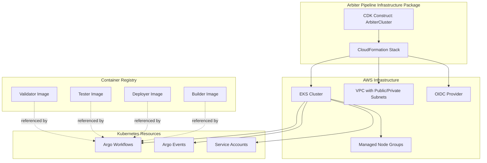
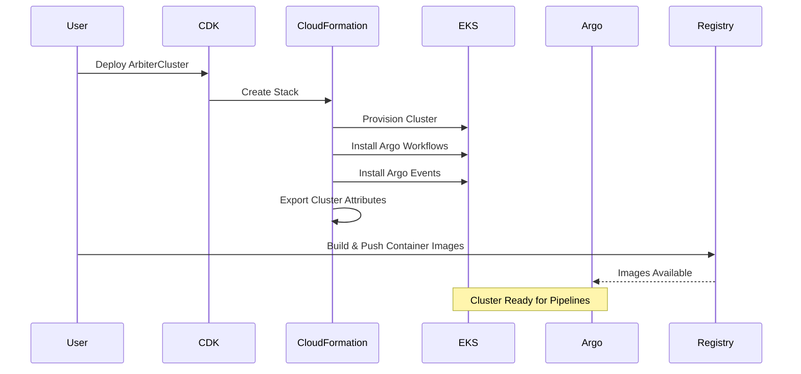
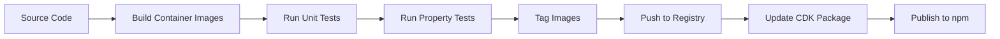
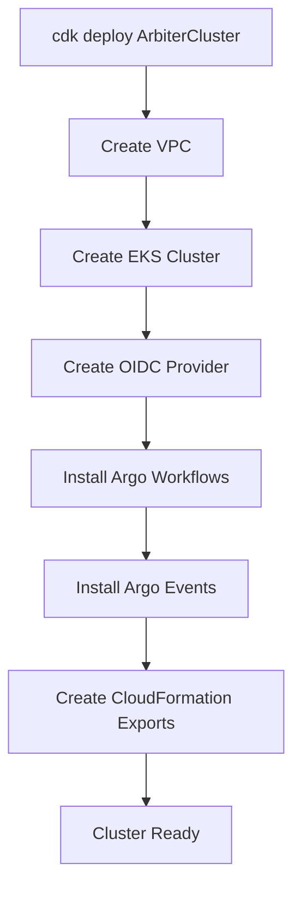
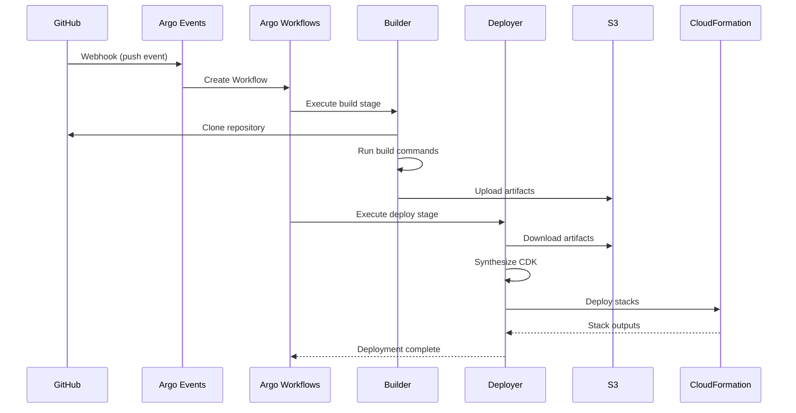

# Design Document

## Overview

The Arbiter Pipeline Infrastructure is a CDK-based infrastructure package that provides a shared execution environment for deploying CDK applications across the Arbiter agent suite. This package contains the AphexCluster construct, which creates and manages the complete pipeline infrastructure. The system consists of three main layers:

1. **Infrastructure Layer**: EKS cluster with Argo Workflows and Argo Events (via AphexCluster construct)
2. **Container Layer**: Pre-built Docker images with execution scripts
3. **Integration Layer**: CloudFormation exports and IRSA configuration for pipeline consumption

The design prioritizes reusability, security, and multi-tenancy. A single cluster can host multiple independent pipelines, each with isolated permissions and resources. Container images are generic and work with any CDK project, requiring no application-specific customization.

**Note**: The AphexCluster construct is currently part of this package. If it becomes generic and used across multiple packages in the future, it can be refactored into its own standalone package.

## Architecture

### High-Level Architecture



### Component Interaction Flow



## Components and Interfaces

### 1. ArbiterCluster CDK Construct

**Purpose**: Main CDK construct that creates the complete infrastructure stack.

**Interface**:
```typescript
export interface ArbiterClusterProps {
  /**
   * Name of the EKS cluster
   * @default 'arbiter-pipeline-cluster'
   */
  readonly clusterName?: string;
  
  /**
   * Minimum number of nodes in the cluster
   * @default 2
   */
  readonly minNodes?: number;
  
  /**
   * Maximum number of nodes in the cluster
   * @default 10
   */
  readonly maxNodes?: number;
  
  /**
   * Instance type for cluster nodes
   * @default 't3.medium'
   */
  readonly instanceType?: ec2.InstanceType;
  
  /**
   * Kubernetes version
   * @default 1.28
   */
  readonly kubernetesVersion?: eks.KubernetesVersion;
  
  /**
   * VPC to use for the cluster. If not provided, a new VPC will be created.
   */
  readonly vpc?: ec2.IVpc;
  
  /**
   * Namespace for Argo Workflows
   * @default 'argo'
   */
  readonly argoNamespace?: string;
  
  /**
   * Whether to enable CloudWatch Container Insights
   * @default true
   */
  readonly enableContainerInsights?: boolean;
}

export class ArbiterCluster extends Construct {
  /**
   * The EKS cluster
   */
  public readonly cluster: eks.Cluster;
  
  /**
   * The OIDC provider for the cluster
   */
  public readonly oidcProvider: iam.IOpenIdConnectProvider;
  
  /**
   * The kubectl role ARN
   */
  public readonly kubectlRoleArn: string;
  
  /**
   * CloudFormation export name for cluster name
   */
  public readonly clusterNameExport: string;
  
  /**
   * CloudFormation export name for OIDC provider ARN
   */
  public readonly oidcProviderArnExport: string;
  
  constructor(scope: Construct, id: string, props?: ArbiterClusterProps);
  
  /**
   * Import an existing cluster by its attributes
   */
  public static fromClusterAttributes(
    scope: Construct,
    id: string,
    attrs: ClusterAttributes
  ): IArbiterCluster;
}

export interface ClusterAttributes {
  readonly clusterName: string;
  readonly oidcProviderArn: string;
  readonly kubectlRoleArn: string;
}
```

**Responsibilities**:
- Create or reference VPC
- Provision EKS cluster with managed node groups
- Configure cluster autoscaling
- Install Argo Workflows via Helm chart
- Install Argo Events via Helm chart
- Create OIDC provider for IRSA
- Export cluster attributes via CloudFormation
- Configure CloudWatch logging

### 2. Container Images

#### Builder Image (`public.ecr.aws/arbiter/builder:latest`)

**Base Image**: `node:20-alpine`

**Installed Tools**:
- Node.js 20.x and npm
- Python 3.11 and pip
- Git 2.x
- AWS CLI v2
- Build essentials (gcc, make, g++)

**Execution Script**: `/usr/local/bin/aphex-build`

**Script Interface**:
```bash
aphex-build <repo-url> <commit-sha> <build-commands> <artifact-bucket>
```

**Environment Variables**:
- `AWS_REGION`: AWS region for S3 operations
- `AWS_ROLE_ARN`: IAM role to assume (via IRSA)

#### Deployer Image (`public.ecr.aws/arbiter/deployer:latest`)

**Base Image**: `node:20-alpine`

**Installed Tools**:
- Node.js 20.x and npm
- Python 3.11 and pip
- AWS CDK CLI (latest)
- AWS CLI v2
- kubectl (matching EKS version)
- Git 2.x

**Execution Scripts**:
- `/usr/local/bin/aphex-deploy-pipeline`
- `/usr/local/bin/aphex-deploy-stack`

**Script Interfaces**:
```bash
# Deploy pipeline infrastructure
aphex-deploy-pipeline <repo-url> <commit-sha> <stack-name> <artifact-bucket>

# Deploy application stacks
aphex-deploy-stack <repo-url> <commit-sha> <environment> <stack-list> <artifact-bucket>
```

**Environment Variables**:
- `AWS_REGION`: Target AWS region
- `AWS_ACCOUNT`: Target AWS account
- `AWS_ROLE_ARN`: IAM role to assume for deployment

#### Tester Image (`public.ecr.aws/arbiter/tester:latest`)

**Base Image**: `node:20-alpine`

**Installed Tools**:
- Node.js 20.x and npm
- Python 3.11 and pip
- Jest, Mocha, Pytest (common test frameworks)
- AWS CLI v2

**Execution Script**: `/usr/local/bin/aphex-test`

**Script Interface**:
```bash
aphex-test <test-commands>
```

#### Validator Image (`public.ecr.aws/arbiter/validator:latest`)

**Base Image**: `python:3.11-slim`

**Installed Tools**:
- Python 3.11 and pip
- jsonschema library
- PyYAML library
- AWS CLI v2

**Execution Script**: `/usr/local/bin/aphex-validate`

**Script Interface**:
```bash
aphex-validate <config-path>
```

### 3. Execution Scripts

All execution scripts follow a common pattern:

**Input**: Command-line arguments and environment variables
**Output**: Structured JSON to stdout on success, stderr on failure
**Exit Codes**: 0 for success, non-zero for failure
**Logging**: All operations logged to CloudWatch via stdout/stderr

**Common Script Structure**:
```python
#!/usr/bin/env python3
import sys
import json
import logging
from typing import Dict, Any

def setup_logging():
    logging.basicConfig(
        level=logging.INFO,
        format='%(asctime)s - %(name)s - %(levelname)s - %(message)s'
    )

def output_result(success: bool, data: Dict[str, Any]):
    result = {
        "success": success,
        "data": data,
        "timestamp": datetime.utcnow().isoformat()
    }
    print(json.dumps(result))

def main():
    setup_logging()
    try:
        # Script logic here
        output_result(True, {"message": "Operation completed"})
        sys.exit(0)
    except Exception as e:
        logging.error(f"Error: {str(e)}", exc_info=True)
        output_result(False, {"error": str(e)})
        sys.exit(1)

if __name__ == "__main__":
    main()
```

### 4. CloudFormation Exports

The stack exports the following values:

| Export Name | Value | Purpose |
|-------------|-------|---------|
| `ArbiterCluster-ClusterName` | EKS cluster name | Pipeline stacks reference cluster |
| `ArbiterCluster-OIDCProviderArn` | OIDC provider ARN | Pipeline stacks create IRSA roles |
| `ArbiterCluster-KubectlRoleArn` | kubectl IAM role ARN | Pipeline stacks interact with cluster |
| `ArbiterCluster-ClusterSecurityGroupId` | Cluster security group ID | Pipeline stacks configure networking |

## Data Models

### Cluster Configuration

```typescript
interface ClusterConfig {
  clusterName: string;
  minNodes: number;
  maxNodes: number;
  instanceType: string;
  kubernetesVersion: string;
  argoNamespace: string;
  enableContainerInsights: boolean;
}
```

### Script Execution Result

```typescript
interface ScriptResult {
  success: boolean;
  data: {
    [key: string]: any;
  };
  timestamp: string;
  error?: string;
}
```

### Build Artifact Metadata

```typescript
interface ArtifactMetadata {
  commitSha: string;
  timestamp: string;
  s3Bucket: string;
  s3Key: string;
  buildCommands: string[];
  artifactSize: number;
}
```

### Deployment Result

```typescript
interface DeploymentResult {
  stackName: string;
  stackId: string;
  outputs: {
    [key: string]: string;
  };
  status: 'CREATE_COMPLETE' | 'UPDATE_COMPLETE';
  duration: number;
}
```

## Correctness Properties

*A property is a characteristic or behavior that should hold true across all valid executions of a system—essentially, a formal statement about what the system should do. Properties serve as the bridge between human-readable specifications and machine-verifiable correctness guarantees.*


### Property 1: Script parameter acceptance
*For any* execution script and its documented parameter set, the script should accept all required parameters without error
**Validates: Requirements 4.1, 5.1, 5.4, 6.1, 7.1**

### Property 2: Repository cloning at specific commits
*For any* valid repository URL and commit SHA, the aphex-build and aphex-deploy scripts should successfully clone the repository at the specified commit
**Validates: Requirements 4.2, 5.2**

### Property 3: Build command execution
*For any* valid build commands, the aphex-build script should execute them in the cloned repository and capture their exit status
**Validates: Requirements 4.3**

### Property 4: Artifact upload with metadata
*For any* successful build, the aphex-build script should package artifacts, tag them with commit SHA and timestamp, upload to S3, and output the S3 path
**Validates: Requirements 4.4, 4.5, 4.6, 4.7**

### Property 5: CDK stack synthesis and deployment
*For any* valid CDK stack definition, the aphex-deploy-pipeline script should synthesize and deploy the stack to CloudFormation
**Validates: Requirements 5.2, 5.3**

### Property 6: Artifact-based deployment
*For any* valid artifact reference and stack list, the aphex-deploy-stack script should download artifacts, synthesize stacks, deploy them, and capture outputs
**Validates: Requirements 5.5, 5.6, 5.8**

### Property 7: Dependency-ordered deployment
*For any* set of CDK stacks with dependency relationships, the aphex-deploy-stack script should deploy them in an order that respects dependencies (no stack deploys before its dependencies)
**Validates: Requirements 5.7**

### Property 8: Test execution and result capture
*For any* test commands, the aphex-test script should execute them, capture stdout/stderr, capture the exit code, and output pass/fail status based on the exit code
**Validates: Requirements 6.2, 6.3, 6.4, 6.5**

### Property 9: Configuration validation sequence
*For any* configuration file, the aphex-validate script should validate it against the JSON schema, then validate AWS credentials, then validate CDK context, and output success only if all validations pass
**Validates: Requirements 7.2, 7.3, 7.4, 7.5**

### Property 10: CloudFormation export resolution
*For any* pipeline stack that references the cluster's CloudFormation exports, the exports should resolve to the correct cluster attribute values
**Validates: Requirements 8.4**

### Property 11: Autoscaling configuration
*For any* valid minimum and maximum node count values, the deployed cluster should have autoscaling configured with those bounds
**Validates: Requirements 9.3**

### Property 12: Script exit code behavior
*For any* execution script, it should exit with code 0 on success and non-zero on error
**Validates: Requirements 10.1, 10.4**

### Property 13: Structured script output
*For any* execution script result (success or error), the script should output structured JSON with success status, data/error information, and timestamp
**Validates: Requirements 10.2, 10.5**

### Property 14: Error logging
*For any* execution script error, the error details should be logged to CloudWatch Logs
**Validates: Requirements 10.3**

### Property 15: IRSA credential provisioning
*For any* workflow pod execution, AWS credentials should be provided via IRSA without long-lived access keys
**Validates: Requirements 11.1, 11.2**

### Property 16: Pipeline permission isolation
*For any* set of pipelines sharing the cluster, each pipeline should have isolated IAM permissions via separate service accounts
**Validates: Requirements 11.4**

### Property 17: Container image tagging
*For any* published container image, it should be tagged with a semantic version, the Git commit SHA, and "latest" if it is the most recent build
**Validates: Requirements 12.1, 12.2, 12.3**

### Property 18: Image tag resolution
*For any* valid image tag (version-specific or "latest"), the container image should be resolvable and pullable from the registry
**Validates: Requirements 12.4**

### Property 19: Pipeline resource isolation
*For any* set of pipelines deployed to the cluster, each pipeline's Kubernetes resources should be isolated via namespaces or labels
**Validates: Requirements 13.1**

### Property 20: Pipeline deletion isolation
*For any* pipeline deletion, other pipelines running on the cluster should remain unaffected and continue operating normally
**Validates: Requirements 13.3**

## Error Handling

### Script-Level Error Handling

All execution scripts implement a consistent error handling pattern:

1. **Input Validation**: Validate all parameters before execution
2. **Early Exit**: Exit immediately on validation failures
3. **Exception Handling**: Catch and log all exceptions
4. **Structured Output**: Output errors in JSON format
5. **Exit Codes**: Use non-zero exit codes for failures
6. **Logging**: Log all errors to CloudWatch

**Error Categories**:
- **Input Errors** (exit code 1): Invalid parameters, missing arguments
- **Authentication Errors** (exit code 2): AWS credential failures, IRSA issues
- **Resource Errors** (exit code 3): S3 access failures, repository clone failures
- **Execution Errors** (exit code 4): Build failures, deployment failures, test failures
- **Timeout Errors** (exit code 5): Operations exceeding time limits

### Infrastructure-Level Error Handling

**EKS Cluster Failures**:
- CloudFormation rollback on cluster creation failure
- Automatic retry of Helm chart installations
- Health checks for Argo Workflows and Argo Events

**Container Image Build Failures**:
- Build process fails fast on Dockerfile errors
- Image push failures logged and reported
- Version tagging failures prevent "latest" tag update

**IRSA Configuration Failures**:
- OIDC provider creation failures prevent cluster deployment
- Service account creation failures logged in Kubernetes events
- Role assumption failures logged in pod events

### Monitoring and Alerting

**CloudWatch Metrics**:
- Workflow execution count (success/failure)
- Workflow duration
- Node count and utilization
- Pod failure count

**CloudWatch Alarms**:
- High workflow failure rate (> 10% in 5 minutes)
- Cluster node count at maximum (autoscaling limit reached)
- Pod crash loop detected
- IRSA authentication failures

**Logging**:
- All script output captured in CloudWatch Logs
- Kubernetes events logged for cluster resources
- Argo Workflows logs retained for 30 days

## Testing Strategy

### Unit Testing

Unit tests verify specific examples and edge cases for individual components:

**CDK Construct Tests**:
- Cluster creation with default parameters
- Cluster creation with custom VPC
- CloudFormation export names are correct
- OIDC provider is created
- Argo Workflows Helm chart is installed

**Script Tests**:
- Script accepts valid parameters
- Script rejects invalid parameters
- Script handles missing environment variables
- Script outputs valid JSON
- Script exits with correct exit codes

**Container Image Tests**:
- Required tools are installed
- Tool versions are correct
- Scripts are executable
- Base image is correct

### Property-Based Testing

Property-based tests verify universal properties across all inputs using **Hypothesis** (Python) and **fast-check** (TypeScript/JavaScript):

**Script Property Tests**:
- For any valid repository and commit, cloning succeeds
- For any build commands, execution captures exit status
- For any artifact, S3 upload produces valid S3 path
- For any CDK stack, synthesis produces CloudFormation template
- For any test commands, exit code determines pass/fail status
- For any configuration, validation follows the correct sequence

**Infrastructure Property Tests**:
- For any min/max node values, autoscaling is configured correctly
- For any pipeline set, resources are isolated
- For any CloudFormation export reference, resolution succeeds

**Configuration**:
- Each property test runs a minimum of 100 iterations
- Each test is tagged with the format: `**Feature: arbiter-pipeline-infrastructure, Property {number}: {property_text}**`
- Each correctness property is implemented by a single property-based test

### Integration Testing

Integration tests verify end-to-end workflows:

**Cluster Deployment Test**:
1. Deploy ArbiterCluster stack
2. Verify cluster is accessible via kubectl
3. Verify Argo Workflows is running
4. Verify Argo Events is running
5. Verify CloudFormation exports exist
6. Clean up resources

**Container Image Test**:
1. Build all container images
2. Push to registry
3. Pull images from registry
4. Run each script with sample inputs
5. Verify outputs are correct

**Pipeline Execution Test**:
1. Deploy test pipeline to cluster
2. Trigger workflow via Argo Events
3. Verify build stage completes
4. Verify deployment stage completes
5. Verify test stage completes
6. Verify artifacts are in S3
7. Clean up resources

### Test Organization

```
tests/
├── unit/
│   ├── constructs/
│   │   └── test_arbiter_cluster.py
│   ├── scripts/
│   │   ├── test_aphex_build.py
│   │   ├── test_aphex_deploy_pipeline.py
│   │   ├── test_aphex_deploy_stack.py
│   │   ├── test_aphex_test.py
│   │   └── test_aphex_validate.py
│   └── containers/
│       └── test_image_contents.py
├── property/
│   ├── test_script_properties.py
│   ├── test_infrastructure_properties.py
│   └── test_configuration_properties.py
└── integration/
    ├── test_cluster_deployment.py
    ├── test_container_images.py
    └── test_pipeline_execution.py
```

## Deployment Architecture

### Build and Publish Pipeline



### Cluster Deployment Flow



### Runtime Workflow Execution



## Security Considerations

### IAM Permissions

**Cluster IAM Role**:
- EKS cluster management
- EC2 instance management
- VPC networking
- CloudWatch logging

**Node Group IAM Role**:
- ECR image pull
- CloudWatch logging
- EKS cluster communication

**IRSA Roles** (per pipeline):
- S3 bucket access (scoped to pipeline bucket)
- CloudFormation deployment (scoped to pipeline stacks)
- Cross-account role assumption (for multi-account deployments)

### Network Security

**VPC Configuration**:
- Public subnets for load balancers
- Private subnets for EKS nodes
- NAT gateways for outbound internet access
- VPC endpoints for AWS services (S3, ECR, CloudWatch)

**Security Groups**:
- Cluster security group (EKS control plane)
- Node security group (worker nodes)
- Pod security group (via security group for pods)

### Secrets Management

**GitHub Tokens**:
- Stored in AWS Secrets Manager
- Referenced by Argo Events EventSource
- Rotated regularly

**AWS Credentials**:
- No long-lived credentials in containers
- IRSA provides temporary credentials
- Credentials scoped to minimum required permissions

**Container Registry**:
- Public registry for container images (no secrets needed)
- Images signed with cosign for verification

## Operational Considerations

### Monitoring

**Cluster Health**:
- EKS cluster status
- Node health and capacity
- Pod resource utilization
- Argo Workflows controller health

**Workflow Metrics**:
- Workflow success/failure rate
- Workflow duration
- Queue depth
- Concurrent workflow count

**Cost Monitoring**:
- EC2 instance costs
- Data transfer costs
- S3 storage costs

### Maintenance

**Cluster Updates**:
- Kubernetes version upgrades (quarterly)
- Argo Workflows upgrades (as needed)
- Node AMI updates (monthly)

**Container Image Updates**:
- Base image security patches (weekly)
- Tool version updates (as needed)
- CDK CLI updates (monthly)

**Backup and Recovery**:
- EKS cluster configuration backed up
- Argo Workflows templates backed up to S3
- Disaster recovery plan documented

### Scaling

**Horizontal Scaling**:
- Node autoscaling based on pod resource requests
- Workflow parallelism configurable per pipeline
- Multiple clusters for different environments (dev/prod)

**Vertical Scaling**:
- Node instance type configurable
- Pod resource requests/limits configurable
- Workflow resource requirements configurable

## Future Enhancements

### Planned Features

1. **Multi-Region Support**: Deploy clusters in multiple regions for high availability
2. **Spot Instance Support**: Use spot instances for cost optimization
3. **Custom Workflow Steps**: Allow users to define custom container images and scripts
4. **Workflow Templates Library**: Pre-built templates for common deployment patterns
5. **Enhanced Monitoring**: Grafana dashboards for workflow visualization
6. **Cost Optimization**: Automatic cluster scaling based on schedule
7. **Security Scanning**: Container image vulnerability scanning
8. **Compliance**: SOC2 and ISO27001 compliance features

### Extension Points

**Custom Container Images**:
Users can extend base images or provide completely custom images:
```typescript
new ArbiterPipeline(this, 'Pipeline', {
  cluster: cluster,
  builderImage: 'my-company/custom-builder:latest',
  // ...
});
```

**Custom Workflow Steps**:
Users can add custom steps to workflows:
```typescript
new ArbiterPipeline(this, 'Pipeline', {
  cluster: cluster,
  customSteps: [
    {
      name: 'security-scan',
      image: 'my-company/security-scanner:latest',
      command: ['scan', '--severity', 'high'],
    },
  ],
  // ...
});
```

**Event Sources**:
Support for additional event sources beyond GitHub:
- GitLab webhooks
- Bitbucket webhooks
- AWS CodeCommit
- Manual triggers via API

## Conclusion

The Arbiter Pipeline Infrastructure provides a robust, scalable, and secure foundation for CDK deployment pipelines. By separating infrastructure concerns from orchestration, the system enables multiple applications to share a common execution environment while maintaining isolation and security. The use of pre-built container images and generic execution scripts ensures that pipelines can be created quickly without custom container development.

The design prioritizes correctness through comprehensive property-based testing, security through IRSA and least-privilege IAM, and operability through extensive monitoring and logging. The architecture is extensible, allowing users to customize container images and workflow steps while maintaining the benefits of the shared infrastructure.
