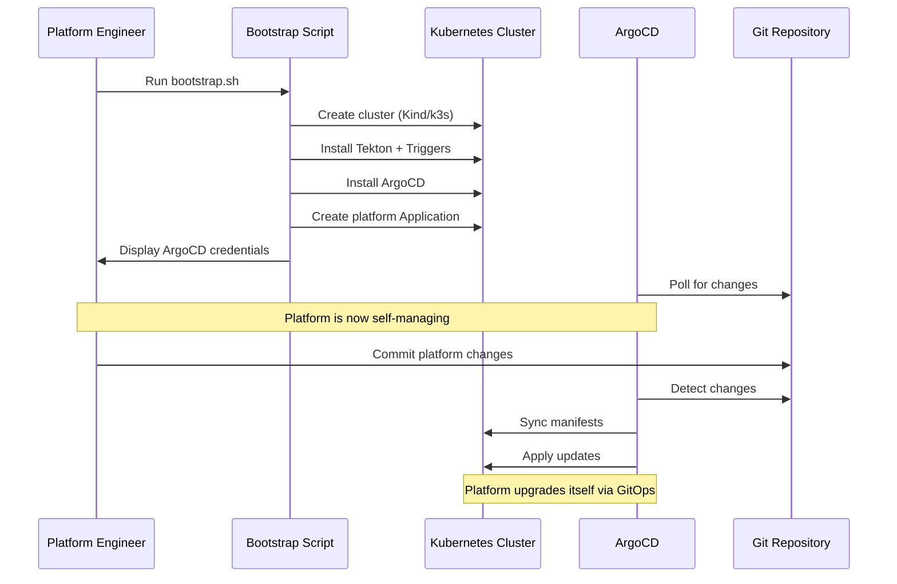
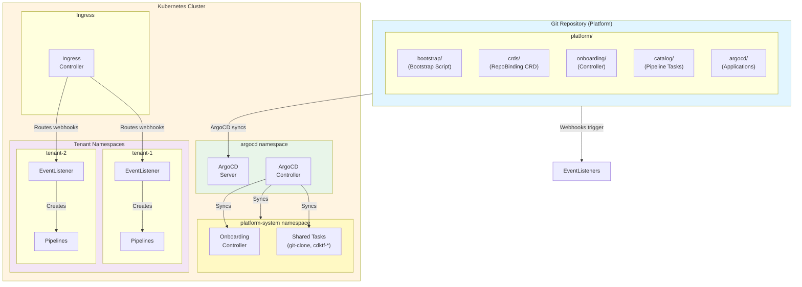
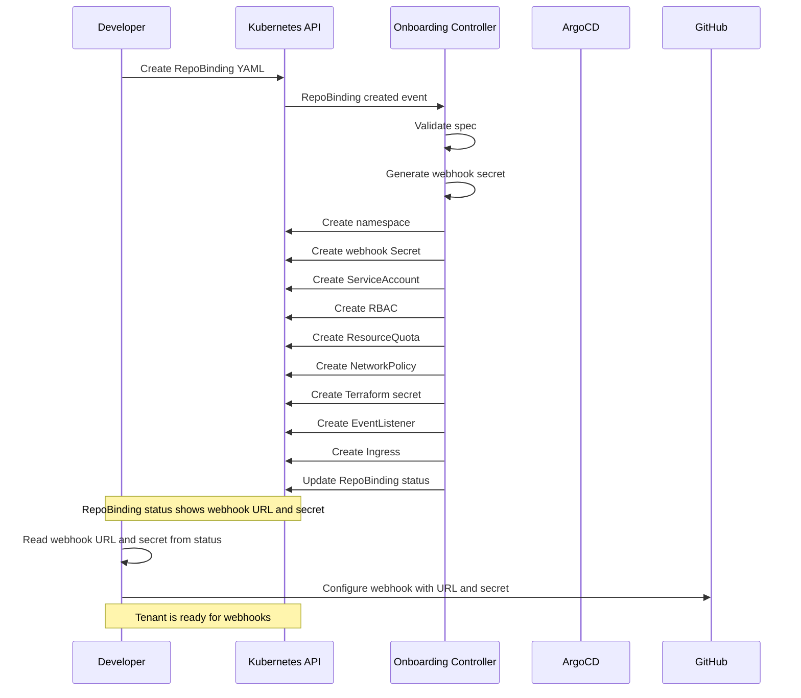

# Design Document: ArgoCD + Tekton GitOps Platform

## Overview

This document describes the design of a lightweight GitOps platform using ArgoCD and Tekton for homelab Kubernetes clusters. The platform provides self-service repository registration with automated tenant provisioning, CDKTF deployment pipelines, and self-upgrade capabilities through ArgoCD-based GitOps.

### Key Design Principles

1. **GitOps Native**: ArgoCD manages all platform components declaratively from Git
2. **Minimal Custom Code**: Leverage existing tools (ArgoCD, Tekton Triggers) instead of custom webhook handlers
3. **Single Bootstrap**: One script sets up everything, then ArgoCD takes over
4. **Tenant Isolation**: Strong RBAC, network, and resource isolation between tenants
5. **Webhook-Driven**: GitHub webhooks trigger pipelines via Tekton EventListeners

### Architecture Philosophy

The platform follows a **"Bootstrap Once, GitOps Forever"** pattern:



This eliminates custom upgrade pipelines. ArgoCD handles all platform synchronization from Git.

## Architecture

### High-Level Architecture



### Component Layers

The platform is organized into four layers:

1. **Bootstrap Layer**: One-time initialization script
2. **GitOps Layer**: ArgoCD manages all platform components
3. **Platform Services Layer**: Core services (Tekton, Onboarding Controller, Catalog)
4. **Tenant Layer**: User namespaces with EventListeners and Pipelines

## Components and Interfaces

### 1. Bootstrap Script

**Purpose**: One-time initialization of cluster and platform components

**Responsibilities**:
- Detect and clean up existing JenkinsX installations
- Create Kubernetes cluster (Kind for local, configurable for others)
- Install Tekton Pipelines and Tekton Triggers
- Install ArgoCD
- Create platform namespaces (argocd, tekton-pipelines, platform-system)
- Create platform ArgoCD Application
- Display ArgoCD credentials and access instructions

**Interface**:
```bash
./bootstrap.sh [OPTIONS]

Options:
  --cluster-name NAME    Name of the cluster (default: aphex-platform)
  --cluster-type TYPE    Type of cluster: kind, k3s, existing (default: kind)
  --repo-url URL         Platform repository URL (default: current repo)
  --cleanup-jenkinsx     Force cleanup of JenkinsX components (default: auto-detect)
  --skip-argocd-install  Skip ArgoCD installation (use existing)
```

**Cleanup Logic**:
```bash
# Detect JenkinsX
if kubectl get namespace jx &>/dev/null; then
  echo "Detected JenkinsX installation, cleaning up..."
  
  # Remove Lighthouse
  kubectl delete deployment lighthouse-webhooks -n jx --ignore-not-found
  kubectl delete deployment lighthouse-foghorn -n jx --ignore-not-found
  
  # Remove Jenkins X operators
  kubectl delete deployment jx-git-operator -n jx-git-operator --ignore-not-found
  
  # Remove namespaces
  kubectl delete namespace jx jx-git-operator jx-production jx-staging --ignore-not-found
  
  # Remove CRDs
  kubectl delete crd sourcerepositories.jenkins.io --ignore-not-found
  kubectl delete crd pipelineactivities.jenkins.io --ignore-not-found
  
  echo "JenkinsX cleanup complete"
fi
```

**Output**:
- Kubernetes cluster running
- Tekton Pipelines and Triggers installed
- ArgoCD installed and accessible
- Platform Application created and syncing
- ArgoCD admin password displayed
- Next steps instructions displayed

### 2. ArgoCD

**Purpose**: GitOps continuous delivery tool that manages platform components

**Installation**: Installed via kubectl during bootstrap

**Configuration**:
```yaml
# Applied from ArgoCD release manifests
# https://raw.githubusercontent.com/argoproj/argo-cd/stable/manifests/install.yaml

# Patch for insecure mode (homelab)
apiVersion: v1
kind: ConfigMap
metadata:
  name: argocd-cmd-params-cm
  namespace: argocd
data:
  server.insecure: "true"  # For homelab without TLS
```

**Access**:
- UI: `http://localhost:8080` (port-forward) or via Ingress
- CLI: `argocd login <server>`
- Initial admin password: Retrieved from Secret `argocd-initial-admin-secret`

**Components**:
- argocd-server: Web UI and API server
- argocd-application-controller: Syncs Applications from Git
- argocd-repo-server: Manages Git repository connections
- argocd-dex-server: SSO and authentication (optional)

### 3. Platform ArgoCD Applications (App of Apps Pattern)

**Purpose**: Manage all platform components via GitOps using the App of Apps pattern

**Architecture**: The platform uses a root Application that manages child Applications for each component layer.

**Root Application** (platform-root):
```yaml
apiVersion: argoproj.io/v1alpha1
kind: Application
metadata:
  name: platform-root
  namespace: argocd
  finalizers:
    - resources-finalizer.argocd.argoproj.io
spec:
  project: default
  source:
    repoURL: https://github.com/bdchatham/AphexPlatformInfrastructure
    targetRevision: main
    path: platform/argocd/apps
  destination:
    server: https://kubernetes.default.svc
    namespace: argocd
  syncPolicy:
    automated:
      prune: true
      selfHeal: true
    retry:
      limit: 5
      backoff:
        duration: 5s
        factor: 2
        maxDuration: 3m
```

**Child Applications**:

1. **platform-crds** (CRDs and foundational resources):
```yaml
apiVersion: argoproj.io/v1alpha1
kind: Application
metadata:
  name: platform-crds
  namespace: argocd
spec:
  project: default
  source:
    repoURL: https://github.com/bdchatham/AphexPlatformInfrastructure
    targetRevision: main
    path: platform/crds
  destination:
    server: https://kubernetes.default.svc
    namespace: platform-system
  syncPolicy:
    automated:
      prune: true
      selfHeal: true
    syncOptions:
      - CreateNamespace=true
```

2. **platform-infrastructure** (Namespaces, RBAC, base resources):
```yaml
apiVersion: argoproj.io/v1alpha1
kind: Application
metadata:
  name: platform-infrastructure
  namespace: argocd
spec:
  project: default
  source:
    repoURL: https://github.com/bdchatham/AphexPlatformInfrastructure
    targetRevision: main
    path: platform/infrastructure
  destination:
    server: https://kubernetes.default.svc
    namespace: platform-system
  syncPolicy:
    automated:
      prune: true
      selfHeal: true
    syncOptions:
      - CreateNamespace=true
```

3. **platform-controllers** (Onboarding controller):
```yaml
apiVersion: argoproj.io/v1alpha1
kind: Application
metadata:
  name: platform-controllers
  namespace: argocd
spec:
  project: default
  source:
    repoURL: https://github.com/bdchatham/AphexPlatformInfrastructure
    targetRevision: main
    path: platform/onboarding
  destination:
    server: https://kubernetes.default.svc
    namespace: platform-system
  syncPolicy:
    automated:
      prune: true
      selfHeal: true
```

4. **platform-catalog** (Tekton tasks, pipelines, triggers):
```yaml
apiVersion: argoproj.io/v1alpha1
kind: Application
metadata:
  name: platform-catalog
  namespace: argocd
spec:
  project: default
  source:
    repoURL: https://github.com/bdchatham/AphexPlatformInfrastructure
    targetRevision: main
    path: platform/catalog
  destination:
    server: https://kubernetes.default.svc
    namespace: platform-system
  syncPolicy:
    automated:
      prune: true
      selfHeal: true
```

**Sync Order**: ArgoCD automatically syncs Applications in dependency order:
1. platform-crds (CRDs must exist first)
2. platform-infrastructure (Namespaces and RBAC)
3. platform-controllers (Controllers depend on CRDs and infrastructure)
4. platform-catalog (Catalog depends on Tekton being installed)

**Benefits of App of Apps**:
- Independent lifecycle management for each component
- Clearer separation of concerns
- Easier troubleshooting (each Application has its own sync status)
- Can have different sync policies per component
- Better visibility in ArgoCD UI

### 4. Tekton Pipelines and Triggers

**Purpose**: Pipeline execution engine and webhook handling

**Installation**: Applied via kubectl during bootstrap

**Configuration**:
```yaml
# Tekton Pipelines
# https://github.com/tektoncd/pipeline/releases/download/v0.56.0/release.yaml

# Tekton Triggers
# https://github.com/tektoncd/triggers/releases/download/v0.25.0/release.yaml

# Tekton Dashboard (optional)
# https://github.com/tektoncd/dashboard/releases/download/v0.43.0/release.yaml
```

**Components**:
- tekton-pipelines-controller: Manages PipelineRun execution
- tekton-pipelines-webhook: Validates and mutates Tekton resources
- tekton-triggers-controller: Manages EventListeners and Triggers
- tekton-triggers-webhook: Validates Trigger resources
- tekton-dashboard: Web UI for pipeline visibility (optional)

### 5. Onboarding Controller

**Purpose**: Provision tenant resources based on RepoBinding CRs

**Installation**: Managed by ArgoCD from `platform/onboarding/`

**Resources**:
- Controller Deployment
- Controller ServiceAccount
- Controller ClusterRole and ClusterRoleBinding
- Tenant resource templates

**Controller Logic**:
1. Watch RepoBinding resources
2. Validate spec (org, repo, tenant name)
3. Generate webhook secret (cryptographically secure)
4. Create namespace with labels
5. Create service account and RBAC
6. Create ResourceQuota and LimitRange
7. Create NetworkPolicy
8. Create Terraform backend secret
9. Create EventListener for webhooks
10. Create Ingress for EventListener
11. Update RepoBinding status with webhook URL and secret

**Webhook Secret Management**:
- Secret generated using crypto/rand (e.g., `whsec_` + 32 random bytes base64)
- Stored in Secret: `webhook-<tenant-name>` in tenant namespace
- EventListener configured to validate using this secret
- Secret displayed in RepoBinding status for GitHub configuration

### 6. Tekton EventListener (Per Tenant)

**Purpose**: Receive GitHub webhooks and create PipelineRuns

**Created By**: Onboarding Controller when RepoBinding is created

**Definition**:
```yaml
apiVersion: triggers.tekton.dev/v1beta1
kind: EventListener
metadata:
  name: github-listener
  namespace: tenant-example
spec:
  serviceAccountName: pipeline-runner
  triggers:
    - name: github-push
      interceptors:
        - ref:
            name: github
          params:
            - name: secretRef
              value:
                secretName: webhook-tenant-example
                secretKey: secret
            - name: eventTypes
              value:
                - push
        - ref:
            name: cel
          params:
            - name: filter
              value: "body.ref == 'refs/heads/main'"
      bindings:
        - ref: github-push-binding
      template:
        ref: cdktf-deploy-trigger-template
```

**Service and Ingress**:
```yaml
# Service created automatically by EventListener
apiVersion: v1
kind: Service
metadata:
  name: el-github-listener
  namespace: tenant-example
spec:
  ports:
    - port: 8080
      targetPort: 8080
  selector:
    eventlistener: github-listener

---
# Ingress created by Onboarding Controller
apiVersion: networking.k8s.io/v1
kind: Ingress
metadata:
  name: github-webhook
  namespace: tenant-example
spec:
  rules:
    - host: webhooks.example.com
      http:
        paths:
          - path: /tenant-example
            pathType: Prefix
            backend:
              service:
                name: el-github-listener
                port:
                  number: 8080
```

### 7. Pipeline Catalog

**Purpose**: Provide shared Tekton Tasks and Pipelines

**Installation**: Managed by ArgoCD from `platform/catalog/`

**Resources**:
- git-clone Task
- cdktf-synth Task
- cdktf-deploy Task
- cdktf-deploy-pipeline Pipeline
- TriggerBindings and TriggerTemplates

**Configuration**:
```yaml
# Deployed to platform-system namespace
# Tasks are cluster-scoped (ClusterTask) for sharing across tenants
```

### 8. Tenant Provisioning Flow

**Pattern**: When a RepoBinding is created, the Onboarding Controller provisions all tenant resources.



## Data Models

### RepoBinding Custom Resource

```yaml
apiVersion: aphex/v1alpha1
kind: RepoBinding
metadata:
  name: example-repo-binding
  namespace: platform-system
spec:
  repoOrg: bdchatham
  repoName: example-repo
  tenantName: tenant-example-repo
  permissionProfile: standard  # or elevated
  ingressHost: webhooks.example.com  # Optional, defaults to cluster ingress
status:
  phase: Ready  # Pending, Provisioning, Ready, Failed
  message: "Tenant provisioned successfully. Configure webhook in GitHub."
  webhookURL: https://webhooks.example.com/tenant-example-repo
  webhookSecret: whsec_abc123xyz456  # Generated by controller
  namespaceCreated: true
  serviceAccountCreated: true
  rbacCreated: true
  quotasCreated: true
  networkPolicyCreated: true
  terraformSecretCreated: true
  eventListenerCreated: true
  ingressCreated: true
```

**Webhook Setup Instructions** (displayed in RepoBinding status):
```
Registration successful!

Next steps - Configure GitHub webhook:
1. Go to: https://github.com/bdchatham/example-repo/settings/hooks/new
2. Payload URL: https://webhooks.example.com/tenant-example-repo
3. Content type: application/json
4. Secret: whsec_abc123xyz456
5. Events: Push events, Pull request events
6. Active: ✓
7. Click "Add webhook"
```

### ArgoCD Application for Platform

```yaml
apiVersion: argoproj.io/v1alpha1
kind: Application
metadata:
  name: platform
  namespace: argocd
  finalizers:
    - resources-finalizer.argocd.argoproj.io
spec:
  project: default
  source:
    repoURL: https://github.com/bdchatham/AphexPlatformInfrastructure
    targetRevision: main
    path: platform
    directory:
      recurse: true
  destination:
    server: https://kubernetes.default.svc
    namespace: platform-system
  syncPolicy:
    automated:
      prune: true
      selfHeal: true
    syncOptions:
      - CreateNamespace=true
    retry:
      limit: 5
      backoff:
        duration: 5s
        factor: 2
        maxDuration: 3m
```

## Repository Structure

```
AphexPlatformInfrastructure/
├── platform/
│   ├── bootstrap/
│   │   ├── bootstrap.sh                     # Main bootstrap script
│   │   ├── namespace-platform-system.yaml   # Platform namespace
│   │   └── README.md                        # Bootstrap documentation
│   ├── argocd/
│   │   ├── apps/                            # App of Apps pattern
│   │   │   ├── platform-root.yaml           # Root Application
│   │   │   ├── platform-crds.yaml           # CRDs Application
│   │   │   ├── platform-infrastructure.yaml # Infrastructure Application
│   │   │   ├── platform-controllers.yaml    # Controllers Application
│   │   │   └── platform-catalog.yaml        # Catalog Application
│   │   └── argocd-cm-patch.yaml             # ArgoCD config patches
│   ├── crds/
│   │   ├── repobinding-crd.yaml             # RepoBinding CRD
│   │   └── example-repobinding.yaml         # Example usage
│   ├── infrastructure/
│   │   ├── namespaces/                      # Platform namespaces
│   │   └── rbac/                            # Platform RBAC
│   ├── onboarding/
│   │   ├── controller/                      # Go controller source
│   │   ├── controller-deployment.yaml       # Controller deployment
│   │   ├── controller-rbac.yaml             # Controller RBAC
│   │   └── controller-service-account.yaml  # Controller SA
│   ├── catalog/
│   │   ├── tasks/
│   │   │   ├── git-clone.yaml
│   │   │   ├── cdktf-synth.yaml
│   │   │   └── cdktf-deploy.yaml
│   │   ├── pipelines/
│   │   │   └── cdktf-deploy-pipeline.yaml
│   │   └── triggers/
│   │       ├── github-push-binding.yaml
│   │       └── cdktf-deploy-trigger-template.yaml
│   └── tenancy/
│       └── templates/                       # Tenant resource templates
│           ├── namespace-template.yaml
│           ├── serviceaccount-template.yaml
│           ├── role-*.yaml
│           ├── rolebinding-template.yaml
│           ├── resourcequota-template.yaml
│           ├── limitrange-template.yaml
│           ├── networkpolicy-template.yaml
│           ├── eventlistener-template.yaml
│           ├── ingress-template.yaml
│           └── terraform-secret-template.yaml
└── .kiro/
    └── docs/                                # Platform documentation
        ├── overview.md
        ├── architecture.md
        ├── operations.md
        ├── api.md
        ├── data-models.md
        └── faq.md
```

## Correctness Properties

*A property is a characteristic or behavior that should hold true across all valid executions of a system—essentially, a formal statement about what the system should do. Properties serve as the bridge between human-readable specifications and machine-verifiable correctness guarantees.*

### Property Reflection

After analyzing all acceptance criteria, I identified several redundant properties that can be consolidated:

**Redundancies Eliminated:**
- Requirements 4.1, 4.3, 4.5 are redundant with 3.5, 2.6, 3.6
- Requirements 7.1, 7.5 are redundant with 6.1, 7.2
- Requirements 9.4, 9.5 are redundant with 6.8, 8.1
- Requirements 11.2, 11.3 are redundant with 6.2, 9.1
- Requirements 12.2 is redundant with 2.5
- Requirements 17.2, 17.5 are redundant with 6.7, 6.8
- Requirements 18.2 is redundant with 3.5

**Combined Properties:**
- Webhook secret generation (6.2, 9.1, 11.3) → Single property about cryptographic secret generation
- Tenant namespace creation (6.1, 7.1) → Single property about namespace provisioning
- RepoBinding status updates (6.8, 9.4, 17.5) → Single property about status completeness

This reflection ensures each property provides unique validation value without logical redundancy.

### Property 1: JenkinsX Detection
*For any* Kubernetes cluster, if JenkinsX namespaces (jx, jx-git-operator) exist, the bootstrap script should detect them before proceeding with cleanup.
**Validates: Requirements 1.1**

### Property 2: JenkinsX Component Removal
*For any* cluster with JenkinsX components, running cleanup should remove all Lighthouse deployments, Jenkins X operators, and related resources.
**Validates: Requirements 1.2**

### Property 3: Tekton Preservation During Cleanup
*For any* cluster with existing Tekton Pipelines installation, running JenkinsX cleanup should preserve all Tekton resources.
**Validates: Requirements 1.3**

### Property 4: JenkinsX Namespace Cleanup
*For any* cluster with JenkinsX namespaces (jx, jx-git-operator, jx-production, jx-staging), running cleanup should remove all these namespaces.
**Validates: Requirements 1.4**

### Property 5: JenkinsX CRD Cleanup
*For any* cluster with JenkinsX CRDs (sourcerepositories.jenkins.io, pipelineactivities.jenkins.io), running cleanup should remove these CRDs.
**Validates: Requirements 1.5**

### Property 6: Platform Application Existence
*For any* successful bootstrap execution, an ArgoCD Application named "platform" should exist in the argocd namespace pointing to the platform repository.
**Validates: Requirements 2.1, 3.5, 4.1**

### Property 7: GitOps Sync on Commit
*For any* commit to the platform repository, ArgoCD should detect the change and sync the platform Application within the polling interval.
**Validates: Requirements 2.2, 2.6, 4.3**

### Property 8: Platform Manifest Management
*For any* platform component (CRDs, controllers, catalog), the corresponding Kubernetes manifest should exist in the platform/ directory in Git and be managed by the platform Application.
**Validates: Requirements 2.3, 4.4, 5.1, 5.2, 5.3, 5.4**

### Property 9: Git as Source of Truth
*For any* platform component, its configuration should be defined in Git with no cluster-specific state except secrets.
**Validates: Requirements 2.5, 12.2**

### Property 10: Automated Sync Policy
*For any* platform Application, the syncPolicy should have automated sync, self-heal, and prune enabled.
**Validates: Requirements 2.6, 18.3**

### Property 11: Cluster Creation
*For any* bootstrap execution with cluster-type parameter, a Kubernetes cluster of that type should be created and accessible via kubectl.
**Validates: Requirements 3.1**

### Property 12: Tekton Installation
*For any* successful bootstrap execution, Tekton Pipelines and Tekton Triggers should be installed with all controllers running.
**Validates: Requirements 3.2**

### Property 13: ArgoCD Installation
*For any* successful bootstrap execution, ArgoCD should be installed with the server, controller, and repo-server running.
**Validates: Requirements 3.3**

### Property 14: Platform Namespace Creation
*For any* successful bootstrap execution, the namespaces argocd, tekton-pipelines, and platform-system should exist.
**Validates: Requirements 3.4**

### Property 15: Tenant Namespace Provisioning
*For any* valid RepoBinding resource, the Onboarding Controller should create a namespace with the specified tenant name.
**Validates: Requirements 6.1, 7.1**

### Property 16: Webhook Secret Generation
*For any* RepoBinding, the Onboarding Controller should generate a cryptographically secure webhook secret (whsec_ prefix + 32 random bytes) and store it in a Kubernetes Secret.
**Validates: Requirements 6.2, 9.1, 9.2, 11.2, 11.3**

### Property 17: Service Account and RBAC Creation
*For any* provisioned tenant, a service account named "pipeline-runner" should exist with Role and RoleBinding matching the specified permission profile.
**Validates: Requirements 6.3**

### Property 18: Resource Quota Creation
*For any* provisioned tenant, ResourceQuota and LimitRange resources should exist in the tenant namespace.
**Validates: Requirements 6.4**

### Property 19: Network Policy Creation
*For any* provisioned tenant, a NetworkPolicy should exist that denies ingress from other tenant namespaces.
**Validates: Requirements 6.5**

### Property 20: EventListener Creation
*For any* provisioned tenant, a Tekton EventListener should exist in the tenant namespace configured to validate webhooks using the tenant's webhook secret.
**Validates: Requirements 6.6, 9.3**

### Property 21: Ingress Creation
*For any* provisioned tenant, an Ingress resource should exist routing webhooks to the tenant's EventListener.
**Validates: Requirements 6.7, 17.1, 17.2**

### Property 22: RepoBinding Status Completeness
*For any* successfully provisioned tenant, the RepoBinding status should contain webhookURL, webhookSecret, and all resource creation flags set to true.
**Validates: Requirements 6.8, 9.4, 17.5**

### Property 23: Cross-Tenant RBAC Isolation
*For any* two distinct tenants A and B, the service account in tenant A should not be able to list, get, create, update, or delete resources in tenant B's namespace.
**Validates: Requirements 7.2, 7.5**

### Property 24: Cross-Tenant Network Isolation
*For any* two distinct tenants A and B, pods in tenant A should not be able to establish network connections to pods in tenant B.
**Validates: Requirements 7.3**

### Property 25: Resource Quota Enforcement
*For any* tenant with a ResourceQuota, attempting to create resources exceeding the quota should be rejected by Kubernetes with a quota exceeded error.
**Validates: Requirements 7.4**

### Property 26: Webhook Signature Validation
*For any* webhook received at an EventListener, if the signature is valid, a PipelineRun should be created; if invalid, the request should be rejected with 401 Unauthorized.
**Validates: Requirements 8.1, 9.5, 9.6**

### Property 27: Webhook to PipelineRun Creation
*For any* valid webhook received at a tenant EventListener, a PipelineRun should be created in the tenant namespace with parameters from the webhook payload.
**Validates: Requirements 8.2**

### Property 28: Git Clone at Commit SHA
*For any* PipelineRun triggered by a webhook, the git-clone task should clone the repository at the exact commit SHA from the webhook payload.
**Validates: Requirements 8.3**

### Property 29: CDKTF Synth Execution
*For any* PipelineRun, the cdktf-synth task should execute successfully and produce Terraform configuration files in the workspace.
**Validates: Requirements 8.4**

### Property 30: CDKTF Deploy Execution
*For any* PipelineRun with successful synth, the cdktf-deploy task should execute and apply infrastructure changes.
**Validates: Requirements 8.5**

### Property 31: Terraform State Persistence
*For any* CDKTF deployment, the Terraform state should be stored in the Kubernetes backend and be retrievable for subsequent deployments.
**Validates: Requirements 8.6**

### Property 32: Pipeline Execution Logging
*For any* PipelineRun, all task logs should be stored in Kubernetes and be retrievable via kubectl logs.
**Validates: Requirements 10.3**

### Property 33: PipelineRun Failure Reporting
*For any* PipelineRun that fails, the PipelineRun status should contain a failure message and the failed task name.
**Validates: Requirements 10.4**

### Property 34: ArgoCD Sync Failure Reporting
*For any* ArgoCD Application sync that fails, the Application status should contain an error message describing the failure.
**Validates: Requirements 10.5**

### Property 35: Kubernetes Event Generation
*For any* significant component state change (pod crash, sync failure, controller error), a Kubernetes event should be created.
**Validates: Requirements 10.6**

### Property 36: No Secrets in Git
*For any* file in the Git repository, it should not contain Kubernetes Secret data, API keys, passwords, or other sensitive credentials.
**Validates: Requirements 11.1**

### Property 37: Tenant Secret Isolation
*For any* tenant secret, it should only be accessible to service accounts within that tenant's namespace.
**Validates: Requirements 11.5**

### Property 38: Disaster Recovery via Bootstrap
*For any* cluster that is destroyed, running bootstrap on a new cluster should restore all platform components to a working state.
**Validates: Requirements 12.1**

### Property 39: ArgoCD Auto-Sync After Bootstrap
*For any* successful bootstrap execution, ArgoCD should automatically sync all platform components without manual intervention.
**Validates: Requirements 12.4**

### Property 40: RepoBinding Idempotency
*For any* RepoBinding, applying it multiple times should result in the same tenant state (idempotent provisioning).
**Validates: Requirements 12.5**

### Property 41: Graceful Component Upgrades
*For any* component version change in Git, ArgoCD should perform a rolling update without downtime for stateless components.
**Validates: Requirements 15.2**

### Property 42: Rollback via Git Revert
*For any* Git commit that is reverted, ArgoCD should sync the rollback and restore the previous component state.
**Validates: Requirements 15.5**

### Property 43: Ingress Webhook Routing
*For any* webhook sent to a tenant's ingress path, the request should be routed to the correct tenant EventListener based on the path.
**Validates: Requirements 17.3**

### Property 44: Sync Wave Ordering
*For any* platform Application sync, resources should be applied in sync wave order (CRDs → namespaces → controllers → catalog).
**Validates: Requirements 18.4**

## Error Handling

### Bootstrap Failures
- **Cluster Creation**: Script exits with error message if cluster creation fails
- **Component Installation**: Script exits with error message if any component fails to install
- **Readiness Checks**: Script waits for components to be ready with timeout (5 minutes)
- **JenkinsX Cleanup**: Script logs cleanup actions and continues if some resources don't exist
- **Recovery**: User can re-run bootstrap script after fixing issues

### ArgoCD Sync Failures
- **Invalid Manifests**: ArgoCD reports sync error in Application status with YAML validation errors
- **Resource Conflicts**: ArgoCD reports conflict errors and allows manual resolution
- **Timeout**: ArgoCD retries sync with exponential backoff (configurable)
- **Manual Intervention**: User can manually sync via UI or CLI after fixing issues

### Onboarding Controller Failures
- **Validation Errors**: Invalid RepoBinding specs rejected with clear error messages in status
- **Provisioning Failures**: Partial provisioning rolled back, status updated with failure reason
- **Webhook Secret Generation**: Failures logged, RepoBinding status set to "Failed"
- **Ingress Creation Failures**: Retried with exponential backoff, status updated on persistent failure

### EventListener Webhook Failures
- **Invalid Signature**: Webhook rejected with 401 Unauthorized, logged for debugging
- **Invalid Payload**: Webhook rejected with 400 Bad Request, error details in response
- **PipelineRun Creation Failure**: Error logged, webhook returns 500 Internal Server Error
- **Retry**: GitHub automatically retries failed webhooks with exponential backoff

### Pipeline Execution Failures
- **Git Clone Failure**: PipelineRun fails, logs show git error (auth, network, invalid SHA)
- **CDKTF Synth Failure**: Task fails, logs show cdktf error (syntax, missing dependencies)
- **CDKTF Deploy Failure**: Task fails, Terraform state preserved for debugging
- **Notification**: PipelineRun status visible in Tekton Dashboard and kubectl

## Testing Strategy

### Unit Tests
- **Onboarding Controller**: Test RepoBinding validation, resource template rendering, webhook secret generation
- **Bootstrap Script**: Test cluster detection, component installation checks, cleanup logic
- **Webhook Secret Generation**: Test cryptographic randomness, format validation, uniqueness

### Integration Tests
- **Bootstrap Process**: Run bootstrap, verify all components ready and ArgoCD syncing
- **JenkinsX Cleanup**: Install JenkinsX, run bootstrap, verify cleanup complete
- **Onboarding Flow**: Create RepoBinding, verify all tenant resources provisioned
- **Webhook Flow**: Send test webhook, verify PipelineRun created with correct parameters
- **ArgoCD Sync**: Commit manifest change, verify ArgoCD syncs within polling interval
- **RBAC Isolation**: Attempt cross-tenant access, verify denial
- **Network Isolation**: Attempt cross-tenant connection, verify blocked

### Property-Based Tests
- **Property tests should run minimum 100 iterations** due to randomization
- Each property test must reference its design document property
- Tag format: **Feature: argocd-tekton-platform, Property {number}: {property_text}**

**Property Test Examples**:
- Generate random valid RepoBindings, verify namespace creation (Property 15)
- Generate random webhook payloads, verify signature validation (Property 26)
- Generate random tenant pairs, verify RBAC isolation (Property 23)
- Generate random Git commits, verify ArgoCD sync (Property 7)
- Generate random webhook secrets, verify cryptographic properties (Property 16)

### End-to-End Tests
- **Bootstrap to Running Platform**: Run bootstrap, verify all components healthy and syncing
- **Platform Self-Upgrade**: Commit change to platform/, verify ArgoCD syncs automatically
- **Repository Registration to Pipeline**: Register repo, configure webhook, trigger pipeline, verify deployment
- **Disaster Recovery**: Destroy cluster, bootstrap new cluster, verify platform restored
- **Upgrade**: Change component version in Git, verify rolling update via ArgoCD
- **Rollback**: Revert Git commit, verify ArgoCD rolls back changes

### Manual Tests
- **Bootstrap Experience**: Verify bootstrap script is intuitive and provides clear output
- **ArgoCD UI**: Verify UI shows Application sync status and resource health
- **Webhook Configuration**: Verify RepoBinding status provides clear webhook setup instructions
- **Tekton Dashboard**: Verify dashboard shows PipelineRuns and logs
- **kubectl Experience**: Verify kubectl commands work for troubleshooting

## Source

- `.kiro/specs/argocd-tekton-platform/requirements.md` - Requirements document
- `.kiro/specs/argocd-tekton-platform/design.md` - This design document
- ArgoCD documentation: https://argo-cd.readthedocs.io/
- Tekton documentation: https://tekton.dev/docs/
- Tekton Triggers documentation: https://tekton.dev/docs/triggers/

