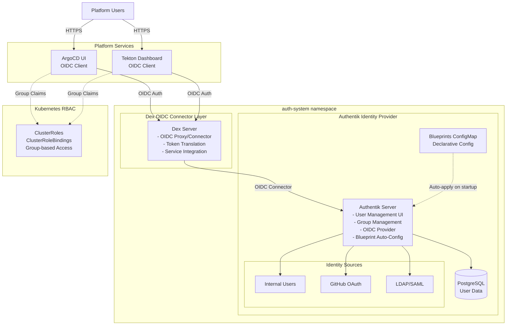
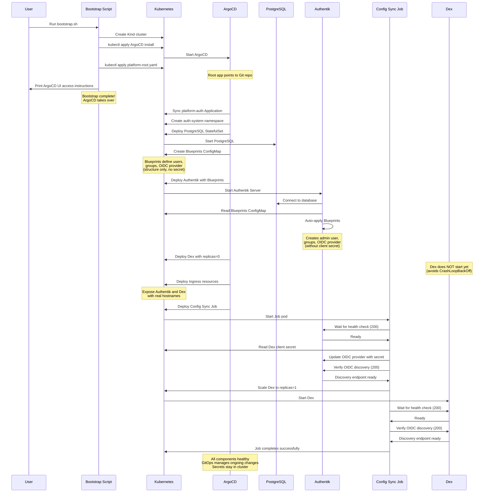
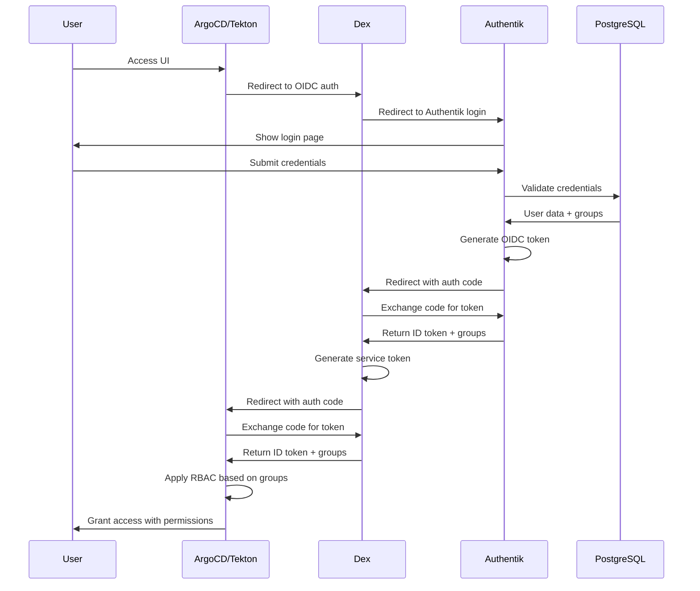
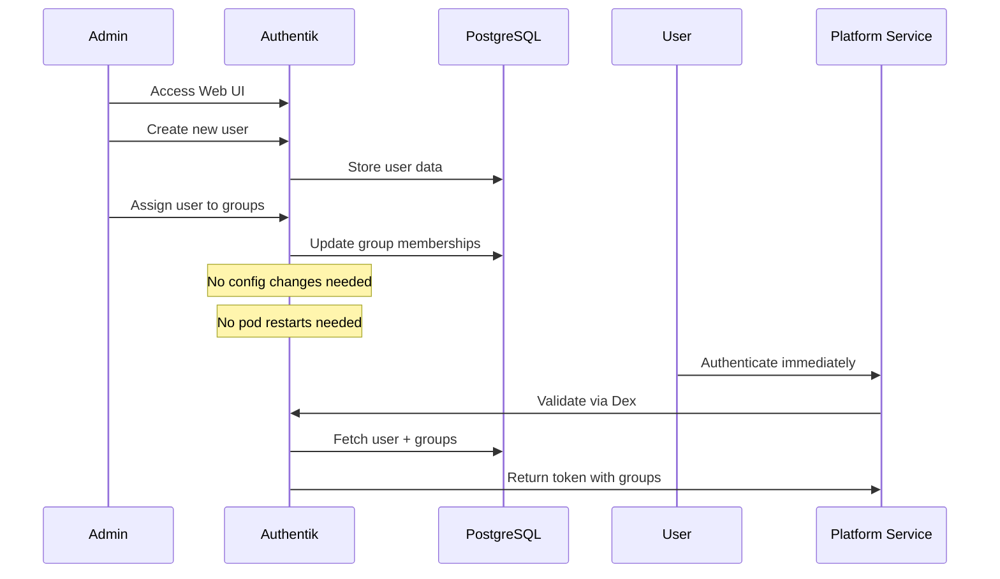

# Design Document: Dex Authentication Platform

## Overview

This design implements a centralized authentication and authorization system for the Arbiter Pipeline Infrastructure platform using Authentik as the primary Identity Provider (IdP) with Dex as an OIDC connector layer. The system integrates with ArgoCD and Tekton Dashboard to provide secure, role-based access to platform services. The implementation follows the existing GitOps patterns where bootstrap scripts handle initial deployment and ArgoCD manages ongoing configuration.

The authentication system provides:
- Self-hosted identity management with web UI through Authentik
- Automated initial configuration using Authentik Blueprints (no manual UI steps)
- User and group management via web UI after initial setup
- OIDC connector layer through Dex for platform service integration
- Support for external identity providers (GitHub OAuth) via Authentik
- OIDC-based authentication for ArgoCD and Tekton Dashboard
- Role-based access control (RBAC) with admin and engineer roles
- GitOps-managed configuration with automatic synchronization
- Secure secret management for credentials

**Architecture Philosophy:**
- Authentik provides the user-facing IdP with web UI for self-service user management
- Authentik Blueprints enable declarative, automated configuration from Git
- Kubernetes Jobs handle imperative cross-system orchestration (Authentik ↔ Dex secret negotiation)
- Dex acts as an OIDC proxy/connector between Authentik and platform services
- This separation allows easy addition of new services without reconfiguring Authentik
- Platform services only need to integrate with Dex (single OIDC endpoint)
- Services are exposed via Ingress with local hostnames for home network access
- Secrets never leave the cluster or enter Git
- Bootstrap never prints secrets by default (optional `--show-secrets` flag for debugging)

**Bootstrap and GitOps Philosophy:**

The system follows a clean separation between three domains:

1. **Host Bootstrap (Out-of-Cluster):**
   - Creates or selects the Kubernetes cluster
   - Installs ArgoCD (the only kubectl apply in bootstrap)
   - Creates the root ArgoCD Application pointing to Git
   - Generates and creates ALL secrets (PostgreSQL, Authentik, Dex)
   - **Exception: Waits for Authentik (deployed by ArgoCD) to create API token**
   - Provides developer UX (printing access instructions, checking prerequisites)
   - **Does NOT** deploy application workloads directly

2. **GitOps (ArgoCD-Managed):**
   - Owns ALL declarative infrastructure after bootstrap
   - Manages Tekton Pipelines, Triggers, and Dashboard
   - Manages namespaces (argocd, tekton-pipelines, auth-system, platform-system)
   - Manages auth-system components (PostgreSQL, Redis, Authentik, Dex, Ingress)
   - Manages RBAC policies and service integrations
   - Provides idempotent, drift-correcting, repeatable deployments
   - **Bootstrap creates ArgoCD Applications; ArgoCD applies manifests**

3. **In-Cluster Jobs (Imperative API Configuration):**
   - Config Sync Job orchestrates Authentik ↔ Dex integration
   - Reads secrets from Kubernetes (never leaves cluster)
   - Updates Authentik OIDC provider via API
   - Scales Dex deployment after Authentik is configured
   - **Only used for imperative mutation against non-Kubernetes APIs**

**Key Principle:** Bootstrap gets you from zero → ArgoCD running. ArgoCD gets you from ArgoCD → complete platform. Jobs handle one-time API-driven configuration that can't be expressed as Kubernetes manifests.

**Bootstrap Exception (Authentik API Token):**

Bootstrap makes ONE exception to the "no waiting for apps" rule: it waits for Authentik to be ready (deployed by ArgoCD) in order to create the Authentik API token via API. This is the ONLY bootstrap → application interaction and is explicitly documented as an exception. The token is required for the Config Sync Job to run, enabling zero-touch convergence. Without this exception, manual UI steps would be required.

## Architecture

### System Components

The authentication system consists of the following components:



### Component Responsibilities

**Authentik Server:**
- Provides web UI for user and group management
- Manages user authentication and sessions
- Issues OIDC tokens for authenticated users
- Integrates with external identity providers (GitHub, LDAP, SAML)
- Stores user data in PostgreSQL database
- Auto-applies Blueprint configurations on startup
- Provides admin interface for configuration

**Authentik Blueprints:**
- Declarative YAML configuration for Authentik
- Defines initial users, groups, OIDC providers, and applications
- Mounted as Kubernetes ConfigMap
- Auto-applied by Authentik on startup
- Enables fully automated bootstrap without manual UI steps
- Version-controlled in Git for GitOps workflow
- Note: Blueprints create OIDC provider structure; Job updates client secret

**Kubernetes Configuration Job:**
- Runs in-cluster after Authentik and Dex are deployed
- Reads Dex client secret from Kubernetes Secret
- Updates Authentik OIDC provider with client secret via Authentik API
- Triggers Dex rollout to pick up configuration changes
- Idempotent and re-runnable for safe retries
- Uses dedicated ServiceAccount with minimal RBAC permissions
- Eliminates need for port-forwarding or exposing secrets outside cluster

**PostgreSQL Database:**
- Stores Authentik user accounts and groups
- Stores authentication sessions and tokens
- Stores Authentik configuration and policies
- Deployed as StatefulSet with persistent storage

**Dex OIDC Connector:**
- Acts as OIDC proxy between Authentik and platform services
- Translates Authentik OIDC tokens to service-specific tokens
- Provides stable OIDC endpoint for platform services
- Simplifies service integration (services only configure Dex)
- Stores minimal state in Kubernetes resources (Secrets/ConfigMaps via kubernetes storage backend)

**ArgoCD OIDC Integration:**
- Redirects unauthenticated users to Dex login
- Dex redirects to Authentik for authentication
- Validates OIDC tokens from Dex
- Maps OIDC groups to ArgoCD RBAC policies
- Enforces application and project access based on roles
- No additional proxy needed (handles redirects directly)

**Tekton Dashboard OIDC Integration:**
- Redirects unauthenticated users to Dex login
- Dex redirects to Authentik for authentication
- Validates OIDC tokens from Dex
- Enforces namespace-based access control
- Restricts pipeline operations based on user groups
- No additional proxy needed (handles redirects directly)

### External URLs and Redirect URIs

**Critical OIDC Requirement:**
Redirect URIs must be reachable by the user's browser, not just by pods. Internal Kubernetes DNS names like `*.svc.cluster.local` are NOT reachable from user browsers and will cause authentication failures.

**Homelab Deployment Strategy:**

This design targets homelab environments where services are accessed from the home network. The system uses real hostnames with Ingress resources to expose services:

**Hostname Configuration:**
- Authentik: `https://auth.home.local` (or your chosen domain)
- Dex: `https://dex.home.local`
- ArgoCD: `https://argocd.home.local`
- Tekton Dashboard: `https://tekton.home.local`

**DNS Setup Options:**
1. **Local DNS Server**: Configure your home router or Pi-hole to resolve `*.home.local` to your cluster's Ingress IP
2. **Hosts File**: Add entries to `/etc/hosts` on each device that needs access
3. **mDNS/Avahi**: Use `.local` domain with mDNS for automatic discovery

**Ingress Requirements:**
- Ingress controller must be deployed (e.g., nginx-ingress, traefik)
- TLS certificates can be self-signed for homelab (users accept certificate warnings)
- Or use Let's Encrypt with DNS-01 challenge for valid certificates

**URL Configuration Rules:**
- **Issuer URLs**: Must use the external hostname (e.g., `https://dex.home.local`)
- **Redirect URIs**: Must use the external hostname (e.g., `https://argocd.home.local/auth/callback`)
- **Internal pod-to-pod communication**: Can use `*.svc.cluster.local` for token validation
- **Browser-facing URLs**: Must NEVER use `*.svc.cluster.local`

**Example Correct Configuration:**
```yaml
# Dex issuer (browser-facing)
issuer: https://dex.home.local

# ArgoCD redirect URI (browser-facing)
redirectURIs:
  - https://argocd.home.local/auth/callback

# Authentik OIDC provider redirect URI (browser-facing)
redirect_uris: |
  https://dex.home.local/callback

# Internal token validation (pod-to-pod, optional)
# Services can use internal DNS for direct API calls
# But issuer and redirects must use external URLs
```

**Common Mistakes to Avoid:**
- ❌ Using `http://dex.auth-system.svc.cluster.local:5556` as issuer (browser can't reach it)
- ❌ Using `http://localhost:8080` in Dex config (only works with port-forward, not for home network access)
- ❌ Mixing internal and external URLs (causes redirect loops and 404s)
- ✅ Using consistent external hostnames across all browser-facing URLs
- ✅ Using HTTPS with valid or accepted certificates
- ✅ Ensuring all family members' devices can resolve the hostnames

### Data Flow

**Initial Setup Flow (Bootstrap → GitOps → Jobs):**



**Authentication Flow:**



**User Management Flow:**



## Components and Interfaces

### PostgreSQL Database

**StatefulSet Specification:**
- Namespace: `auth-system`
- Image: `postgres:15-alpine`
- Replicas: 1 (sufficient for homelab)
- Resource Requests: 250m CPU, 256Mi memory
- Resource Limits: 1000m CPU, 512Mi memory
- Persistent Volume: 10Gi for database storage

**Service Specification:**
- Type: ClusterIP
- Port: 5432
- DNS Name: `postgresql.auth-system.svc.cluster.local`

**Secret Management:**
- Database credentials stored in Kubernetes Secret
- Secret name: `authentik-postgresql`
- Keys: `postgresql-password`, `postgresql-postgres-password`

### Authentik Deployment

**Deployment Specification:**
- Namespace: `auth-system`
- Image: `ghcr.io/goauthentik/server:2024.2.2`
- Replicas: 1 (can scale for production)
- Resource Requests: 500m CPU, 512Mi memory
- Resource Limits: 2000m CPU, 2Gi memory
- Liveness Probe: HTTP GET /api/v3/root/config/ on port 9000
- Readiness Probe: HTTP GET /api/v3/root/config/ on port 9000

**Worker Deployment:**
- Separate deployment for background tasks
- Same image as server
- Command: `worker`
- Resource Requests: 250m CPU, 256Mi memory

**Service Specification:**
- Type: ClusterIP
- Port: 9000 (HTTP), 9443 (HTTPS)
- DNS Name: `authentik.auth-system.svc.cluster.local`

**Environment Configuration:**
```yaml
env:
  - name: AUTHENTIK_SECRET_KEY
    valueFrom:
      secretKeyRef:
        name: authentik-secrets
        key: secret-key
  - name: AUTHENTIK_POSTGRESQL__HOST
    value: postgresql.auth-system.svc.cluster.local
  - name: AUTHENTIK_POSTGRESQL__NAME
    value: authentik
  - name: AUTHENTIK_POSTGRESQL__USER
    value: authentik
  - name: AUTHENTIK_POSTGRESQL__PASSWORD
    valueFrom:
      secretKeyRef:
        name: authentik-postgresql
        key: postgresql-password
  - name: AUTHENTIK_ERROR_REPORTING__ENABLED
    value: "false"
  - name: AUTHENTIK_LOG_LEVEL
    value: info
  - name: AUTHENTIK_BLUEPRINTS__ENABLED
    value: "true"
```

**Blueprint Configuration:**
- Blueprints mounted as ConfigMap volume at `/blueprints/custom/`
- Authentik auto-discovers and applies blueprints on startup
- Blueprints define users, groups, OIDC providers, applications
- No manual UI configuration required

### Redis Cache (Optional but Recommended)

**Deployment Specification:**
- Namespace: `auth-system`
- Image: `redis:7-alpine`
- Replicas: 1
- Resource Requests: 100m CPU, 128Mi memory
- Resource Limits: 500m CPU, 256Mi memory

**Service Specification:**
- Type: ClusterIP
- Port: 6379
- DNS Name: `redis.auth-system.svc.cluster.local`

### Dex Deployment

**Deployment Specification:**
- Namespace: `auth-system`
- Image: `ghcr.io/dexidp/dex:v2.37.0`
- Replicas: 1
- Resource Requests: 100m CPU, 128Mi memory
- Resource Limits: 500m CPU, 256Mi memory
- Liveness Probe: HTTP GET /healthz on port 5556
- Readiness Probe: HTTP GET /healthz on port 5556

**Service Specification:**
- Type: ClusterIP
- Port: 5556
- DNS Name: `dex.auth-system.svc.cluster.local`

**ServiceAccount:**
- Name: `dex`
- Namespace: `auth-system`
- ClusterRole: Permissions to manage Dex CRDs

### Ingress Resources

**Purpose:**
Expose Authentik and Dex to the home network with real hostnames that user browsers can reach.

**Authentik Ingress:**
```yaml
apiVersion: networking.k8s.io/v1
kind: Ingress
metadata:
  name: authentik
  namespace: auth-system
  annotations:
    cert-manager.io/cluster-issuer: "selfsigned-issuer"  # Or letsencrypt-dns
spec:
  ingressClassName: nginx  # Or traefik, depending on your ingress controller
  tls:
    - hosts:
        - auth.home.local
      secretName: authentik-tls
  rules:
    - host: auth.home.local
      http:
        paths:
          - path: /
            pathType: Prefix
            backend:
              service:
                name: authentik
                port:
                  number: 9000
```

**Dex Ingress:**
```yaml
apiVersion: networking.k8s.io/v1
kind: Ingress
metadata:
  name: dex
  namespace: auth-system
  annotations:
    cert-manager.io/cluster-issuer: "selfsigned-issuer"  # Or letsencrypt-dns
spec:
  ingressClassName: nginx  # Or traefik, depending on your ingress controller
  tls:
    - hosts:
        - dex.home.local
      secretName: dex-tls
  rules:
    - host: dex.home.local
      http:
        paths:
          - path: /
            pathType: Prefix
            backend:
              service:
                name: dex
                port:
                  number: 5556
```

**TLS Certificate Options:**

1. **Self-Signed Certificates (Simplest for homelab):**
   - Use cert-manager with selfsigned ClusterIssuer
   - Users accept certificate warnings in browser
   - No external dependencies

2. **Let's Encrypt with DNS-01 Challenge:**
   - Use cert-manager with letsencrypt ClusterIssuer
   - Requires DNS provider API access (e.g., Cloudflare, Route53)
   - Provides valid, trusted certificates
   - Works even if cluster is not publicly accessible

**DNS Configuration:**

Users must configure DNS so that `*.home.local` resolves to the Ingress controller's IP:

1. **Router/Pi-hole DNS:**
   - Add A records: `auth.home.local`, `dex.home.local`, `argocd.home.local`, `tekton.home.local`
   - Point all to Ingress controller LoadBalancer IP or NodePort IP

2. **Hosts File (Alternative):**
   - Add to `/etc/hosts` on each device:
     ```
     192.168.1.100 auth.home.local
     192.168.1.100 dex.home.local
     192.168.1.100 argocd.home.local
     192.168.1.100 tekton.home.local
     ```
   - Replace `192.168.1.100` with actual Ingress IP

3. **mDNS/Avahi (Alternative):**
   - Use `.local` domain with mDNS for automatic discovery
   - Works on macOS, Linux with Avahi, Windows with Bonjour

**Ingress Controller Requirements:**
- Must be deployed before auth system (e.g., `kubectl apply -f https://raw.githubusercontent.com/kubernetes/ingress-nginx/main/deploy/static/provider/kind/deploy.yaml`)
- Must have LoadBalancer or NodePort service accessible from home network
- Must support TLS termination

### Configuration Sync Job

**Approach:**
Uses a Kubernetes Job to orchestrate cross-system configuration between Authentik and Dex. This provides deterministic, observable, and retryable convergence without relying on timing-based hacks like "sleep 45 seconds".

**Why a Job Instead of Blueprint-Only:**
- **Deterministic**: Job waits for Authentik readiness before proceeding
- **Observable**: Job status shows success/failure clearly in Kubernetes
- **Retryable**: Failed jobs can be re-run safely (idempotent operations)
- **No timing hacks**: No arbitrary sleep periods hoping things converge
- **Auditable**: Job logs show exactly what configuration was applied
- **Avoids CrashLoopBackOff**: Dex doesn't start until Authentik is properly configured

**Job Responsibilities:**
1. Wait for Authentik to be ready (health check endpoint returns 200)
2. Verify Authentik OIDC provider/application exists (created by Blueprint)
3. Read Dex client secret from Kubernetes Secret
4. Update Authentik OIDC provider with client secret via Authentik API
5. Verify Authentik OIDC discovery endpoint returns 200
6. Scale Dex deployment to 1 replica (starts Dex now that Authentik is ready)
7. Verify Dex can connect to Authentik (Dex discovery endpoint returns 200)

**Job Specification:**
```yaml
apiVersion: batch/v1
kind: Job
metadata:
  name: auth-config-sync
  namespace: auth-system
spec:
  backoffLimit: 3
  template:
    spec:
      serviceAccountName: auth-config-sync
      restartPolicy: OnFailure
      containers:
        - name: config-sync
          image: bitnami/kubectl:latest  # Includes kubectl, curl, and sh
          command: ["/bin/sh", "-c"]
          args:
            - |
              set -e
              
              echo "Waiting for Authentik to be ready..."
              until curl -f http://authentik.auth-system.svc.cluster.local:9000/api/v3/root/config/; do
                echo "Authentik not ready, waiting..."
                sleep 5
              done
              echo "Authentik is ready"
              
              echo "Reading Dex client secret..."
              DEX_SECRET=$(cat /secrets/dex-client-secret)
              
              echo "Looking up Authentik OIDC provider..."
              # Lookup provider by name, client_id, and redirect_uris
              # Fail if not exactly 1 match (prevents ambiguity)
              PROVIDER_ID=$(curl -s \
                -H "Authorization: Bearer $(cat /secrets/authentik-token)" \
                http://authentik.auth-system.svc.cluster.local:9000/api/v3/providers/oauth2/ \
                | jq -r '.results[] | select(.name == "Dex OIDC Provider" and .client_id == "dex-client" and (.redirect_uris | contains("https://dex.home.local/callback"))) | .pk')
              
              if [ -z "$PROVIDER_ID" ]; then
                echo "ERROR: OIDC provider not found (name='Dex OIDC Provider', client_id='dex-client')"
                exit 1
              fi
              
              PROVIDER_COUNT=$(echo "$PROVIDER_ID" | wc -l)
              if [ "$PROVIDER_COUNT" -ne 1 ]; then
                echo "ERROR: Found $PROVIDER_COUNT matching providers, expected exactly 1"
                exit 1
              fi
              
              echo "Found provider ID: $PROVIDER_ID"
              
              echo "Updating Authentik OIDC provider with client secret..."
              curl -X PATCH \
                -H "Authorization: Bearer $(cat /secrets/authentik-token)" \
                -H "Content-Type: application/json" \
                -d "{\"client_secret\": \"$DEX_SECRET\"}" \
                http://authentik.auth-system.svc.cluster.local:9000/api/v3/providers/oauth2/$PROVIDER_ID/
              
              echo "Verifying Authentik OIDC discovery..."
              until curl -f http://authentik.auth-system.svc.cluster.local:9000/application/o/dex/.well-known/openid-configuration; do
                echo "OIDC discovery not ready, waiting..."
                sleep 2
              done
              echo "Authentik OIDC discovery is ready"
              
              echo "Starting Dex..."
              kubectl scale deployment/dex --replicas=1 -n auth-system
              
              echo "Waiting for Dex to be ready..."
              until curl -f http://dex.auth-system.svc.cluster.local:5556/healthz; do
                echo "Dex not ready, waiting..."
                sleep 5
              done
              echo "Dex is ready"
              
              echo "Verifying Dex OIDC discovery..."
              curl -f http://dex.auth-system.svc.cluster.local:5556/.well-known/openid-configuration
              
              echo "Configuration sync complete!"
          volumeMounts:
            - name: secrets
              mountPath: /secrets
              readOnly: true
      volumes:
        - name: secrets
          projected:
            sources:
              - secret:
                  name: dex-secrets
                  items:
                    - key: authentik-client-secret
                      path: dex-client-secret
              - secret:
                  name: authentik-api-token
                  items:
                    - key: token
                      path: authentik-token
```

**Important Notes:**

1. **Container Image**: Uses `bitnami/kubectl:latest` which includes kubectl, curl, and sh
2. **Authentik API Token**: The `authentik-api-token` secret must contain a dedicated API token created in Authentik
   - This is NOT the admin password
   - This is a long-lived API token created via Authentik UI or API
   - Token should have minimal permissions (only OAuth2 provider management)
   - Bootstrap script must create this token and store it in the secret

**Alternative: Two-Container Pattern**

For cleaner separation of concerns, use two containers:

```yaml
spec:
  template:
    spec:
      serviceAccountName: auth-config-sync
      restartPolicy: OnFailure
      initContainers:
        - name: configure-authentik
          image: curlimages/curl:latest
          command: ["/bin/sh", "-c"]
          args:
            - |
              # Authentik configuration logic here
              # Writes completion marker to shared volume
          volumeMounts:
            - name: secrets
              mountPath: /secrets
              readOnly: true
            - name: shared
              mountPath: /shared
      containers:
        - name: scale-dex
          image: bitnami/kubectl:latest
          command: ["/bin/sh", "-c"]
          args:
            - |
              # Wait for initContainer completion
              while [ ! -f /shared/authentik-ready ]; do sleep 1; done
              
              # Scale Dex and verify
              kubectl scale deployment/dex --replicas=1 -n auth-system
              # ... verification logic
          volumeMounts:
            - name: shared
              mountPath: /shared
      volumes:
        - name: secrets
          projected: # ... same as above
        - name: shared
          emptyDir: {}
```

**ServiceAccount and RBAC:**
```yaml
apiVersion: v1
kind: ServiceAccount
metadata:
  name: auth-config-sync
  namespace: auth-system
---
apiVersion: rbac.authorization.k8s.io/v1
kind: Role
metadata:
  name: auth-config-sync
  namespace: auth-system
rules:
  - apiGroups: ["apps"]
    resources: ["deployments/scale"]
    resourceNames: ["dex"]
    verbs: ["get", "patch", "update"]
---
apiVersion: rbac.authorization.k8s.io/v1
kind: RoleBinding
metadata:
  name: auth-config-sync
  namespace: auth-system
roleRef:
  apiGroup: rbac.authorization.k8s.io
  kind: Role
  name: auth-config-sync
subjects:
  - kind: ServiceAccount
    name: auth-config-sync
    namespace: auth-system
```

**Blueprint Configuration:**
Blueprints still create the OIDC provider structure, but WITHOUT the client secret:
```yaml
# OIDC provider configuration (structure only, no secret)
- model: authentik_providers_oauth2.oauth2provider
  identifiers:
    name: Dex OIDC Provider
  attrs:
    client_id: dex-client
    # client_secret is set by Config Sync Job, not Blueprint
    redirect_uris: |
      https://dex.home.local/callback
```

**Dex Deployment Strategy:**
- Initial replicas: 0 (Dex does not start during bootstrap)
- Config Sync Job scales to 1 after Authentik is configured
- This avoids CrashLoopBackOff storms while waiting for Authentik

**Bootstrap Orchestration (Minimal Host Script with Zero-Touch Secret Generation):**

The bootstrap script handles out-of-cluster concerns and generates all required secrets for zero-touch convergence:

1. **Cluster Selection/Creation:**
   - Create Kind cluster OR select existing cluster
   - Set kubecontext
   - Verify cluster is reachable (`kubectl cluster-info`)

2. **Secret Generation (Before ArgoCD):**
   - Generate PostgreSQL credentials
   - Generate Authentik secret key and admin password
   - Generate Dex client secret
   - Create all Kubernetes Secrets in auth-system namespace
   - **Secrets created BEFORE ArgoCD syncs (ArgoCD manifests reference them)**

3. **ArgoCD Installation:**
   - `kubectl apply` ArgoCD install YAML (one-time, not managed by ArgoCD itself)
   - Wait for ArgoCD to be ready

4. **Root Application Creation:**
   - `kubectl apply` platform-root.yaml (points to Git repo)
   - ArgoCD discovers and syncs all child Applications
   - **ArgoCD deploys Authentik, Dex, Config Sync Job, etc.**

5. **Authentik API Token Creation (Automated):**
   - Wait for Authentik to be ready (deployed by ArgoCD)
   - Authenticate to Authentik API with admin credentials
   - Create API token via Authentik API
   - Store token in `authentik-api-token` Secret
   - **Config Sync Job can now run (has API token)**

6. **Developer UX:**
   - Print ArgoCD UI access instructions
   - Print commands to retrieve secrets (NOT the secrets themselves)
   - Optional `--show-secrets` flag for debugging (with warning)

**Zero-Touch Convergence:**

With this workflow, running `./platform/bootstrap/bootstrap.sh` results in a fully functional platform with no manual steps:

```
bootstrap.sh
  ↓
Create cluster + secrets
  ↓
Install ArgoCD + root app
  ↓
ArgoCD syncs all Applications
  ↓
Bootstrap creates Authentik API token
  ↓
Config Sync Job runs automatically
  ↓
Platform fully functional
```

**What Bootstrap Does:**
- ✅ Create/select Kubernetes cluster
- ✅ Generate and create ALL secrets (PostgreSQL, Authentik, Dex, API token)
- ✅ Install ArgoCD
- ✅ Create root Application
- ✅ Wait for Authentik and create API token
- ✅ Print access instructions

**What Bootstrap Does NOT Do:**
- ❌ Deploy Tekton (ArgoCD does this)
- ❌ Deploy namespaces (ArgoCD does this)
- ❌ Deploy auth-system components (ArgoCD does this)
- ❌ Build or push container images (belongs in CI/dev workflow)
- ❌ Wait for all pods to be ready (ArgoCD health checks handle this)
- ❌ Run kubectl apply for application manifests (ArgoCD does this)
- ❌ Print secrets to stdout (unless `--show-secrets` flag is used)

**GitOps Ownership (ArgoCD Applications):**

After bootstrap, ArgoCD owns all declarative infrastructure:

- **platform-tekton Application:** Tekton Pipelines, Triggers, Dashboard
- **platform-auth Application:** PostgreSQL, Redis, Authentik, Dex, Ingress, Config Sync Job
- **platform-controllers Application:** Custom controllers and CRDs
- **platform-catalog Application:** Pipeline and task catalog

Each Application points to a directory in Git. Changes to Git trigger ArgoCD sync. No more `kubectl apply` in bootstrap for these components.

**In-Cluster Job Ownership (Config Sync Job):**

The Config Sync Job is the ONLY imperative component. It:
- Waits for Authentik to be ready (deterministic, not timing-based)
- Updates Authentik OIDC provider via API (imperative mutation)
- Scales Dex deployment (Kubernetes API, but imperative action)
- Verifies end-to-end connectivity

The Job is deployed BY ArgoCD (as part of platform-auth Application), but RUNS as an imperative one-time task. The Job has the API token it needs because bootstrap created it.

**Advantages:**
- **No CrashLoopBackOff**: Dex doesn't start until ready
- **No arbitrary sleeps**: Job waits for actual readiness signals
- **Observable**: Job status shows exactly what succeeded/failed
- **Retryable**: Can re-run job if it fails (idempotent operations)
- **Auditable**: Job logs show complete configuration process
- **Testable**: Can verify each step independently

**Error Handling:**
- Job fails if Authentik doesn't become ready (backoffLimit: 3)
- Job fails if OIDC provider update fails
- Job fails if Dex doesn't start successfully
- Failed jobs leave clear error messages in logs
- Operator can inspect job logs to diagnose issues
- Re-running job is safe (idempotent operations)

### Dex Deployment

**Deployment Specification:**
- Namespace: `auth-system`
- Image: `ghcr.io/dexidp/dex:v2.37.0`
- Replicas: 1
- Resource Requests: 100m CPU, 128Mi memory
- Resource Limits: 500m CPU, 256Mi memory
- Liveness Probe: HTTP GET /healthz on port 5556
- Readiness Probe: HTTP GET /healthz on port 5556

**Service Specification:**
- Type: ClusterIP
- Port: 5556
- DNS Name: `dex.auth-system.svc.cluster.local`

**ServiceAccount:**
- Name: `dex`
- Namespace: `auth-system`
- Role: Minimal permissions for Kubernetes storage backend
  - `get`, `list`, `watch`, `create`, `update`, `patch`, `delete` on Secrets (only in auth-system namespace)
  - `get`, `list`, `watch`, `create`, `update`, `patch`, `delete` on ConfigMaps (only in auth-system namespace)
  - **Needs write access to persist OIDC state (auth codes, refresh tokens)**
  - **Namespace-scoped only (no cluster-wide access)**
  - **Least privilege: Only manages its own storage in auth-system**

### Dex Configuration

**ConfigMap Structure:**
```yaml
apiVersion: v1
kind: ConfigMap
metadata:
  name: dex-config
  namespace: auth-system
data:
  config.yaml: |
    issuer: https://dex.home.local
    storage:
      type: kubernetes
      config:
        inCluster: true
    web:
      http: 0.0.0.0:5556
    staticClients:
      - id: argocd
        name: ArgoCD
        secret: <generated-secret>
        redirectURIs:
          - https://argocd.home.local/auth/callback
      - id: tekton-dashboard
        name: Tekton Dashboard
        secret: <generated-secret>
        redirectURIs:
          - https://tekton.home.local/auth/callback
    connectors:
      - type: oidc
        id: authentik
        name: Authentik
        config:
          issuer: https://auth.home.local/application/o/dex/
          clientID: dex-client
          clientSecret: $AUTHENTIK_CLIENT_SECRET
          redirectURI: https://dex.home.local/callback
          scopes:
            - openid
            - profile
            - email
            - groups
          getUserInfo: true
          claimMapping:
            groups: groups
    expiry:
      signingKeys: "6h"
      idTokens: "24h"
      refreshTokens:
        validIfNotUsedFor: "2160h"
        absoluteLifetime: "3960h"
```

**Important URL Notes:**
- `issuer`: Must be the external hostname reachable by browsers (`https://dex.home.local`)
- `redirectURIs`: Must be external hostnames where users access services
- `connectors[].config.issuer`: Must be external Authentik hostname
- `connectors[].config.redirectURI`: Must be external Dex hostname
- All URLs use HTTPS (required for OIDC security)
- Replace `home.local` with your actual domain

**Secret Management:**
- Authentik client secret stored in Kubernetes Secret
- ArgoCD and Tekton client secrets stored in Kubernetes Secrets
- Secrets referenced via environment variables in Dex pod
- Secret generation documented in operations guide

### Authentik Configuration

**Authentik Blueprint Structure:**

Authentik Blueprints are YAML files that declaratively configure Authentik. They are mounted as a ConfigMap and auto-applied on startup.

**Blueprint ConfigMap:**
```yaml
apiVersion: v1
kind: ConfigMap
metadata:
  name: authentik-blueprints
  namespace: auth-system
data:
  initial-setup.yaml: |
    version: 1
    metadata:
      name: Initial Platform Setup
    entries:
      # Create admin group
      - model: authentik_core.group
        identifiers:
          name: admins
        attrs:
          is_superuser: true
      
      # Create engineering group
      - model: authentik_core.group
        identifiers:
          name: engineering
        attrs:
          is_superuser: false
      
      # Create admin user
      - model: authentik_core.user
        identifiers:
          username: admin
        attrs:
          name: Platform Administrator
          email: admin@platform.local
          is_active: true
          groups:
            - !Find [authentik_core.group, [name, admins]]
      
      # Create OIDC provider for Dex
      - model: authentik_providers_oauth2.oauth2provider
        identifiers:
          name: Dex OIDC Provider
        id: dex-provider
        attrs:
          authorization_flow: !Find [authentik_flows.flow, [slug, default-authentication-flow]]
          client_type: confidential
          client_id: dex-client
          redirect_uris: |
            https://dex.home.local/callback
          signing_key: !Find [authentik_crypto.certificatekeypair, [name, authentik Self-signed Certificate]]
          property_mappings:
            - !Find [authentik_providers_oauth2.scopemapping, [scope_name, openid]]
            - !Find [authentik_providers_oauth2.scopemapping, [scope_name, email]]
            - !Find [authentik_providers_oauth2.scopemapping, [scope_name, profile]]
      
      # Create application for platform services
      - model: authentik_core.application
        identifiers:
          slug: platform-services
        attrs:
          name: Platform Services
          provider: !KeyOf dex-provider
```

**Important:** Replace `home.local` with your actual domain. The redirect URI must be reachable by user browsers.

**Blueprint Volume Mount:**
```yaml
volumeMounts:
  - name: blueprints
    mountPath: /blueprints/custom
    readOnly: true

volumes:
  - name: blueprints
    configMap:
      name: authentik-blueprints
```

**Initial Admin Password:**
- Admin password set via Kubernetes Secret
- Secret created during bootstrap
- Password can be changed via Authentik UI after first login

**Post-Bootstrap Configuration (Optional):**

After bootstrap, admins can use Authentik web UI to:
1. Change admin password
2. Create additional users and groups
3. Configure external identity providers (GitHub, LDAP, SAML)
4. Customize authentication flows
5. Configure additional OIDC applications

**Group Mapping:**
- Authentik groups are passed through OIDC claims
- Dex forwards groups to platform services
- Platform services map groups to RBAC roles

### ArgoCD OIDC Configuration

**ArgoCD ConfigMap Patch:**
```yaml
apiVersion: v1
kind: ConfigMap
metadata:
  name: argocd-cm
  namespace: argocd
data:
  url: https://argocd.home.local
  oidc.config: |
    name: Dex
    issuer: https://dex.home.local
    clientID: argocd
    clientSecret: $oidc.dex.clientSecret
    requestedScopes:
      - openid
      - profile
      - email
      - groups
```

**Important:** Replace `home.local` with your actual domain. The `url` and `issuer` must be external hostnames reachable by user browsers.

**ArgoCD RBAC Policy:**
```yaml
apiVersion: v1
kind: ConfigMap
metadata:
  name: argocd-rbac-cm
  namespace: argocd
data:
  policy.default: role:readonly
  policy.csv: |
    # Admin group has full access
    g, admins, role:admin
    
    # Engineering group has read-only access
    g, engineering, role:readonly
    
    # Readonly role can view applications
    p, role:readonly, applications, get, */*, allow
    p, role:readonly, applications, list, */*, allow
    p, role:readonly, repositories, get, *, allow
    p, role:readonly, repositories, list, *, allow
    p, role:readonly, clusters, get, *, allow
    p, role:readonly, clusters, list, *, allow
```

### Tekton Dashboard OIDC Configuration

**Tekton Dashboard Deployment Patch:**
```yaml
apiVersion: apps/v1
kind: Deployment
metadata:
  name: tekton-dashboard
  namespace: tekton-pipelines
spec:
  template:
    spec:
      containers:
        - name: tekton-dashboard
          args:
            - --oidc-issuer=https://dex.home.local
            - --oidc-client-id=tekton-dashboard
            - --oidc-client-secret=$(OIDC_CLIENT_SECRET)
            - --oidc-redirect-uri=https://tekton.home.local/auth/callback
            - --oidc-scopes=openid,profile,email,groups
          env:
            - name: OIDC_CLIENT_SECRET
              valueFrom:
                secretKeyRef:
                  name: tekton-dashboard-oidc
                  key: client-secret
```

**Important:** Replace `home.local` with your actual domain. The `--oidc-issuer` and `--oidc-redirect-uri` must be external hostnames reachable by user browsers.

**Tekton RBAC Policies:**
```yaml
# Admin ClusterRole - full access
apiVersion: rbac.authorization.k8s.io/v1
kind: ClusterRole
metadata:
  name: tekton-admin
rules:
  - apiGroups: ["tekton.dev"]
    resources: ["*"]
    verbs: ["*"]
  - apiGroups: [""]
    resources: ["pods", "pods/log"]
    verbs: ["get", "list", "watch"]

---
# Engineer ClusterRole - read-only access
apiVersion: rbac.authorization.k8s.io/v1
kind: ClusterRole
metadata:
  name: tekton-viewer
rules:
  - apiGroups: ["tekton.dev"]
    resources: ["*"]
    verbs: ["get", "list", "watch"]
  - apiGroups: [""]
    resources: ["pods", "pods/log"]
    verbs: ["get", "list", "watch"]

---
# ClusterRoleBinding for admins group
apiVersion: rbac.authorization.k8s.io/v1
kind: ClusterRoleBinding
metadata:
  name: tekton-admins
roleRef:
  apiGroup: rbac.authorization.k8s.io
  kind: ClusterRole
  name: tekton-admin
subjects:
  - kind: Group
    name: admins
    apiGroup: rbac.authorization.k8s.io

---
# ClusterRoleBinding for engineering group
apiVersion: rbac.authorization.k8s.io/v1
kind: ClusterRoleBinding
metadata:
  name: tekton-engineers
roleRef:
  apiGroup: rbac.authorization.k8s.io
  kind: ClusterRole
  name: tekton-viewer
subjects:
  - kind: Group
    name: engineering
    apiGroup: rbac.authorization.k8s.io
```

### Directory Structure

Following the existing platform patterns with clear GitOps ownership:

```
platform/
├── bootstrap/
│   ├── bootstrap.sh                    # Minimal: cluster + ArgoCD + root app
│   ├── kind-cluster-config.yaml        # Kind cluster configuration
│   └── namespace-*.yaml                # Initial namespaces (ArgoCD itself)
├── argocd/
│   ├── apps/
│   │   ├── platform-root.yaml          # Root app (app-of-apps pattern)
│   │   ├── platform-auth.yaml          # Auth system Application
│   │   ├── platform-tekton.yaml        # Tekton Application
│   │   ├── platform-controllers.yaml   # Controllers Application
│   │   └── platform-catalog.yaml       # Catalog Application
│   └── platform-application.yaml       # ArgoCD Application CRD
├── auth/                               # GitOps-managed by platform-auth Application
│   ├── postgresql/
│   │   ├── statefulset.yaml            # PostgreSQL StatefulSet
│   │   ├── service.yaml                # PostgreSQL service
│   │   └── secret.yaml.example         # Example secret (not committed)
│   ├── authentik/
│   │   ├── server-deployment.yaml      # Authentik server deployment
│   │   ├── worker-deployment.yaml      # Authentik worker deployment
│   │   ├── service.yaml                # Authentik service
│   │   ├── blueprints-configmap.yaml   # Authentik blueprints for auto-config
│   │   ├── secret.yaml.example         # Example secret (not committed)
│   │   └── README.md                   # Authentik setup instructions
│   ├── config-sync/
│   │   ├── job.yaml                    # Configuration sync Job (ArgoCD-deployed)
│   │   ├── serviceaccount.yaml         # Job ServiceAccount
│   │   ├── rbac.yaml                   # Job RBAC
│   │   ├── configmap.yaml              # Job script ConfigMap
│   │   └── README.md                   # Job documentation
│   ├── dex/
│   │   ├── deployment.yaml             # Dex deployment (ArgoCD-managed)
│   │   ├── service.yaml                # Dex service
│   │   ├── serviceaccount.yaml         # Dex ServiceAccount
│   │   ├── rbac.yaml                   # Dex Role and RoleBinding (namespace-scoped)
│   │   ├── configmap.yaml              # Dex configuration
│   │   └── README.md                   # Dex documentation
│   ├── secrets/
│   │   ├── README.md                   # Secret generation instructions
│   │   └── .gitkeep                    # Secrets not committed to Git
│   ├── ingress/
│   │   ├── authentik-ingress.yaml      # Authentik Ingress (https://auth.home.local)
│   │   ├── dex-ingress.yaml            # Dex Ingress (https://dex.home.local)
│   │   ├── argocd-ingress.yaml         # ArgoCD Ingress (https://argocd.home.local)
│   │   ├── tekton-ingress.yaml         # Tekton Dashboard Ingress (https://tekton.home.local)
│   │   └── README.md                   # Ingress setup and DNS configuration
│   └── README.md                       # Auth system overview
├── integrations/                       # GitOps-managed by platform-auth Application
│   ├── argocd-oidc-config.yaml         # ArgoCD OIDC configuration patch
│   ├── argocd-rbac-policy.yaml         # ArgoCD RBAC policies
│   ├── tekton-dashboard-oidc.yaml      # Tekton Dashboard OIDC configuration patch
│   └── tekton-rbac.yaml                # Tekton RBAC policies
├── tekton/                             # GitOps-managed by platform-tekton Application
│   ├── kustomization.yaml              # Tekton Pipelines + Triggers install
│   └── README.md                       # Tekton documentation
├── catalog/                            # GitOps-managed by platform-catalog Application
│   ├── pipelines/
│   ├── tasks/
│   └── triggers/
└── onboarding/                         # GitOps-managed by platform-controllers Application
    └── controller/
```

**Key Ownership Boundaries:**

- **bootstrap/**: Host script (not managed by ArgoCD)
- **argocd/apps/**: ArgoCD Applications (created by bootstrap, then self-managed)
- **auth/**: Managed by platform-auth Application
- **integrations/**: Managed by platform-auth Application
- **tekton/**: Managed by platform-tekton Application
- **catalog/**: Managed by platform-catalog Application
- **onboarding/**: Managed by platform-controllers Application

**GitOps Workflow:**
1. Developer commits change to `platform/auth/dex/configmap.yaml`
2. Git push triggers webhook (optional) or ArgoCD polls
3. ArgoCD detects drift in platform-auth Application
4. ArgoCD syncs change to cluster
5. Dex pod restarts with new config (if needed)

**No More Bootstrap kubectl apply:**
- Bootstrap does NOT apply manifests in `platform/auth/`, `platform/tekton/`, etc.
- Bootstrap ONLY applies ArgoCD install and platform-root.yaml
- Everything else is ArgoCD-managed

### Secret Handling Policy

**Zero-Touch Bootstrap Philosophy:**

The platform must converge from `bootstrap.sh` → fully functional auth system without manual intervention. Bootstrap generates ALL required secrets by default and stores them in Kubernetes Secrets so ArgoCD-managed Jobs can run deterministically.

**Bootstrap Secret Responsibilities (Automated by Default):**

Bootstrap script generates and creates the following secrets:

1. **PostgreSQL Credentials:**
   - Database password
   - Postgres superuser password
   - Created in `authentik-postgresql` Secret

2. **Authentik Secrets:**
   - `AUTHENTIK_SECRET_KEY` (random 50-character string)
   - Admin password (random 32-character string)
   - Created in `authentik-secrets` Secret

3. **Dex Client Secret:**
   - Random 32-character string for Dex OIDC client
   - Created in `dex-secrets` Secret

4. **Authentik API Token (Automated):**
   - Bootstrap waits for Authentik to be ready
   - Bootstrap authenticates to Authentik API with admin credentials
   - Bootstrap creates API token via Authentik API
   - **Token is scoped to OAuth2 provider update ONLY (minimal permissions)**
   - Token stored in `authentik-api-token` Secret
   - **This enables zero-touch convergence - no manual UI steps required**

**Secret Creation Workflow:**

```bash
# 1. Generate secrets
POSTGRES_PASSWORD=$(openssl rand -base64 32)
AUTHENTIK_SECRET_KEY=$(openssl rand -base64 50)
AUTHENTIK_ADMIN_PASSWORD=$(openssl rand -base64 32)
DEX_CLIENT_SECRET=$(openssl rand -base64 32)

# 2. Create Kubernetes Secrets
kubectl create secret generic authentik-postgresql \
  -n auth-system \
  --from-literal=postgresql-password=$POSTGRES_PASSWORD

kubectl create secret generic authentik-secrets \
  -n auth-system \
  --from-literal=secret-key=$AUTHENTIK_SECRET_KEY \
  --from-literal=admin-password=$AUTHENTIK_ADMIN_PASSWORD

kubectl create secret generic dex-secrets \
  -n auth-system \
  --from-literal=client-secret=$DEX_CLIENT_SECRET

# 3. Wait for Authentik to be ready (ArgoCD deploys it)
kubectl wait --for=condition=ready pod -l app=authentik -n auth-system --timeout=300s

# 4. Create Authentik API token (automated)
TOKEN=$(curl -X POST \
  -H "Content-Type: application/json" \
  -d "{\"identifier\": \"admin\", \"password\": \"$AUTHENTIK_ADMIN_PASSWORD\"}" \
  http://authentik.auth-system.svc.cluster.local:9000/api/v3/flows/executor/default-authentication-flow/ \
  | jq -r '.token')

API_TOKEN=$(curl -X POST \
  -H "Authorization: Bearer $TOKEN" \
  -H "Content-Type: application/json" \
  -d '{"identifier": "config-sync-job", "intent": "api"}' \
  http://authentik.auth-system.svc.cluster.local:9000/api/v3/core/tokens/ \
  | jq -r '.key')

kubectl create secret generic authentik-api-token \
  -n auth-system \
  --from-literal=token=$API_TOKEN

# 5. ArgoCD syncs Config Sync Job (Job runs automatically with token)
```

**Secret Output (Default Behavior):**

Bootstrap NEVER prints secret values to stdout/logs by default:

```bash
✓ Generated PostgreSQL credentials
✓ Generated Authentik secrets
✓ Generated Dex client secret
✓ Created Authentik API token
✓ All secrets stored in Kubernetes

To retrieve secrets (requires RBAC permissions):
  kubectl get secret authentik-secrets -n auth-system -o jsonpath='{.data.admin-password}' | base64 -d
  kubectl get secret dex-secrets -n auth-system -o jsonpath='{.data.client-secret}' | base64 -d
  kubectl get secret authentik-api-token -n auth-system -o jsonpath='{.data.token}' | base64 -d
```

**Debug Mode (Optional `--show-secrets` Flag):**

For local debugging, bootstrap accepts `--show-secrets` flag:

```bash
⚠️  WARNING: Displaying secrets (--show-secrets enabled)
⚠️  Do not use in production or shared environments

✓ Generated PostgreSQL password: abc123...
✓ Generated Authentik admin password: xyz789...
✓ Generated Dex client secret: def456...
✓ Created Authentik API token: ghi789...
✓ All secrets stored in Kubernetes
```

**Production Secret Override (Optional):**

For production environments, operators MAY override automated token creation:

1. **Before bootstrap:** Create `authentik-api-token` Secret manually
2. **Bootstrap detects existing secret** and skips automated token creation
3. **Use case:** Tighter token scoping, token rotation, compliance requirements

This is OPTIONAL - bootstrap works zero-touch without manual intervention.

**GitOps Secret Management:**

- Secrets are created by bootstrap BEFORE ArgoCD syncs
- ArgoCD manifests reference secrets by name (assume they exist)
- ArgoCD does NOT manage secret values (only references)
- Secrets are NOT committed to Git (only `.example` templates)

**Token Security:**
- **API token has minimal permissions (ONLY OAuth2 provider management)**
- **Token scope is explicitly limited to prevent privilege escalation**
- Token is long-lived but can be rotated via Authentik UI
- Token never leaves the cluster
- Token is only accessible to Config Sync Job ServiceAccount

**Zero-Touch Convergence:**

With this approach, the complete bootstrap workflow is:

1. Run `./platform/bootstrap/bootstrap.sh`
2. Bootstrap creates cluster, installs ArgoCD, creates root Application
3. Bootstrap generates all secrets (including Authentik API token)
4. ArgoCD syncs all Applications (Tekton, auth-system, etc.)
5. Config Sync Job runs automatically (has API token)
6. Platform is fully functional - no manual steps required

**Walk away and it works.**

## Data Models

### Authentik User Schema

**User Object:**
- `username`: Unique username (required)
- `email`: Email address (required, unique)
- `name`: Full display name
- `is_active`: Account active status (boolean)
- `is_superuser`: Admin privileges (boolean)
- `groups`: List of group memberships
- `attributes`: Custom key-value attributes (JSON)

**Group Object:**
- `name`: Group name (required, unique)
- `is_superuser`: Grant admin privileges to all members (boolean)
- `parent`: Parent group for hierarchical groups
- `attributes`: Custom key-value attributes (JSON)

### Dex Configuration Schema

**Issuer Configuration:**
- `issuer`: OIDC issuer URL (must be accessible by clients)
- `storage.type`: Storage backend type (kubernetes)
- `storage.config.inCluster`: Use in-cluster Kubernetes API

**Static Client:**
- `id`: Client identifier (e.g., "argocd")
- `name`: Human-readable client name
- `secret`: Client secret for authentication
- `redirectURIs`: List of allowed redirect URIs after authentication

**OIDC Connector (Authentik):**
- `type`: "oidc"
- `id`: Connector identifier
- `name`: Human-readable connector name
- `config.issuer`: Authentik OIDC issuer URL
- `config.clientID`: Authentik application client ID
- `config.clientSecret`: Authentik application client secret
- `config.redirectURI`: Dex callback URL
- `config.scopes`: Requested OIDC scopes (openid, profile, email, groups)
- `config.getUserInfo`: Fetch user info from userinfo endpoint (boolean)
- `config.claimMapping.groups`: Map Authentik groups claim to Dex groups

### OIDC Token Claims

**ID Token Claims (from Dex):**
- `iss`: Issuer (Dex URL)
- `sub`: Subject (user ID from Authentik)
- `aud`: Audience (client ID)
- `exp`: Expiration timestamp
- `iat`: Issued at timestamp
- `email`: User email address
- `email_verified`: Email verification status
- `name`: User display name
- `groups`: List of user groups (from Authentik)

### RBAC Policy Model

**RBAC Scoping Summary:**

The authentication system uses different RBAC scopes for different components:

1. **Dex ServiceAccount:**
   - Scope: **Namespace-scoped** (auth-system only)
   - Resources: Role + RoleBinding
   - Permissions: Read/write (`get`, `list`, `watch`, `create`, `update`, `patch`, `delete`) on Secrets and ConfigMaps
   - Rationale: Dex uses Kubernetes storage backend to persist OIDC state (auth codes, refresh tokens)

2. **Config Sync Job ServiceAccount:**
   - Scope: **Namespace-scoped** (auth-system only)
   - Resources: Role + RoleBinding
   - Permissions: Scale Deployments only (specifically: `dex` deployment)
   - Rationale: Job only needs to scale Dex after Authentik is configured

3. **Platform Service RBAC (ArgoCD, Tekton):**
   - Scope: **Cluster-scoped**
   - Resources: ClusterRole + ClusterRoleBinding
   - Permissions: Varies by service and user group
   - Rationale: Services need cluster-wide access to manage resources

**ArgoCD Policy:**
- `g, <group>, <role>`: Group to role mapping
- `p, <role>, <resource>, <action>, <object>, <effect>`: Permission definition

**Kubernetes RBAC:**
- `ClusterRole`: Defines permissions across cluster
- `ClusterRoleBinding`: Binds ClusterRole to subjects (users/groups)
- `subjects[].kind`: "Group" for OIDC group-based access
- `subjects[].name`: Group name from OIDC token

## Correctness Properties

*A property is a characteristic or behavior that should hold true across all valid executions of a system—essentially, a formal statement about what the system should do. Properties serve as the bridge between human-readable specifications and machine-verifiable correctness guarantees.*

### Property 1: Dex Deployment Health

*For any* Dex deployment, the health check endpoint should return success when the pod is ready, and the pod should restart automatically if health checks fail.

**Validates: Requirements 1.4, 11.2**

### Property 2: User Authentication via Authentik

*For any* user with valid credentials in Authentik, authentication should succeed and return an OIDC token containing the user's groups, which Dex should forward to platform services.

**Validates: Requirements 2.1, 2.4**

### Property 3: Invalid Credentials Rejection

*For any* authentication attempt with invalid credentials (wrong password or non-existent user), Authentik should reject the authentication and Dex should not issue a token.

**Validates: Requirements 2.2**

### Property 4: Group Membership in Tokens

*For any* authenticated user, the issued OIDC ID token should contain all groups assigned to that user in Authentik, passed through Dex to platform services.

**Validates: Requirements 2.4, 4.2, 5.2**

### Property 5: ArgoCD RBAC Enforcement

*For any* user in the admins group, ArgoCD should grant full access to all applications, and for any user in the engineering group, ArgoCD should grant read-only access.

**Validates: Requirements 4.3, 4.4**

### Property 6: Tekton Namespace Access Control

*For any* user attempting to access Tekton resources, the system should only allow access to namespaces where the user has appropriate RBAC permissions based on their groups.

**Validates: Requirements 5.3, 5.4, 5.5**

### Property 7: GitOps Configuration Sync

*For any* change to authentication configuration in Git (Dex config, Authentik blueprints), ArgoCD should detect the change and sync the updated configuration to the cluster within the configured sync interval.

**Validates: Requirements 6.2, 6.5**

### Property 8: Secret Isolation

*For any* secret containing OAuth client credentials or password hashes, the secret should be stored in Kubernetes Secrets and should not appear in Git repository or pod logs.

**Validates: Requirements 9.1, 9.2, 9.3**

### Property 9: Service Discovery

*For any* platform service configured to use Dex, the service should be able to resolve the Dex service URL using Kubernetes DNS without requiring external DNS or IP addresses.

**Validates: Requirements 10.1, 10.2**

### Property 10: Bootstrap to GitOps Transition

*For any* bootstrap execution, ArgoCD should be installed and the root Application created, then ArgoCD should deploy PostgreSQL, Authentik, and Dex, and all subsequent updates should be managed exclusively by ArgoCD (not bootstrap).

**Validates: Requirements 7.2, 7.4, 8.2**

### Property 11: Authentik OIDC Discovery Endpoint

*For any* configured Authentik OIDC provider, the OIDC discovery endpoint should return 200 and valid JSON containing issuer, authorization_endpoint, token_endpoint, and jwks_uri.

**Validates: Requirements 1.3, 3.5**

### Property 12: Dex OIDC Discovery Endpoint

*For any* running Dex instance configured with Authentik connector, the Dex OIDC discovery endpoint should return 200 and valid JSON, and Dex should be able to successfully fetch Authentik's discovery endpoint.

**Validates: Requirements 2.2, 2.4**

## Error Handling

### Authentik Errors

**Pod Startup Failures:**
- Symptom: Authentik pod fails to start or crashes repeatedly
- Causes: Database connection failure, missing secrets, invalid configuration
- Handling: Kubernetes restarts pod automatically; check logs for errors
- Recovery: Verify PostgreSQL is running, check database credentials, fix configuration in Git

**Database Connection Errors:**
- Symptom: Authentik cannot connect to PostgreSQL
- Causes: PostgreSQL not ready, incorrect credentials, network issues
- Handling: Authentik logs connection errors and retries
- Recovery: Verify PostgreSQL pod is running, check service DNS resolution, verify credentials

**User Authentication Failures:**
- Symptom: User cannot log in with valid credentials
- Causes: Account disabled, incorrect password, database issues
- Handling: Authentik returns error message to user
- Recovery: Check user account status in Authentik UI, verify password, check database health

### Dex Errors

**Pod Startup Failures:**
- Symptom: Dex pod fails to start or crashes repeatedly
- Causes: Invalid configuration, missing secrets, insufficient RBAC permissions
- Handling: Kubernetes restarts pod automatically; check logs for configuration errors
- Recovery: Fix configuration in Git, ArgoCD syncs corrected config

**Authentik Connector Errors:**
- Symptom: Dex cannot connect to Authentik
- Causes: Authentik not ready, incorrect OIDC configuration, network issues
- Handling: Dex logs error and returns 500 to clients
- Recovery: Verify Authentik is running, check OIDC provider configuration in Authentik UI, verify Dex connector config

**Authentication Failures:**
- Symptom: User cannot log in through Dex
- Causes: Authentik authentication failure, token validation failure, expired tokens
- Handling: Dex returns error to client with reason
- Recovery: Check Authentik logs, verify OIDC configuration, check token expiry settings

**Storage Backend Errors:**
- Symptom: Dex cannot persist authentication state
- Causes: Insufficient RBAC permissions, Kubernetes API unavailable
- Handling: Dex logs error and returns 500 to clients
- Recovery: Verify ServiceAccount permissions, check cluster health

### Service Integration Errors

**OIDC Configuration Errors:**
- Symptom: Service cannot redirect to Dex or validate tokens
- Causes: Incorrect issuer URL, wrong client ID/secret, network connectivity
- Handling: Service returns authentication error to user
- Recovery: Verify OIDC configuration matches Dex static clients, check service logs

**Token Validation Failures:**
- Symptom: Service rejects valid OIDC tokens
- Causes: Clock skew, token expiration, signature verification failure
- Handling: Service logs validation error and prompts re-authentication
- Recovery: Verify system clocks are synchronized, check token expiry settings

**RBAC Policy Errors:**
- Symptom: Authenticated user cannot access expected resources
- Causes: Missing group in token, incorrect RBAC policy, group name mismatch
- Handling: Service returns 403 Forbidden
- Recovery: Verify user groups in Dex config, check RBAC policies, ensure group names match

### GitOps Sync Errors

**ArgoCD Sync Failures:**
- Symptom: ArgoCD cannot apply authentication manifests
- Causes: Invalid YAML, resource conflicts, namespace missing
- Handling: ArgoCD marks application as OutOfSync with error details
- Recovery: Fix YAML syntax, resolve conflicts, ensure namespaces exist

**Configuration Drift:**
- Symptom: Cluster state differs from Git
- Causes: Manual changes to cluster, ArgoCD auto-sync disabled
- Handling: ArgoCD detects drift and shows diff
- Recovery: Enable auto-sync or manually sync application

## Testing Strategy

### Unit Tests

Unit tests will validate specific configuration examples and edge cases:

**Authentik Configuration Validation:**
- Test PostgreSQL connection string format
- Test Authentik environment variable configuration
- Test initial admin user creation
- Test group creation and user assignment

**Dex Configuration Validation:**
- Test valid Dex configuration YAML parses correctly
- Test invalid configuration (missing required fields) is rejected
- Test OIDC connector configuration for Authentik
- Test OIDC token claim structure

**RBAC Policy Validation:**
- Test ArgoCD policy syntax is valid
- Test Kubernetes RBAC manifests are valid
- Test group-to-role mappings are correct
- Test permission definitions match requirements

**Secret Generation:**
- Test client secret generation produces valid random strings
- Test PostgreSQL password generation
- Test secret references in manifests are correct

### Property-Based Tests

Property-based tests will validate universal properties across all inputs:

**Property Test 1: Dex Health Check**
- Generate random Dex pod states (running, pending, failed)
- For running pods, verify health check endpoint returns 200
- For failed pods, verify Kubernetes restarts the pod
- **Feature: dex-authentication-platform, Property 1: Dex Deployment Health**

**Property Test 2: User Authentication via Authentik**
- Generate random valid user credentials in Authentik
- Authenticate with each user through Dex
- Verify OIDC token is issued with correct groups from Authentik
- **Feature: dex-authentication-platform, Property 2: User Authentication via Authentik**

**Property Test 3: Invalid Credentials Rejection**
- Generate random invalid credentials (wrong passwords, non-existent users)
- Attempt authentication with each
- Verify authentication fails and no token is issued
- **Feature: dex-authentication-platform, Property 3: Invalid Credentials Rejection**

**Property Test 4: Group Membership in Tokens**
- Generate random users with various group assignments in Authentik
- Authenticate each user through Dex
- Verify ID token contains exactly the groups assigned in Authentik
- **Feature: dex-authentication-platform, Property 4: Group Membership in Tokens**

**Property Test 5: ArgoCD RBAC Enforcement**
- Generate random users in admins and engineering groups
- Authenticate to ArgoCD with each user
- Verify admins can perform all operations
- Verify engineers can only perform read operations
- **Feature: dex-authentication-platform, Property 5: ArgoCD RBAC Enforcement**

**Property Test 6: Tekton Namespace Access Control**
- Generate random namespaces with different RBAC policies
- Generate random users with different group memberships
- Attempt to access Tekton resources in each namespace
- Verify access is granted only when user has appropriate permissions
- **Feature: dex-authentication-platform, Property 6: Tekton Namespace Access Control**

**Property Test 7: GitOps Configuration Sync**
- Generate random Authentik blueprint or Dex configuration changes
- Commit changes to Git
- Verify ArgoCD detects changes and syncs within expected time
- Verify cluster state matches Git after sync
- **Feature: dex-authentication-platform, Property 7: GitOps Configuration Sync**

**Property Test 8: Secret Isolation**
- Generate random secrets (client secrets, password hashes)
- Store in Kubernetes Secrets
- Verify secrets do not appear in Git repository
- Verify secrets do not appear in pod logs
- **Feature: dex-authentication-platform, Property 8: Secret Isolation**

**Property Test 9: Service Discovery**
- Generate random service configurations with Dex OIDC settings
- Deploy services in various namespaces
- Verify each service can resolve Dex service URL via DNS
- Verify OIDC discovery endpoint is accessible
- **Feature: dex-authentication-platform, Property 9: Service Discovery**

**Property Test 10: Bootstrap to GitOps Transition**
- Execute bootstrap script
- Verify PostgreSQL is deployed and healthy
- Verify Authentik is deployed and healthy
- Verify Dex is deployed and healthy
- Verify ArgoCD Application for auth system is created
- Make configuration change in Git
- Verify ArgoCD syncs change (not bootstrap script)
- **Feature: dex-authentication-platform, Property 10: Bootstrap to GitOps Transition**

### Integration Tests

Integration tests will validate end-to-end authentication flows:

**Authentik User Management Flow:**
1. Access Authentik web UI
2. Log in with admin credentials
3. Create new user with email, username, password
4. Assign user to groups
5. Verify user can authenticate immediately
6. Verify no configuration changes or restarts required

**ArgoCD Authentication Flow:**
1. Start with unauthenticated user
2. Access ArgoCD UI
3. Redirect to Dex login page
4. Dex redirects to Authentik login page
5. Authenticate with Authentik user credentials
6. Redirect back to Dex with authorization code
7. Dex exchanges code for Authentik token
8. Redirect back to ArgoCD with Dex token
9. Verify ArgoCD exchanges code for tokens
10. Verify user can access ArgoCD with appropriate permissions

**Tekton Dashboard Authentication Flow:**
1. Start with unauthenticated user
2. Access Tekton Dashboard UI
3. Redirect to Dex login page
4. Dex redirects to Authentik login page
5. Authenticate with Authentik user (or external provider via Authentik)
6. Redirect back to Dex with authorization code
7. Dex exchanges code for Authentik token
8. Redirect back to Tekton Dashboard with Dex token
9. Verify Tekton Dashboard exchanges code for tokens
10. Verify user can access pipelines in authorized namespaces

**Token Refresh Flow:**
1. Authenticate user and obtain tokens
2. Wait for access token to expire
3. Use refresh token to obtain new access token
4. Verify new access token is valid
5. Verify user can continue accessing services

### Testing Framework

- **Property-Based Testing Library**: Use `hypothesis` (Python) or `fast-check` (TypeScript) for property-based tests
- **Integration Testing**: Use `pytest` with Kubernetes client library for integration tests
- **Test Configuration**: Run property tests with minimum 100 iterations per test
- **Test Environment**: Use Kind cluster for local testing, matching bootstrap configuration
