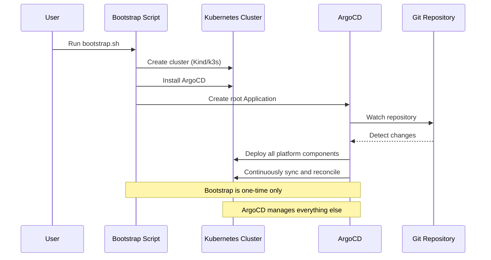
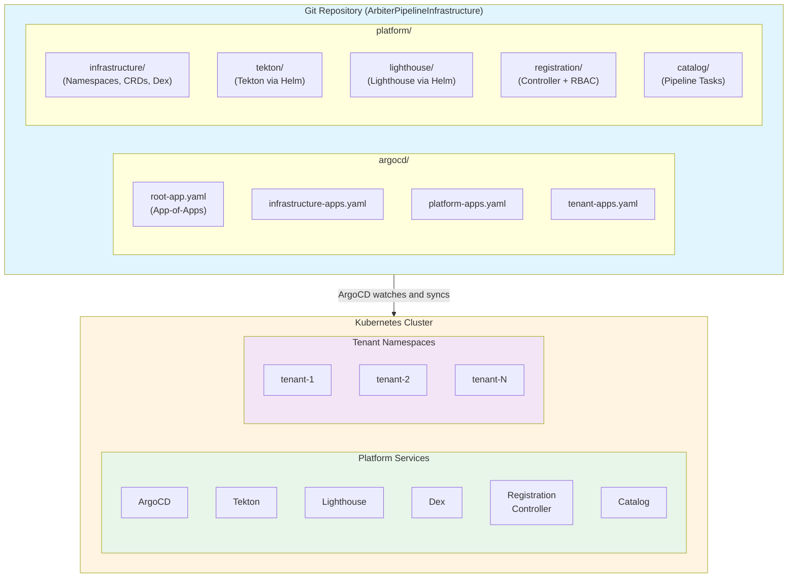
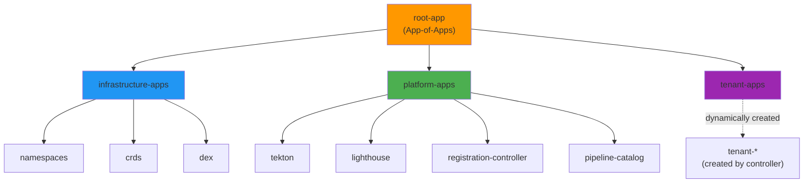
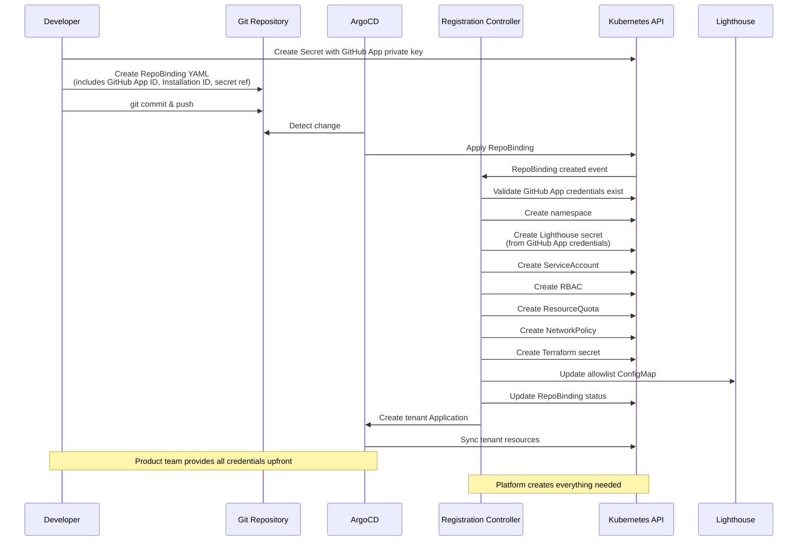

# Design Document: Jenkins X GitOps Platform

## Overview

This document describes the design of a GitOps-based Jenkins X platform for homelab Kubernetes clusters. The platform provides self-service repository registration with automated tenant provisioning and CDKTF deployment pipelines, managed entirely through ArgoCD.

### Key Design Principles

1. **GitOps-First**: All platform components are managed declaratively through Git
2. **Minimal Bootstrap**: Bootstrap script only creates cluster and installs ArgoCD
3. **Standard Tools**: Leverage ArgoCD, Helm, and Kustomize instead of custom scripts
4. **Declarative**: Everything is defined as Kubernetes resources
5. **Self-Healing**: ArgoCD automatically reconciles drift

### Architecture Philosophy

The platform follows a **"Bootstrap to GitOps"** pattern:



This eliminates the need for multiple installation scripts, manual kubectl commands, and imperative workflows. Once ArgoCD is installed, all platform management happens through Git commits.

## Architecture

### High-Level Architecture



### Component Layers

The platform is organized into three layers:

1. **Infrastructure Layer**: Core Kubernetes resources (namespaces, CRDs, RBAC, Dex)
2. **Platform Layer**: Platform services (Tekton, Lighthouse, Registration Controller, Catalog)
3. **Tenant Layer**: User namespaces and resources (provisioned by Registration Controller)

### ArgoCD Application Structure



## Components and Interfaces

### 1. Bootstrap Script

**Purpose**: One-time initialization of cluster and ArgoCD

**Responsibilities**:
- Create Kubernetes cluster (Kind for local, configurable for others)
- Install ArgoCD using official manifests
- Create initial ArgoCD Application pointing to Git repository
- Configure ArgoCD to watch the platform repository
- Display ArgoCD admin credentials
- Display Lighthouse webhook URL for product teams
- No GitHub integration required (webhooks managed manually)

**Interface**:
```bash
./bootstrap.sh [OPTIONS]

Options:
  --cluster-name NAME    Name of the cluster (default: arbiter-infrastructure)
  --cluster-type TYPE    Type of cluster: kind, k3s, existing (default: kind)
  --repo-url URL         Git repository URL (default: current repo)
  --repo-branch BRANCH   Git branch to watch (default: mainline)
  --argocd-version VER   ArgoCD version to install (default: stable)
```

**Output**:
- Kubernetes cluster running
- ArgoCD installed and accessible
- Root Application created and syncing
- ArgoCD admin password displayed
- Lighthouse webhook URL displayed for product teams

**Configuration**: None (minimal script, no config files)

### 2. ArgoCD

**Purpose**: GitOps operator that manages all platform components

**Responsibilities**:
- Watch Git repository for changes
- Sync Kubernetes resources to match Git state
- Detect and report drift
- Provide UI and CLI for status and management
- Handle Application dependencies via sync waves

**Interface**:
- **UI**: `https://argocd.homelab.local` (or port-forward)
- **CLI**: `argocd` command-line tool
- **API**: Kubernetes CRDs (Application, AppProject)

**Configuration**:
```yaml
# argocd/root-app.yaml
apiVersion: argoproj.io/v1alpha1
kind: Application
metadata:
  name: root-app
  namespace: argocd
spec:
  project: default
  source:
    repoURL: https://github.com/bdchatham/ArbiterPipelineInfrastructure
    targetRevision: mainline
    path: argocd/apps
  destination:
    server: https://kubernetes.default.svc
    namespace: argocd
  syncPolicy:
    automated:
      prune: true
      selfHeal: true
```

### 3. Infrastructure Applications

#### 3.1 Namespaces

**Purpose**: Create platform and system namespaces

**Managed By**: ArgoCD Application using Kustomize

**Resources**:
- `platform-services`: Platform services namespace
- `platform-assets`: Shared pipeline assets namespace
- `auth-system`: Authentication services namespace (Dex)

**Configuration**:
```yaml
# platform/infrastructure/namespaces/kustomization.yaml
apiVersion: kustomize.config.k8s.io/v1beta1
kind: Kustomization
resources:
  - namespace-platform-services.yaml
  - namespace-platform-assets.yaml
  - namespace-auth-system.yaml
```

#### 3.2 Custom Resource Definitions (CRDs)

**Purpose**: Install RepoBinding CRD

**Managed By**: ArgoCD Application using Kustomize

**Resources**:
- RepoBinding CRD with validation rules

**Configuration**:
```yaml
# platform/infrastructure/crds/repobinding-crd.yaml
apiVersion: apiextensions.k8s.io/v1
kind: CustomResourceDefinition
metadata:
  name: repobindings.arbiter.io
spec:
  group: arbiter.io
  names:
    kind: RepoBinding
    plural: repobindings
  scope: Cluster
  versions:
    - name: v1alpha1
      served: true
      storage: true
      schema:
        openAPIV3Schema:
          type: object
          properties:
            spec:
              type: object
              required: [repoOrg, repoName, tenantName]
              properties:
                repoOrg:
                  type: string
                  pattern: '^[a-z0-9-]+$'
                repoName:
                  type: string
                  pattern: '^[a-z0-9-]+$'
                tenantName:
                  type: string
                  pattern: '^tenant-[a-z0-9-]+$'
                permissionProfile:
                  type: string
                  enum: [standard, elevated]
                  default: standard
            status:
              type: object
              properties:
                phase:
                  type: string
                  enum: [Pending, Provisioning, Ready, Failed]
                message:
                  type: string
                namespaceCreated:
                  type: boolean
                serviceAccountCreated:
                  type: boolean
                rbacCreated:
                  type: boolean
                quotasCreated:
                  type: boolean
                networkPolicyCreated:
                  type: boolean
                terraformSecretCreated:
                  type: boolean
                allowlistUpdated:
                  type: boolean
```

#### 3.3 Dex (OIDC Provider)

**Purpose**: Provide OIDC authentication for Kubernetes API and webhooks

**Managed By**: ArgoCD Application using Kustomize

**Resources**:
- Dex Deployment
- Dex Service
- Dex ConfigMap
- Dex RBAC

**Configuration**:
```yaml
# platform/infrastructure/dex/kustomization.yaml
apiVersion: kustomize.config.k8s.io/v1beta1
kind: Kustomization
namespace: auth-system
resources:
  - deployment.yaml
  - service.yaml
  - configmap.yaml
  - rbac.yaml
```

**Dex ConfigMap**:
```yaml
# platform/infrastructure/dex/configmap.yaml
apiVersion: v1
kind: ConfigMap
metadata:
  name: dex-config
  namespace: auth-system
data:
  config.yaml: |
    issuer: https://dex.homelab.local
    storage:
      type: kubernetes
      config:
        inCluster: true
    web:
      http: 0.0.0.0:5556
    enablePasswordDB: true
    staticClients:
      - id: kubernetes
        name: Kubernetes
        secret: kubernetes-client-secret
        redirectURIs:
          - http://localhost:8000
    staticPasswords:
      - email: "admin@homelab.local"
        hash: "$2a$10$2b2cU8CPhOTaGrs1HRQuAueS7JTT5ZHsHSzYiFPm1leZck7Mc8T4W"
        username: "admin"
        userID: "admin"
        groups:
          - engineering
```

### 4. Platform Applications

#### 4.1 Tekton Pipelines

**Purpose**: Provide pipeline execution engine

**Managed By**: ArgoCD Application using Helm

**Configuration**:
```yaml
# argocd/apps/tekton.yaml
apiVersion: argoproj.io/v1alpha1
kind: Application
metadata:
  name: tekton
  namespace: argocd
spec:
  project: default
  source:
    chart: tekton-pipelines
    repoURL: https://charts.tekton.dev
    targetRevision: 0.56.0
    helm:
      values: |
        controller:
          image:
            repository: ghcr.io/tektoncd/pipeline/controller
            tag: v0.56.0
        webhook:
          image:
            repository: ghcr.io/tektoncd/pipeline/webhook
            tag: v0.56.0
  destination:
    server: https://kubernetes.default.svc
    namespace: platform-services
  syncPolicy:
    automated:
      prune: true
      selfHeal: true
    syncOptions:
      - CreateNamespace=true
  syncWave: 1
```

**Note**: If Tekton doesn't have an official Helm chart, we'll use a Kustomize-based Application that applies the release YAML with image patches for ghcr.io.

#### 4.2 Lighthouse

**Purpose**: Handle GitHub webhooks and trigger pipelines

**Managed By**: ArgoCD Application using Helm or Kustomize

**Configuration**:
```yaml
# argocd/apps/lighthouse.yaml
apiVersion: argoproj.io/v1alpha1
kind: Application
metadata:
  name: lighthouse
  namespace: argocd
spec:
  project: default
  source:
    chart: lighthouse
    repoURL: https://jenkins-x-charts.github.io/repo
    targetRevision: 1.x.x
    helm:
      values: |
        webhook:
          enabled: true
        configMaps:
          config: "lighthouse-config"
          allowlist: "repo-allowlist"
  destination:
    server: https://kubernetes.default.svc
    namespace: platform-services
  syncPolicy:
    automated:
      prune: true
      selfHeal: true
  syncWave: 2
```

**Webhook Management**:
- Webhooks created manually by product teams in GitHub
- Registration Controller generates webhook secrets
- Lighthouse validates webhook signatures using stored secrets
- Each repository has its own webhook secret stored in Kubernetes

#### 4.3 Registration Controller

**Purpose**: Provision tenant resources based on RepoBinding CRs

**Managed By**: ArgoCD Application using Kustomize

**Resources**:
- Controller Deployment
- Controller ServiceAccount
- Controller ClusterRole and ClusterRoleBinding
- Tenant resource templates (ConfigMaps)

**Configuration**:
```yaml
# platform/registration/kustomization.yaml
apiVersion: kustomize.config.k8s.io/v1beta1
kind: Kustomization
namespace: platform-services
resources:
  - deployment.yaml
  - service-account.yaml
  - rbac.yaml
  - templates/
images:
  - name: registration-controller
    newName: ghcr.io/bdchatham/registration-controller
    newTag: latest
```

**Controller Logic**:
- Watch RepoBinding resources
- Validate spec (org, repo, tenant name)
- **Generate webhook secret** (cryptographically secure random string)
- Store webhook secret in Kubernetes Secret for Lighthouse
- Create namespace with labels
- Create service account
- Create Role/RoleBinding based on permission profile
- Create ResourceQuota and LimitRange
- Create NetworkPolicy
- Create Terraform backend secret
- Update Lighthouse allowlist ConfigMap with repo + secret reference
- Update RepoBinding status with webhook secret and URL
- **Return webhook secret to user** for manual GitHub webhook configuration

**Webhook Secret Management**:
- Secret generated using crypto/rand (e.g., `whsec_` + 32 random bytes base64)
- Stored in Secret: `webhook-<tenant-name>` in platform-services namespace
- Lighthouse reads secrets to validate incoming webhooks
- Secret displayed in RepoBinding status and CLI output

#### 4.4 Pipeline Catalog

**Purpose**: Provide shared Tekton Tasks and Pipelines

**Managed By**: ArgoCD Application using Kustomize

**Resources**:
- git-clone Task
- cdktf-synth Task
- cdktf-deploy Task
- cdktf-deploy-pipeline Pipeline

**Configuration**:
```yaml
# platform/catalog/kustomization.yaml
apiVersion: kustomize.config.k8s.io/v1beta1
kind: Kustomization
namespace: platform-assets
resources:
  - tasks/git-clone.yaml
  - tasks/cdktf-synth.yaml
  - tasks/cdktf-deploy.yaml
  - pipelines/cdktf-deploy-pipeline.yaml
```

### 5. Tenant Applications

**Purpose**: Represent tenant namespaces in ArgoCD

**Managed By**: Registration Controller (creates ArgoCD Applications dynamically)

**Pattern**: When a RepoBinding is created with GitHub App credentials, the Registration Controller provisions all tenant resources including the Lighthouse secret.



**Configuration** (created by controller):
```yaml
apiVersion: argoproj.io/v1alpha1
kind: Application
metadata:
  name: tenant-example-repo
  namespace: argocd
spec:
  project: default
  source:
    repoURL: https://github.com/bdchatham/ArbiterPipelineInfrastructure
    targetRevision: mainline
    path: tenants/example-repo
  destination:
    server: https://kubernetes.default.svc
    namespace: tenant-example-repo
  syncPolicy:
    automated:
      prune: true
      selfHeal: true
```

## Data Models

### RepoBinding Custom Resource

```yaml
apiVersion: arbiter.io/v1alpha1
kind: RepoBinding
metadata:
  name: example-repo-binding
spec:
  repoOrg: bdchatham
  repoName: example-repo
  tenantName: tenant-example-repo
  permissionProfile: standard  # or elevated
status:
  phase: Ready  # Pending, Provisioning, Ready, Failed
  message: "Tenant provisioned successfully. Configure webhook in GitHub."
  webhookSecret: whsec_abc123xyz456  # Generated by controller, use in GitHub
  webhookURL: https://lighthouse.homelab.local/hook
  namespaceCreated: true
  serviceAccountCreated: true
  rbacCreated: true
  quotasCreated: true
  networkPolicyCreated: true
  terraformSecretCreated: true
  webhookSecretCreated: true
  allowlistUpdated: true
```

**Webhook Setup Instructions** (displayed after registration):
```
Registration successful!

Next steps - Configure GitHub webhook:
1. Go to: https://github.com/bdchatham/example-repo/settings/hooks/new
2. Payload URL: https://lighthouse.homelab.local/hook
3. Content type: application/json
4. Secret: whsec_abc123xyz456
5. Events: Push events, Pull request events
6. Active: ✓
7. Click "Add webhook"
```

### ArgoCD Application (Root)

```yaml
apiVersion: argoproj.io/v1alpha1
kind: Application
metadata:
  name: root-app
  namespace: argocd
  finalizers:
    - resources-finalizer.argocd.argoproj.io
spec:
  project: default
  source:
    repoURL: https://github.com/bdchatham/ArbiterPipelineInfrastructure
    targetRevision: mainline
    path: argocd/apps
  destination:
    server: https://kubernetes.default.svc
    namespace: argocd
  syncPolicy:
    automated:
      prune: true
      selfHeal: true
      allowEmpty: false
    syncOptions:
      - CreateNamespace=false
```

### Lighthouse ConfigMap (Allowlist)

```yaml
apiVersion: v1
kind: ConfigMap
metadata:
  name: repo-allowlist
  namespace: platform-services
data:
  allowlist.yaml: |
    repositories:
      - org: bdchatham
        repo: example-repo
        tenant: tenant-example-repo
      - org: bdchatham
        repo: another-repo
        tenant: tenant-another-repo
```

## Repository Structure

```
ArbiterPipelineInfrastructure/
├── argocd/
│   ├── root-app.yaml                    # Root Application (App-of-Apps)
│   └── apps/
│       ├── infrastructure-apps.yaml     # Infrastructure layer apps
│       ├── platform-apps.yaml           # Platform layer apps
│       └── tenant-apps.yaml             # Tenant layer apps (optional)
├── platform/
│   ├── infrastructure/
│   │   ├── namespaces/
│   │   │   ├── kustomization.yaml
│   │   │   ├── namespace-platform-services.yaml
│   │   │   ├── namespace-platform-assets.yaml
│   │   │   └── namespace-auth-system.yaml
│   │   ├── crds/
│   │   │   ├── kustomization.yaml
│   │   │   └── repobinding-crd.yaml
│   │   └── dex/
│   │       ├── kustomization.yaml
│   │       ├── deployment.yaml
│   │       ├── service.yaml
│   │       ├── configmap.yaml
│   │       └── rbac.yaml
│   ├── tekton/
│   │   └── application.yaml             # ArgoCD App for Tekton
│   ├── lighthouse/
│   │   ├── application.yaml             # ArgoCD App for Lighthouse
│   │   └── config/
│   │       ├── lighthouse-config.yaml
│   │       └── repo-allowlist.yaml
│   ├── registration/
│   │   ├── kustomization.yaml
│   │   ├── deployment.yaml
│   │   ├── service-account.yaml
│   │   ├── rbac.yaml
│   │   └── templates/
│   │       ├── namespace-template.yaml
│   │       ├── serviceaccount-template.yaml
│   │       ├── role-standard-template.yaml
│   │       ├── role-elevated-template.yaml
│   │       ├── rolebinding-template.yaml
│   │       ├── resourcequota-template.yaml
│   │       ├── limitrange-template.yaml
│   │       ├── networkpolicy-template.yaml
│   │       └── terraform-secret-template.yaml
│   └── catalog/
│       ├── kustomization.yaml
│       ├── tasks/
│       │   ├── git-clone.yaml
│       │   ├── cdktf-synth.yaml
│       │   └── cdktf-deploy.yaml
│       └── pipelines/
│           └── cdktf-deploy-pipeline.yaml
├── tenants/
│   └── (tenant-specific resources, if any)
├── bootstrap/
│   ├── bootstrap.sh                     # Main bootstrap script
│   └── README.md                        # Bootstrap documentation
└── docs/
    └── .kiro/docs/                      # Platform documentation
```

## Correctness Properties

*A property is a characteristic or behavior that should hold true across all valid executions of a system—essentially, a formal statement about what the system should do. Properties serve as the bridge between human-readable specifications and machine-verifiable correctness guarantees.*


## Correctness Properties

*A property is a characteristic or behavior that should hold true across all valid executions of a system—essentially, a formal statement about what the system should do. Properties serve as the bridge between human-readable specifications and machine-verifiable correctness guarantees.*

### Property 1: GitOps Sync Consistency
*For any* valid Kubernetes manifest committed to the watched Git path, ArgoCD should eventually sync it to the cluster and the resource should exist with matching spec.
**Validates: Requirements 1.2**

### Property 2: Drift Detection
*For any* resource managed by ArgoCD, if the cluster state is manually modified to differ from Git, ArgoCD should detect and report the drift in the Application status.
**Validates: Requirements 1.4**

### Property 3: Git Revert Rollback
*For any* Git commit that modifies a resource, reverting that commit should cause ArgoCD to restore the resource to its previous state.
**Validates: Requirements 1.5**

### Property 4: App-of-Apps Propagation
*For any* Application manifest added to the apps directory in Git, the root Application should create the corresponding child Application in the cluster.
**Validates: Requirements 3.3**

### Property 5: Sync Wave Ordering
*For any* set of resources with sync wave annotations, ArgoCD should apply resources in ascending sync wave order (wave 0 before wave 1, etc.).
**Validates: Requirements 3.5**

### Property 6: Tenant Namespace Provisioning
*For any* valid RepoBinding resource, the Registration Controller should create a namespace with the specified tenant name and appropriate labels.
**Validates: Requirements 5.1**

### Property 7: Tenant Service Account Creation
*For any* provisioned tenant, a service account named "pipeline-runner" should exist in the tenant namespace with appropriate RBAC bindings.
**Validates: Requirements 5.2**

### Property 8: Tenant Resource Limits
*For any* provisioned tenant, ResourceQuota and LimitRange resources should exist in the tenant namespace.
**Validates: Requirements 5.3**

### Property 9: Tenant Network Isolation
*For any* provisioned tenant, a NetworkPolicy should exist that denies ingress from other tenant namespaces.
**Validates: Requirements 5.4**

### Property 10: Allowlist Update
*For any* successfully provisioned tenant, the Lighthouse allowlist ConfigMap should contain an entry for that repository.
**Validates: Requirements 5.5**

### Property 11: Cross-Tenant RBAC Isolation
*For any* two distinct tenants A and B, the service account in tenant A should not be able to list, get, or modify resources in tenant B's namespace.
**Validates: Requirements 6.2**

### Property 12: Cross-Tenant Network Isolation
*For any* two distinct tenants A and B, pods in tenant A should not be able to establish network connections to pods in tenant B.
**Validates: Requirements 6.3**

### Property 13: Resource Quota Enforcement
*For any* tenant with a ResourceQuota, attempting to create resources exceeding the quota should be rejected by Kubernetes.
**Validates: Requirements 6.4**

### Property 14: Webhook to PipelineRun
*For any* valid webhook received for an allowed repository, Lighthouse should create a PipelineRun in the corresponding tenant namespace.
**Validates: Requirements 7.1**

### Property 15: Git Clone at Commit SHA
*For any* PipelineRun triggered by a webhook, the git-clone task should clone the repository at the exact commit SHA from the webhook payload.
**Validates: Requirements 7.2**

### Property 16: CDKTF Synth Execution
*For any* PipelineRun, the cdktf-synth task should execute successfully and produce Terraform configuration files.
**Validates: Requirements 7.3**

### Property 17: CDKTF Deploy Execution
*For any* PipelineRun with successful synth, the cdktf-deploy task should execute and apply infrastructure changes.
**Validates: Requirements 7.4**

### Property 18: Terraform State Persistence
*For any* CDKTF deployment, the Terraform state should be stored in the Kubernetes backend and be retrievable for subsequent deployments.
**Validates: Requirements 7.5**

### Property 19: Webhook Secret Generation
*For any* RepoBinding, the Registration Controller should generate a cryptographically secure webhook secret and store it in a Kubernetes Secret.
**Validates: Requirements 8.1**

### Property 20: Webhook Signature Validation
*For any* webhook received with an invalid signature, Lighthouse should reject it and not create a PipelineRun.
**Validates: Requirements 8.2**

### Property 21: Disallowed Repository Rejection
*For any* webhook received for a repository not in the allowlist, Lighthouse should reject it.
**Validates: Requirements 8.4**

### Property 22: Webhook Secret Isolation
*For any* tenant, the webhook secret should be stored in a Secret accessible only to Lighthouse and not to the tenant's service account.
**Validates: Requirements 8.5**

### Property 23: Application Sync Failure Reporting
*For any* Application that fails to sync, the Application status should contain an error message describing the failure.
**Validates: Requirements 9.3**

### Property 24: Component Upgrade Graceful Rollout
*For any* component version change in Git, ArgoCD should perform a rolling update without downtime for stateless components.
**Validates: Requirements 14.2**

## Error Handling

### ArgoCD Sync Failures
- **Detection**: Application status shows "OutOfSync" or "Degraded"
- **Logging**: Sync errors logged to ArgoCD application-controller logs
- **Recovery**: Manual intervention via ArgoCD UI or CLI to inspect and fix issues
- **Notification**: ArgoCD can be configured to send alerts on sync failures

### Registration Controller Failures
- **Validation Errors**: Invalid RepoBinding specs rejected with clear error messages in status
- **Provisioning Failures**: Partial provisioning rolled back, status updated with failure reason
- **Webhook Secret Generation**: Failures logged, RepoBinding status set to "Failed"
- **Allowlist Update Failures**: Retried with exponential backoff

### Lighthouse Webhook Failures
- **Invalid Signature**: Webhook rejected with 401 Unauthorized
- **Repository Not Allowed**: Webhook rejected with 403 Forbidden
- **PipelineRun Creation Failure**: Error logged, webhook returns 500 Internal Server Error
- **Retry**: GitHub automatically retries failed webhooks

### Pipeline Execution Failures
- **Git Clone Failure**: PipelineRun fails, logs show git error
- **CDKTF Synth Failure**: Task fails, logs show cdktf error
- **CDKTF Deploy Failure**: Task fails, Terraform state preserved for debugging
- **Notification**: PipelineRun status visible in Tekton Dashboard and kubectl

## Testing Strategy

### Unit Tests
- **Registration Controller**: Test RepoBinding validation, resource template rendering, webhook secret generation
- **Bootstrap Script**: Test cluster creation, ArgoCD installation, root Application creation
- **Webhook Secret Generation**: Test cryptographic randomness and format

### Integration Tests
- **ArgoCD Sync**: Deploy test Application, verify resources created
- **Registration Flow**: Create RepoBinding, verify all tenant resources provisioned
- **Webhook Flow**: Send test webhook, verify PipelineRun created
- **RBAC Isolation**: Attempt cross-tenant access, verify denial
- **Network Isolation**: Attempt cross-tenant connection, verify blocked

### Property-Based Tests
- **Property tests should run minimum 100 iterations** due to randomization
- Each property test must reference its design document property
- Tag format: **Feature: jenkinsx-gitops-platform, Property {number}: {property_text}**

**Property Test Examples**:
- Generate random valid RepoBindings, verify namespace creation (Property 6)
- Generate random manifests, verify ArgoCD syncs them (Property 1)
- Generate random webhook payloads, verify signature validation (Property 20)
- Generate random tenant pairs, verify RBAC isolation (Property 11)

### End-to-End Tests
- **Bootstrap to Running Platform**: Run bootstrap, verify all Applications healthy
- **Repository Registration to Pipeline**: Register repo, configure webhook, trigger pipeline, verify deployment
- **Disaster Recovery**: Destroy cluster, bootstrap new cluster, verify platform restored
- **Upgrade**: Change component version, verify rolling update

### Manual Tests
- **ArgoCD UI**: Verify UI accessible and shows correct Application status
- **Tekton Dashboard**: Verify dashboard shows PipelineRuns
- **Webhook Configuration**: Verify instructions are clear and webhook works
- **CLI Experience**: Verify `arbiter register` command is intuitive

## Source

- `.kiro/specs/jenkinsx-gitops-platform/requirements.md` - Requirements document
- `.kiro/specs/jenkinsx-gitops-platform/design.md` - This design document
- ArgoCD documentation: https://argo-cd.readthedocs.io/
- Tekton documentation: https://tekton.dev/docs/
- Lighthouse documentation: https://github.com/jenkins-x/lighthouse
