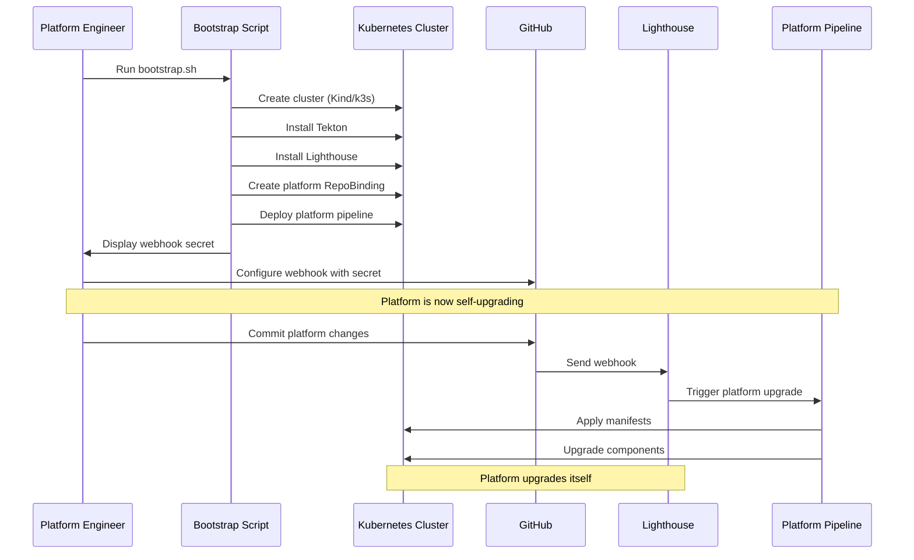
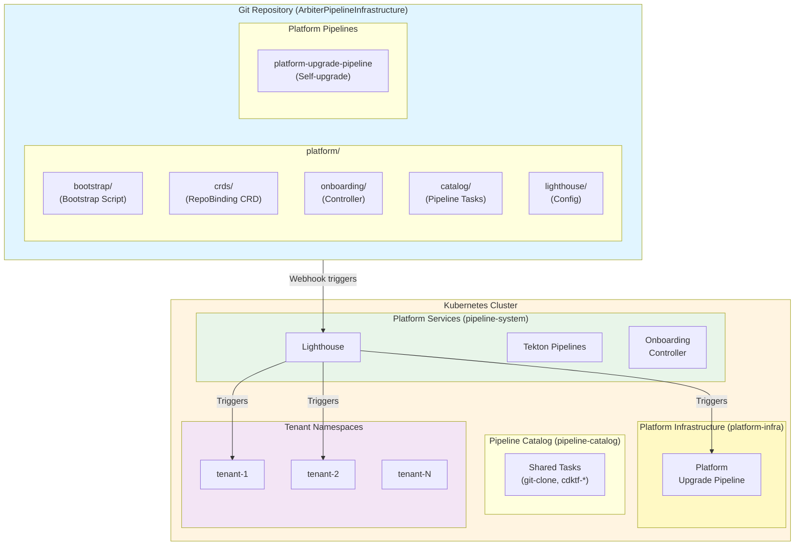
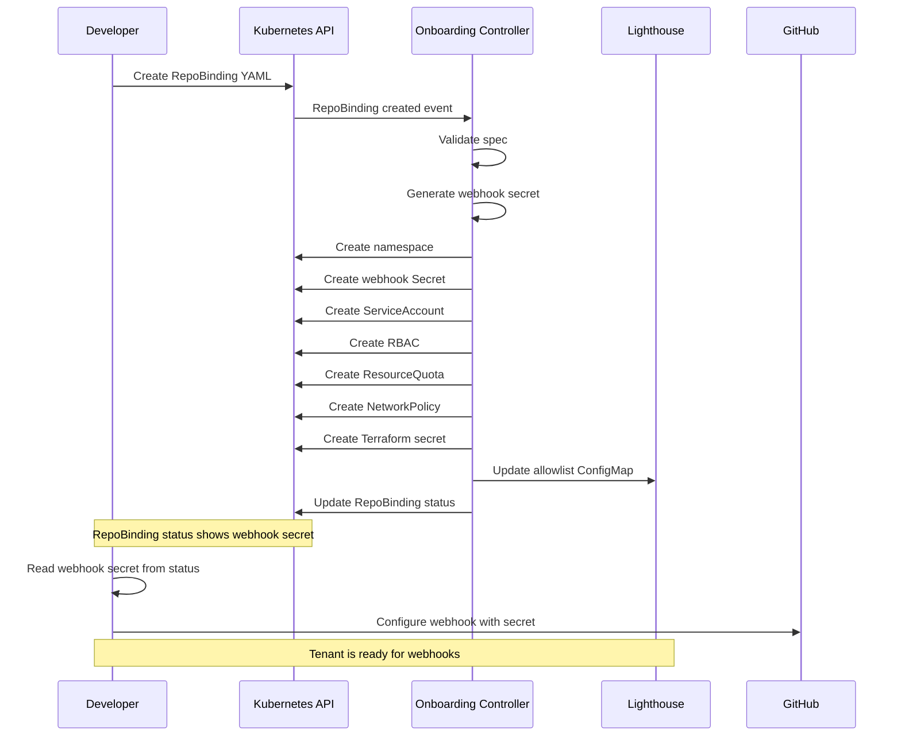

# Design Document: Jenkins X Platform with Self-Service CI/CD

## Overview

This document describes the design of a Jenkins X platform for homelab Kubernetes clusters. The platform provides self-service repository registration with automated tenant provisioning, CDKTF deployment pipelines, and self-upgrade capabilities through its own CI/CD pipeline.

### Key Design Principles

1. **Batteries Included**: Single bootstrap command sets up everything
2. **Self-Upgrading**: Platform manages its own upgrades via pipeline
3. **Minimal Scripts**: One bootstrap script, everything else is declarative
4. **Webhook-Driven**: GitHub webhooks trigger all automation
5. **Tenant Isolation**: Strong RBAC and network isolation between tenants

### Architecture Philosophy

The platform follows a **"Bootstrap Once, Upgrade Forever"** pattern:



This eliminates the need for manual kubectl commands after bootstrap. Once configured, all platform management happens through Git commits and webhooks.

## Architecture

### High-Level Architecture



### Component Layers

The platform is organized into four layers:

1. **Bootstrap Layer**: One-time initialization script
2. **Platform Services Layer**: Core services (Tekton, Lighthouse, Onboarding Controller)
3. **Platform Infrastructure Layer**: Platform's own tenant namespace with upgrade pipeline
4. **Tenant Layer**: User namespaces and resources (provisioned by Onboarding Controller)

## Components and Interfaces

### 1. Bootstrap Script

**Purpose**: One-time initialization of cluster and all platform components

**Responsibilities**:
- Create Kubernetes cluster (Kind for local, configurable for others)
- Install Tekton Pipelines
- Install Jenkins X and Lighthouse
- Create platform namespaces (pipeline-system, pipeline-catalog, auth-system)
- Deploy Onboarding Controller
- Deploy Pipeline Catalog
- Create RepoBinding for platform repository
- Generate webhook secret for platform repository
- Display webhook configuration instructions

**Interface**:
```bash
./bootstrap.sh [OPTIONS]

Options:
  --cluster-name NAME    Name of the cluster (default: arbiter-infrastructure)
  --cluster-type TYPE    Type of cluster: kind, k3s, existing (default: kind)
  --repo-url URL         Platform repository URL (default: current repo)
  --repo-org ORG         Platform repository organization (default: bdchatham)
  --repo-name NAME       Platform repository name (default: ArbiterPipelineInfrastructure)
```

**Output**:
- Kubernetes cluster running
- Tekton Pipelines installed
- Lighthouse installed with GitHub App
- Onboarding Controller deployed
- Pipeline Catalog deployed
- Platform RepoBinding created
- Webhook secret generated and displayed
- GitHub webhook configuration instructions displayed

**Configuration**: Minimal - uses sensible defaults, prompts for required values

### 2. Tekton Pipelines

**Purpose**: Pipeline execution engine

**Installation**: Applied via kubectl during bootstrap

**Configuration**:
```yaml
# Applied from GitHub release with image patches
# https://github.com/tektoncd/pipeline/releases/download/v0.56.0/release.yaml
# Images patched from gcr.io to ghcr.io
```

**Components**:
- tekton-pipelines-controller: Manages PipelineRun execution
- tekton-pipelines-webhook: Validates and mutates Tekton resources

### 3. Lighthouse

**Purpose**: GitHub webhook handler and pipeline trigger

**Installation**: Installed via Helm during bootstrap

**Configuration**:
```yaml
# Helm values
github:
  appId: "${GITHUB_APP_ID}"
  appInstallationId: "${GITHUB_APP_INSTALLATION_ID}"
  secretName: "lighthouse-github-app"
configMaps:
  config: "lighthouse-config"
  allowlist: "repo-allowlist"
```

**Webhook Management**:
- Webhooks configured manually by users in GitHub
- Onboarding Controller generates webhook secrets
- Lighthouse validates webhook signatures using stored secrets
- Each repository has its own webhook secret stored in Kubernetes

**Lighthouse ConfigMaps**:

```yaml
# lighthouse-config.yaml
apiVersion: v1
kind: ConfigMap
metadata:
  name: lighthouse-config
  namespace: pipeline-system
data:
  config.yaml: |
    plank:
      job_url_template: 'http://tekton-dashboard.pipeline-system/pipelineruns/{{.Namespace}}/{{.PipelineRun}}'
    prowjob_namespace: pipeline-system
    pod_namespace: pipeline-system
```

```yaml
# repo-allowlist.yaml
apiVersion: v1
kind: ConfigMap
metadata:
  name: repo-allowlist
  namespace: pipeline-system
data:
  allowlist.yaml: |
    repositories:
      - org: bdchatham
        repo: ArbiterPipelineInfrastructure
        tenant: platform-infra
        webhookSecretRef: webhook-platform-infra
```

### 4. Onboarding Controller

**Purpose**: Provision tenant resources based on RepoBinding CRs

**Installation**: Applied via kubectl during bootstrap

**Resources**:
- Controller Deployment
- Controller ServiceAccount
- Controller ClusterRole and ClusterRoleBinding
- Tenant resource templates

**Controller Logic**:
- Watch RepoBinding resources
- Validate spec (org, repo, tenant name)
- **Generate webhook secret** (cryptographically secure random string)
- Store webhook secret in Kubernetes Secret
- Create namespace with labels
- Create service account
- Create Role/RoleBinding based on permission profile
- Create ResourceQuota and LimitRange
- Create NetworkPolicy
- Create Terraform backend secret
- Update Lighthouse allowlist ConfigMap with repo + secret reference
- Update RepoBinding status with webhook secret and URL
- **Display webhook secret in status** for manual GitHub webhook configuration

**Webhook Secret Management**:
- Secret generated using crypto/rand (e.g., `whsec_` + 32 random bytes base64)
- Stored in Secret: `webhook-<tenant-name>` in pipeline-system namespace
- Lighthouse reads secrets to validate incoming webhooks
- Secret displayed in RepoBinding status for user to configure in GitHub

### 5. Pipeline Catalog

**Purpose**: Provide shared Tekton Tasks and Pipelines

**Installation**: Applied via kubectl during bootstrap

**Resources**:
- git-clone Task
- cdktf-synth Task
- cdktf-deploy Task
- cdktf-deploy-pipeline Pipeline
- platform-upgrade-pipeline Pipeline (for platform self-upgrade)

**Configuration**:
```yaml
# Deployed to pipeline-catalog namespace
# Tasks and Pipelines are cluster-scoped or namespace-scoped
```

### 6. Platform Upgrade Pipeline

**Purpose**: Upgrade platform components when changes are committed

**Triggered By**: Lighthouse webhook from platform repository

**Pipeline Steps**:
1. **git-clone**: Clone platform repository at commit SHA
2. **apply-crds**: Apply CRD manifests (RepoBinding)
3. **apply-namespaces**: Apply namespace manifests
4. **upgrade-tekton**: Apply Tekton release YAML (with image patches)
5. **upgrade-lighthouse**: Helm upgrade Lighthouse
6. **apply-onboarding-controller**: Apply onboarding controller manifests
7. **apply-catalog**: Apply pipeline catalog Tasks and Pipelines

**Configuration**:
```yaml
apiVersion: tekton.dev/v1beta1
kind: Pipeline
metadata:
  name: platform-upgrade-pipeline
  namespace: platform-infra
spec:
  params:
    - name: repo-url
      type: string
    - name: revision
      type: string
  workspaces:
    - name: source
  tasks:
    - name: git-clone
      taskRef:
        name: git-clone
      params:
        - name: url
          value: $(params.repo-url)
        - name: revision
          value: $(params.revision)
      workspaces:
        - name: output
          workspace: source
    
    - name: apply-crds
      runAfter: [git-clone]
      taskRef:
        name: kubectl-apply
      params:
        - name: manifest-dir
          value: platform/crds
      workspaces:
        - name: source
          workspace: source
    
    - name: apply-namespaces
      runAfter: [apply-crds]
      taskRef:
        name: kubectl-apply
      params:
        - name: manifest-dir
          value: platform/bootstrap
      workspaces:
        - name: source
          workspace: source
    
    - name: upgrade-tekton
      runAfter: [apply-namespaces]
      taskRef:
        name: upgrade-tekton
      workspaces:
        - name: source
          workspace: source
    
    - name: upgrade-lighthouse
      runAfter: [upgrade-tekton]
      taskRef:
        name: helm-upgrade
      params:
        - name: chart
          value: jx3/lighthouse
        - name: release-name
          value: lighthouse
        - name: namespace
          value: pipeline-system
      workspaces:
        - name: source
          workspace: source
    
    - name: apply-onboarding-controller
      runAfter: [upgrade-lighthouse]
      taskRef:
        name: kubectl-apply
      params:
        - name: manifest-dir
          value: platform/onboarding
      workspaces:
        - name: source
          workspace: source
    
    - name: apply-catalog
      runAfter: [apply-onboarding-controller]
      taskRef:
        name: kubectl-apply
      params:
        - name: manifest-dir
          value: platform/catalog
      workspaces:
        - name: source
          workspace: source
```

### 7. Tenant Provisioning

**Pattern**: When a RepoBinding is created, the Onboarding Controller provisions all tenant resources.



## Data Models

### RepoBinding Custom Resource

```yaml
apiVersion: arbiter.io/v1alpha1
kind: RepoBinding
metadata:
  name: example-repo-binding
spec:
  repoOrg: bdchatham
  repoName: example-repo
  tenantName: tenant-example-repo
  permissionProfile: standard  # or elevated
status:
  phase: Ready  # Pending, Provisioning, Ready, Failed
  message: "Tenant provisioned successfully. Configure webhook in GitHub."
  webhookSecret: whsec_abc123xyz456  # Generated by controller, use in GitHub
  webhookURL: http://lighthouse.pipeline-system/hook
  namespaceCreated: true
  serviceAccountCreated: true
  rbacCreated: true
  quotasCreated: true
  networkPolicyCreated: true
  terraformSecretCreated: true
  webhookSecretCreated: true
  allowlistUpdated: true
```

**Webhook Setup Instructions** (displayed in RepoBinding status):
```
Registration successful!

Next steps - Configure GitHub webhook:
1. Go to: https://github.com/bdchatham/example-repo/settings/hooks/new
2. Payload URL: http://lighthouse.pipeline-system/hook
3. Content type: application/json
4. Secret: whsec_abc123xyz456
5. Events: Push events, Pull request events
6. Active: ✓
7. Click "Add webhook"
```

### Lighthouse ConfigMap (Allowlist)

```yaml
apiVersion: v1
kind: ConfigMap
metadata:
  name: repo-allowlist
  namespace: pipeline-system
data:
  allowlist.yaml: |
    repositories:
      - org: bdchatham
        repo: ArbiterPipelineInfrastructure
        tenant: platform-infra
        webhookSecretRef: webhook-platform-infra
      - org: bdchatham
        repo: example-repo
        tenant: tenant-example-repo
        webhookSecretRef: webhook-tenant-example-repo
```

## Repository Structure

```
ArbiterPipelineInfrastructure/
├── platform/
│   ├── bootstrap/
│   │   ├── bootstrap.sh                     # Main bootstrap script (all-in-one)
│   │   ├── namespace-*.yaml                 # Platform namespaces
│   │   ├── dex-*.yaml                       # Dex OIDC provider (optional)
│   │   └── README.md                        # Bootstrap documentation
│   ├── crds/
│   │   ├── repobinding.yaml                 # RepoBinding CRD
│   │   └── example-repobinding.yaml         # Example usage
│   ├── onboarding/
│   │   ├── controller/                      # Go controller source
│   │   ├── controller-deployment.yaml       # Controller deployment
│   │   ├── controller-rbac.yaml             # Controller RBAC
│   │   └── controller-service-account.yaml  # Controller SA
│   ├── lighthouse/
│   │   ├── lighthouse-config.yaml           # Lighthouse configuration
│   │   └── repo-allowlist.yaml              # Repository allowlist
│   ├── catalog/
│   │   ├── tasks/
│   │   │   ├── git-clone.yaml
│   │   │   ├── cdktf-synth.yaml
│   │   │   ├── cdktf-deploy.yaml
│   │   │   ├── kubectl-apply.yaml           # For platform upgrades
│   │   │   ├── helm-upgrade.yaml            # For platform upgrades
│   │   │   └── upgrade-tekton.yaml          # For platform upgrades
│   │   └── pipelines/
│   │       ├── cdktf-deploy-pipeline.yaml
│   │       └── platform-upgrade-pipeline.yaml
│   └── tenancy/
│       └── templates/                       # Tenant resource templates
│           ├── namespace-template.yaml
│           ├── serviceaccount-template.yaml
│           ├── role-*.yaml
│           ├── rolebinding-template.yaml
│           ├── resourcequota-template.yaml
│           ├── limitrange-template.yaml
│           ├── networkpolicy-template.yaml
│           └── terraform-secret-template.yaml
└── .kiro/
    └── docs/                                # Platform documentation
        ├── overview.md
        ├── architecture.md
        ├── operations.md
        ├── api.md
        ├── data-models.md
        └── faq.md
```

## Correctness Properties

*A property is a characteristic or behavior that should hold true across all valid executions of a system—essentially, a formal statement about what the system should do. Properties serve as the bridge between human-readable specifications and machine-verifiable correctness guarantees.*

### Property 1: Platform Self-Upgrade Trigger
*For any* commit to the platform repository, Lighthouse should trigger the platform upgrade pipeline in the platform-infra namespace.
**Validates: Requirements 1.2**

### Property 2: Platform Component Upgrade
*For any* platform upgrade pipeline execution, all platform components should be upgraded to match the versions in Git.
**Validates: Requirements 1.3, 1.4**

### Property 3: Bootstrap Completeness
*For any* successful bootstrap execution, all platform components (Tekton, Lighthouse, Onboarding Controller, Catalog) should be running and ready.
**Validates: Requirements 2.1, 2.2, 2.3**

### Property 4: Platform RepoBinding Creation
*For any* bootstrap execution, a RepoBinding for the platform repository should be created with a generated webhook secret.
**Validates: Requirements 3.1, 3.2**

### Property 5: Webhook Secret Display
*For any* bootstrap execution, the webhook secret and GitHub configuration instructions should be displayed to the user.
**Validates: Requirements 2.5, 3.5**

### Property 6: Tenant Namespace Provisioning
*For any* valid RepoBinding resource, the Onboarding Controller should create a namespace with the specified tenant name and appropriate labels.
**Validates: Requirements 5.1**

### Property 7: Webhook Secret Generation
*For any* RepoBinding, the Onboarding Controller should generate a cryptographically secure webhook secret and store it in a Kubernetes Secret.
**Validates: Requirements 5.2, 8.1**

### Property 8: Tenant Service Account Creation
*For any* provisioned tenant, a service account named "pipeline-runner" should exist in the tenant namespace with appropriate RBAC bindings.
**Validates: Requirements 5.3**

### Property 9: Tenant Resource Limits
*For any* provisioned tenant, ResourceQuota and LimitRange resources should exist in the tenant namespace.
**Validates: Requirements 5.4**

### Property 10: Tenant Network Isolation
*For any* provisioned tenant, a NetworkPolicy should exist that denies ingress from other tenant namespaces.
**Validates: Requirements 5.5**

### Property 11: Allowlist Update
*For any* successfully provisioned tenant, the Lighthouse allowlist ConfigMap should contain an entry for that repository with webhook secret reference.
**Validates: Requirements 5.6**

### Property 12: RepoBinding Status Update
*For any* successfully provisioned tenant, the RepoBinding status should contain the webhook secret and configuration instructions.
**Validates: Requirements 5.7**

### Property 13: Cross-Tenant RBAC Isolation
*For any* two distinct tenants A and B, the service account in tenant A should not be able to list, get, or modify resources in tenant B's namespace.
**Validates: Requirements 6.2**

### Property 14: Cross-Tenant Network Isolation
*For any* two distinct tenants A and B, pods in tenant A should not be able to establish network connections to pods in tenant B.
**Validates: Requirements 6.3**

### Property 15: Resource Quota Enforcement
*For any* tenant with a ResourceQuota, attempting to create resources exceeding the quota should be rejected by Kubernetes.
**Validates: Requirements 6.4**

### Property 16: Webhook to PipelineRun
*For any* valid webhook received for an allowed repository, Lighthouse should create a PipelineRun in the corresponding tenant namespace.
**Validates: Requirements 7.1**

### Property 17: Git Clone at Commit SHA
*For any* PipelineRun triggered by a webhook, the git-clone task should clone the repository at the exact commit SHA from the webhook payload.
**Validates: Requirements 7.2**

### Property 18: CDKTF Synth Execution
*For any* PipelineRun, the cdktf-synth task should execute successfully and produce Terraform configuration files.
**Validates: Requirements 7.3**

### Property 19: CDKTF Deploy Execution
*For any* PipelineRun with successful synth, the cdktf-deploy task should execute and apply infrastructure changes.
**Validates: Requirements 7.4**

### Property 20: Terraform State Persistence
*For any* CDKTF deployment, the Terraform state should be stored in the Kubernetes backend and be retrievable for subsequent deployments.
**Validates: Requirements 7.5**

### Property 21: Webhook Signature Validation
*For any* webhook received with an invalid signature, Lighthouse should reject it and not create a PipelineRun.
**Validates: Requirements 8.4**

### Property 22: Disallowed Repository Rejection
*For any* webhook received for a repository not in the allowlist, Lighthouse should reject it.
**Validates: Requirements 8.5**

### Property 23: Webhook Secret Isolation
*For any* tenant, the webhook secret should be stored in a Secret accessible only to Lighthouse and not to the tenant's service account.
**Validates: Requirements 10.5**

### Property 24: PipelineRun Failure Reporting
*For any* PipelineRun that fails, the PipelineRun status should contain an error message describing the failure.
**Validates: Requirements 9.3**

### Property 25: Component Upgrade Graceful Rollout
*For any* component version change in Git, the platform upgrade pipeline should perform a rolling update without downtime for stateless components.
**Validates: Requirements 14.2**

## Error Handling

### Bootstrap Failures
- **Cluster Creation**: Script exits with error message if cluster creation fails
- **Component Installation**: Script exits with error message if any component fails to install
- **Readiness Checks**: Script waits for components to be ready with timeout
- **Recovery**: User can re-run bootstrap script after fixing issues

### Onboarding Controller Failures
- **Validation Errors**: Invalid RepoBinding specs rejected with clear error messages in status
- **Provisioning Failures**: Partial provisioning rolled back, status updated with failure reason
- **Webhook Secret Generation**: Failures logged, RepoBinding status set to "Failed"
- **Allowlist Update Failures**: Retried with exponential backoff

### Lighthouse Webhook Failures
- **Invalid Signature**: Webhook rejected with 401 Unauthorized
- **Repository Not Allowed**: Webhook rejected with 403 Forbidden
- **PipelineRun Creation Failure**: Error logged, webhook returns 500 Internal Server Error
- **Retry**: GitHub automatically retries failed webhooks

### Pipeline Execution Failures
- **Git Clone Failure**: PipelineRun fails, logs show git error
- **CDKTF Synth Failure**: Task fails, logs show cdktf error
- **CDKTF Deploy Failure**: Task fails, Terraform state preserved for debugging
- **Platform Upgrade Failure**: Pipeline fails, platform remains in previous state
- **Notification**: PipelineRun status visible in Tekton Dashboard and kubectl

## Testing Strategy

### Unit Tests
- **Onboarding Controller**: Test RepoBinding validation, resource template rendering, webhook secret generation
- **Bootstrap Script**: Test cluster creation, component installation, RepoBinding creation
- **Webhook Secret Generation**: Test cryptographic randomness and format

### Integration Tests
- **Bootstrap Process**: Run bootstrap, verify all components ready
- **Onboarding Flow**: Create RepoBinding, verify all tenant resources provisioned
- **Webhook Flow**: Send test webhook, verify PipelineRun created
- **Platform Upgrade**: Trigger platform pipeline, verify components upgraded
- **RBAC Isolation**: Attempt cross-tenant access, verify denial
- **Network Isolation**: Attempt cross-tenant connection, verify blocked

### Property-Based Tests
- **Property tests should run minimum 100 iterations** due to randomization
- Each property test must reference its design document property
- Tag format: **Feature: jenkinsx-platform, Property {number}: {property_text}**

**Property Test Examples**:
- Generate random valid RepoBindings, verify namespace creation (Property 6)
- Generate random webhook payloads, verify signature validation (Property 21)
- Generate random tenant pairs, verify RBAC isolation (Property 13)
- Generate random platform commits, verify upgrade pipeline triggers (Property 1)

### End-to-End Tests
- **Bootstrap to Running Platform**: Run bootstrap, verify all components healthy
- **Platform Self-Upgrade**: Commit change, verify platform upgrades itself
- **Repository Registration to Pipeline**: Register repo, configure webhook, trigger pipeline, verify deployment
- **Disaster Recovery**: Destroy cluster, bootstrap new cluster, verify platform restored
- **Upgrade**: Change component version, verify rolling update

### Manual Tests
- **Bootstrap Experience**: Verify bootstrap script is intuitive and provides clear output
- **Webhook Configuration**: Verify instructions are clear and webhook works
- **Tekton Dashboard**: Verify dashboard shows PipelineRuns
- **kubectl Experience**: Verify kubectl commands work for troubleshooting

## Source

- `.kiro/specs/jenkinsx-gitops-platform/requirements.md` - Requirements document
- `.kiro/specs/jenkinsx-gitops-platform/design.md` - This design document
- Tekton documentation: https://tekton.dev/docs/
- Jenkins X documentation: https://jenkins-x.io/v3/
- Lighthouse documentation: https://github.com/jenkins-x/lighthouse
