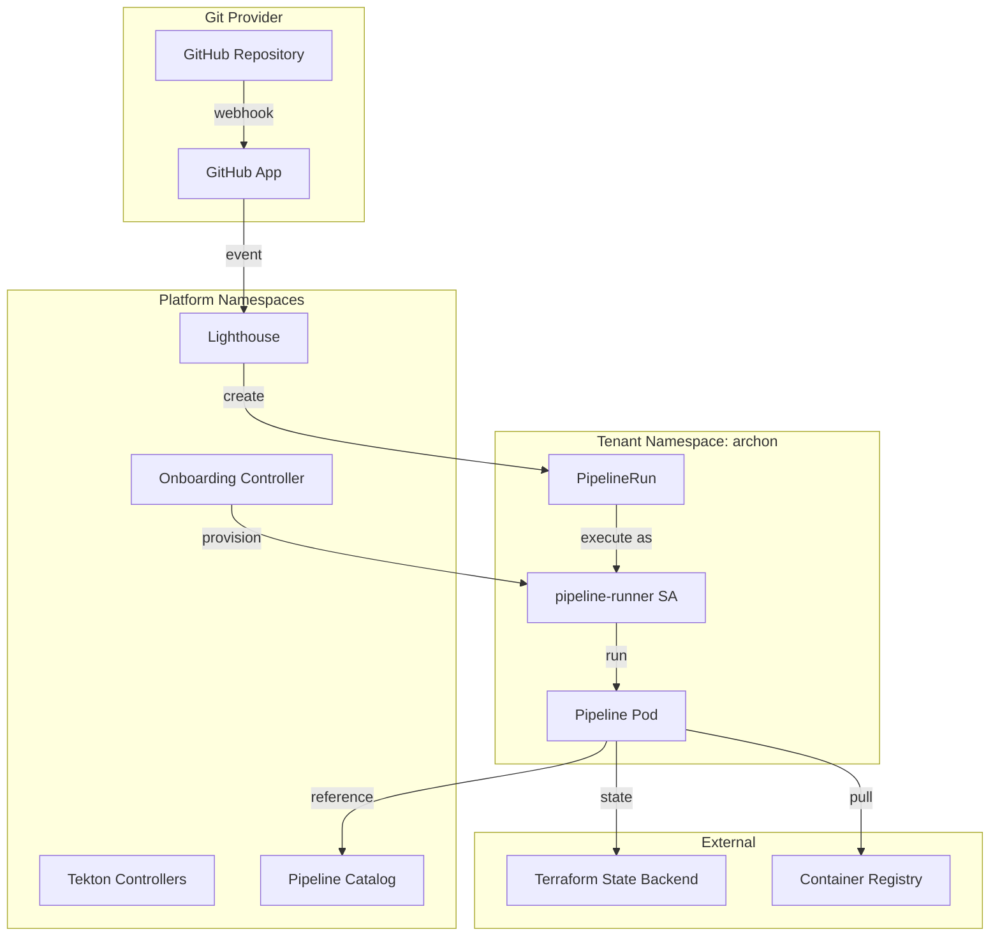
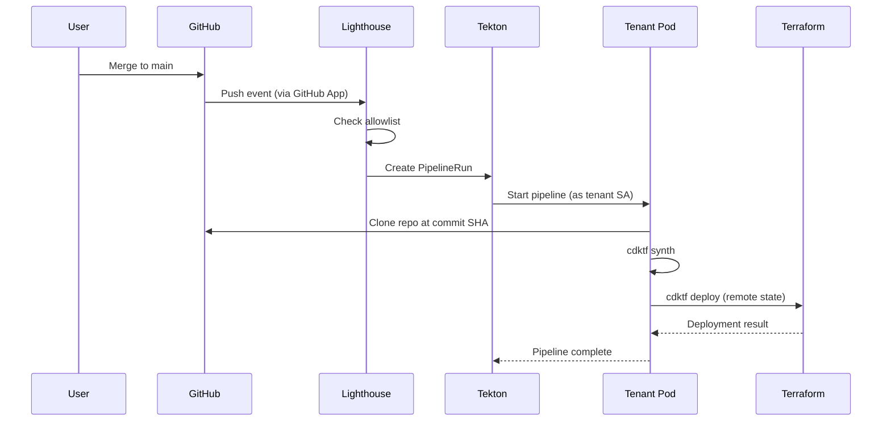
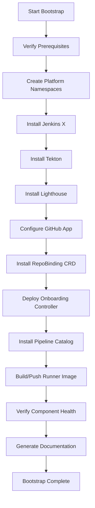

# Design Document

## Overview

The Arbiter Pipeline Infrastructure is a Jenkins X-based CI/CD platform designed for homelab deployment. The system provides shared pipeline infrastructure for multiple product teams with strong tenant isolation through Kubernetes namespaces, RBAC, and network policies. The platform uses Lighthouse for Git event handling and Tekton for pipeline execution, enabling product teams to deploy infrastructure-as-code (CDKTF) automatically on merge to main.

The design prioritizes:
- **Self-Service**: OIDC-authenticated users can onboard repositories without admin access
- **Isolation**: Each tenant gets dedicated namespace with least-privilege service account
- **Inspectability**: Comprehensive logging and status reporting for automated agent reasoning
- **Reproducibility**: Deterministic bootstrap and upgrade processes
- **Security**: Allowlist-based access control, RBAC boundaries, and remote state management

## Architecture

### High-Level Architecture



### Component Interaction Flow



## Components and Interfaces

### 1. Jenkins X Platform Components

**Namespace**: `pipeline-system`

**Components**:
- **Lighthouse**: Git event handler that receives webhooks and triggers pipelines
- **Tekton Pipelines**: Kubernetes-native pipeline execution engine
- **Tekton Triggers**: Event-driven pipeline triggering (used by Lighthouse)
- **Tekton Dashboard**: Web UI for pipeline visualization (optional)

**Installation Method**: Helm charts or Kustomize manifests

**Configuration**:
```yaml
# lighthouse-config.yaml
apiVersion: v1
kind: ConfigMap
metadata:
  name: lighthouse-config
  namespace: pipeline-system
data:
  config.yaml: |
    github:
      app_id: "${GITHUB_APP_ID}"
      app_installation_id: "${GITHUB_APP_INSTALLATION_ID}"
    allowlist:
      - org: "your-github-org"
        repos:
          - "archon-agent"
          - "another-repo"
```

### 2. GitHub App Integration

**Purpose**: Centralized webhook delivery at organization level

**Required Permissions**:
- Repository: Read access to code
- Repository: Read and write access to pull requests
- Repository: Read and write access to checks
- Organization: Read access to members

**Webhook Events**:
- Push
- Pull request
- Check run
- Check suite

**Webhook URL**: `https://<lighthouse-ingress>/hook`

**Secret Management**: GitHub App private key stored in Kubernetes Secret

### 3. Repository Allowlist

**Implementation**: ConfigMap in `pipeline-system` namespace

**Structure**:
```yaml
apiVersion: v1
kind: ConfigMap
metadata:
  name: repo-allowlist
  namespace: pipeline-system
data:
  allowlist.yaml: |
    repos:
      - org: "your-github-org"
        name: "archon-agent"
        tenant: "archon"
      - org: "your-github-org"
        name: "another-repo"
        tenant: "another"
```

**Reload Mechanism**: Lighthouse watches ConfigMap for changes and reloads automatically

### 4. Onboarding API

**Preferred Implementation**: Custom Resource Definition (CRD)

**CRD Definition**:
```yaml
apiVersion: apiextensions.k8s.io/v1
kind: CustomResourceDefinition
metadata:
  name: repobindings.platform.arbiter.io
spec:
  group: platform.arbiter.io
  names:
    kind: RepoBinding
    plural: repobindings
    singular: repobinding
  scope: Namespaced
  versions:
    - name: v1alpha1
      served: true
      storage: true
      schema:
        openAPIV3Schema:
          type: object
          properties:
            spec:
              type: object
              required:
                - repoOrg
                - repoName
                - tenantName
              properties:
                repoOrg:
                  type: string
                  pattern: '^[a-z0-9-]+$'
                repoName:
                  type: string
                  pattern: '^[a-z0-9-]+$'
                tenantName:
                  type: string
                  pattern: '^[a-z0-9-]+$'
                permissionProfile:
                  type: string
                  enum: ["standard", "elevated"]
                  default: "standard"
            status:
              type: object
              properties:
                phase:
                  type: string
                  enum: ["Pending", "Provisioning", "Ready", "Failed"]
                message:
                  type: string
                namespaceCreated:
                  type: boolean
                serviceAccountCreated:
                  type: boolean
                rbacConfigured:
                  type: boolean
                allowlistUpdated:
                  type: boolean
```

**Usage Example**:
```yaml
apiVersion: platform.arbiter.io/v1alpha1
kind: RepoBinding
metadata:
  name: archon-binding
  namespace: pipeline-system
spec:
  repoOrg: "your-github-org"
  repoName: "archon-agent"
  tenantName: "archon"
  permissionProfile: "standard"
```

### 5. Onboarding Controller

**Purpose**: Reconcile RepoBinding resources and provision tenant infrastructure

**Reconciliation Logic**:
1. Validate request (org allowlist, namespace pattern, permission profile)
2. Create tenant namespace with labels
3. Create tenant service account
4. Create RBAC (Role + RoleBinding)
5. Create ResourceQuota and LimitRange
6. Create NetworkPolicy
7. Create Terraform backend secret references
8. Update repository allowlist ConfigMap
9. Update RepoBinding status

**RBAC for Controller**:
- ClusterRole with permissions to create namespaces, roles, rolebindings
- ServiceAccount in `pipeline-system` namespace
- ClusterRoleBinding associating SA with ClusterRole

**Implementation Language**: Go (using controller-runtime framework)

### 6. Tenant Namespace Resources

**Namespace Template**:
```yaml
apiVersion: v1
kind: Namespace
metadata:
  name: ${TENANT_NAME}
  labels:
    platform.arbiter.io/tenant: "${TENANT_NAME}"
    platform.arbiter.io/repo: "${REPO_ORG}/${REPO_NAME}"
    platform.arbiter.io/managed-by: "onboarding-controller"
```

**Service Account**:
```yaml
apiVersion: v1
kind: ServiceAccount
metadata:
  name: pipeline-runner
  namespace: ${TENANT_NAME}
```

**Role (Standard Profile)**:
```yaml
apiVersion: rbac.authorization.k8s.io/v1
kind: Role
metadata:
  name: pipeline-runner
  namespace: ${TENANT_NAME}
rules:
  - apiGroups: [""]
    resources: ["pods", "pods/log", "configmaps", "secrets"]
    verbs: ["get", "list", "create", "update", "delete"]
  - apiGroups: ["tekton.dev"]
    resources: ["pipelineruns", "taskruns"]
    verbs: ["get", "list", "create"]
```

**ResourceQuota**:
```yaml
apiVersion: v1
kind: ResourceQuota
metadata:
  name: tenant-quota
  namespace: ${TENANT_NAME}
spec:
  hard:
    requests.cpu: "4"
    requests.memory: "8Gi"
    limits.cpu: "8"
    limits.memory: "16Gi"
    persistentvolumeclaims: "5"
    pods: "20"
```

**LimitRange**:
```yaml
apiVersion: v1
kind: LimitRange
metadata:
  name: tenant-limits
  namespace: ${TENANT_NAME}
spec:
  limits:
    - type: Container
      default:
        cpu: "500m"
        memory: "512Mi"
      defaultRequest:
        cpu: "100m"
        memory: "128Mi"
```

**NetworkPolicy**:
```yaml
apiVersion: networking.k8s.io/v1
kind: NetworkPolicy
metadata:
  name: tenant-isolation
  namespace: ${TENANT_NAME}
spec:
  podSelector: {}
  policyTypes:
    - Ingress
    - Egress
  ingress:
    - from:
        - podSelector: {}  # Allow from same namespace
  egress:
    - to:
        - podSelector: {}  # Allow to same namespace
    - to:  # Allow DNS
        - namespaceSelector:
            matchLabels:
              kubernetes.io/metadata.name: kube-system
      ports:
        - protocol: UDP
          port: 53
    - to:  # Allow internet (for git clone, terraform providers)
        - ipBlock:
            cidr: 0.0.0.0/0
```

### 7. Golden Pipeline Catalog

**Namespace**: `pipeline-catalog`

**Shared Tekton Tasks**:
- `git-clone`: Clone repository at specific commit
- `cdktf-synth`: Run cdktf synth
- `cdktf-deploy`: Run cdktf deploy with remote state
- `upload-artifacts`: Upload logs/outputs to external storage

**Shared Tekton Pipeline**:
```yaml
apiVersion: tekton.dev/v1beta1
kind: Pipeline
metadata:
  name: cdktf-deploy-pipeline
  namespace: pipeline-catalog
spec:
  params:
    - name: repo-url
      type: string
    - name: commit-sha
      type: string
    - name: tenant-name
      type: string
  workspaces:
    - name: source
    - name: terraform-state
  tasks:
    - name: clone
      taskRef:
        name: git-clone
        kind: Task
      params:
        - name: url
          value: $(params.repo-url)
        - name: revision
          value: $(params.commit-sha)
      workspaces:
        - name: output
          workspace: source
    
    - name: synth
      taskRef:
        name: cdktf-synth
        kind: Task
      runAfter:
        - clone
      workspaces:
        - name: source
          workspace: source
    
    - name: deploy
      taskRef:
        name: cdktf-deploy
        kind: Task
      runAfter:
        - synth
      params:
        - name: tenant-name
          value: $(params.tenant-name)
      workspaces:
        - name: source
          workspace: source
        - name: terraform-state
          workspace: terraform-state
```

**Runner Image**:
```dockerfile
FROM node:20-alpine

# Install system dependencies
RUN apk add --no-cache \
    git \
    curl \
    bash \
    python3 \
    py3-pip

# Install Terraform
RUN wget https://releases.hashicorp.com/terraform/1.6.0/terraform_1.6.0_linux_amd64.zip && \
    unzip terraform_1.6.0_linux_amd64.zip && \
    mv terraform /usr/local/bin/ && \
    rm terraform_1.6.0_linux_amd64.zip

# Install CDKTF CLI
RUN npm install -g cdktf-cli@latest

# Install kubectl
RUN curl -LO "https://dl.k8s.io/release/$(curl -L -s https://dl.k8s.io/release/stable.txt)/bin/linux/amd64/kubectl" && \
    chmod +x kubectl && \
    mv kubectl /usr/local/bin/

WORKDIR /workspace
```

### 8. OIDC Authentication

**Identity Provider**: Self-hosted OIDC provider for homelab deployment

**Self-Hosted OIDC Options**:

**Option 1: Dex (Recommended for Homelab)**
- Lightweight OIDC provider
- Supports multiple authentication backends (LDAP, GitHub, Google, static users)
- Easy to deploy on Kubernetes
- Minimal resource requirements

**Dex Deployment**:
```yaml
apiVersion: apps/v1
kind: Deployment
metadata:
  name: dex
  namespace: auth-system
spec:
  replicas: 1
  selector:
    matchLabels:
      app: dex
  template:
    metadata:
      labels:
        app: dex
    spec:
      containers:
        - name: dex
          image: ghcr.io/dexidp/dex:v2.37.0
          ports:
            - containerPort: 5556
          volumeMounts:
            - name: config
              mountPath: /etc/dex
      volumes:
        - name: config
          configMap:
            name: dex-config
```

**Dex Configuration**:
```yaml
apiVersion: v1
kind: ConfigMap
metadata:
  name: dex-config
  namespace: auth-system
data:
  config.yaml: |
    issuer: https://dex.homelab.local
    storage:
      type: kubernetes
      config:
        inCluster: true
    web:
      http: 0.0.0.0:5556
    staticClients:
      - id: kubernetes
        name: Kubernetes
        secret: kubernetes-client-secret
        redirectURIs:
          - http://localhost:8000
          - http://localhost:18000
    connectors:
      - type: github
        id: github
        name: GitHub
        config:
          clientID: $GITHUB_OAUTH_CLIENT_ID
          clientSecret: $GITHUB_OAUTH_CLIENT_SECRET
          redirectURI: https://dex.homelab.local/callback
          orgs:
            - name: your-github-org
              teams:
                - engineering
    staticPasswords:
      - email: "admin@homelab.local"
        hash: "$2a$10$..." # bcrypt hash
        username: "admin"
        userID: "admin"
        groups:
          - engineering
```

**Option 2: Keycloak**
- Full-featured identity and access management
- Web UI for user management
- Supports LDAP, Active Directory, social logins
- Higher resource requirements

**Keycloak Deployment** (via Helm):
```bash
helm repo add bitnami https://charts.bitnami.com/bitnami
helm install keycloak bitnami/keycloak \
  --namespace auth-system \
  --create-namespace \
  --set auth.adminUser=admin \
  --set auth.adminPassword=admin
```

**Option 3: Authentik**
- Modern identity provider with web UI
- Supports LDAP, OAuth, SAML
- Built-in user management
- Medium resource requirements

**Kubernetes API Server OIDC Configuration**:

For k3s (common in homelab):
```yaml
# /etc/rancher/k3s/config.yaml
kube-apiserver-arg:
  - "oidc-issuer-url=https://dex.homelab.local"
  - "oidc-client-id=kubernetes"
  - "oidc-username-claim=email"
  - "oidc-groups-claim=groups"
  - "oidc-ca-file=/etc/ssl/certs/dex-ca.crt"
```

For kubeadm clusters:
```yaml
# /etc/kubernetes/manifests/kube-apiserver.yaml
spec:
  containers:
    - command:
        - kube-apiserver
        - --oidc-issuer-url=https://dex.homelab.local
        - --oidc-client-id=kubernetes
        - --oidc-username-claim=email
        - --oidc-groups-claim=groups
        - --oidc-ca-file=/etc/ssl/certs/dex-ca.crt
```

**Engineering Group Mapping**:
- OIDC group: `engineering` (defined in Dex/Keycloak)
- Kubernetes group: `system:authenticated:engineering`

**RBAC for Onboarding**:
```yaml
apiVersion: rbac.authorization.k8s.io/v1
kind: ClusterRole
metadata:
  name: repo-onboarder
rules:
  - apiGroups: ["platform.arbiter.io"]
    resources: ["repobindings"]
    verbs: ["create", "get", "list", "watch"]
---
apiVersion: rbac.authorization.k8s.io/v1
kind: ClusterRoleBinding
metadata:
  name: engineering-onboarders
roleRef:
  apiGroup: rbac.authorization.k8s.io
  kind: ClusterRole
  name: repo-onboarder
subjects:
  - kind: Group
    name: "system:authenticated:engineering"
    apiGroup: rbac.authorization.k8s.io
```

**kubectl Configuration for Users**:
```bash
# Install kubelogin (OIDC helper)
kubectl krew install oidc-login

# Configure kubectl
kubectl config set-credentials oidc \
  --exec-api-version=client.authentication.k8s.io/v1beta1 \
  --exec-command=kubectl \
  --exec-arg=oidc-login \
  --exec-arg=get-token \
  --exec-arg=--oidc-issuer-url=https://dex.homelab.local \
  --exec-arg=--oidc-client-id=kubernetes \
  --exec-arg=--oidc-client-secret=kubernetes-client-secret

# Use OIDC credentials
kubectl config set-context --current --user=oidc
```

**Cost**: All options are free and open-source, suitable for homelab deployment

### 9. Terraform State Backend

**Backend Type**: Self-hosted S3-compatible storage (MinIO)

**MinIO Deployment** (for homelab):
```yaml
apiVersion: apps/v1
kind: StatefulSet
metadata:
  name: minio
  namespace: storage-system
spec:
  serviceName: minio
  replicas: 1
  selector:
    matchLabels:
      app: minio
  template:
    metadata:
      labels:
        app: minio
    spec:
      containers:
        - name: minio
          image: minio/minio:latest
          args:
            - server
            - /data
            - --console-address
            - ":9001"
          env:
            - name: MINIO_ROOT_USER
              valueFrom:
                secretKeyRef:
                  name: minio-credentials
                  key: root-user
            - name: MINIO_ROOT_PASSWORD
              valueFrom:
                secretKeyRef:
                  name: minio-credentials
                  key: root-password
          ports:
            - containerPort: 9000
              name: api
            - containerPort: 9001
              name: console
          volumeMounts:
            - name: data
              mountPath: /data
  volumeClaimTemplates:
    - metadata:
        name: data
      spec:
        accessModes: ["ReadWriteOnce"]
        resources:
          requests:
            storage: 100Gi
```

**Alternative Backend Options**:
- **Kubernetes Backend**: Store state in Kubernetes Secrets (simple, no external dependencies)
- **HTTP Backend**: Use Terraform HTTP backend with self-hosted API
- **Consul Backend**: Use self-hosted Consul cluster

**Configuration Approach**: Kubernetes Secrets (no external secret management required)

**Secret Structure (MinIO Backend)**:
```yaml
apiVersion: v1
kind: Secret
metadata:
  name: terraform-backend-config
  namespace: ${TENANT_NAME}
type: Opaque
stringData:
  backend.tf: |
    terraform {
      backend "s3" {
        bucket = "terraform-state-${TENANT_NAME}"
        key    = "state.tfstate"
        region = "us-east-1"  # Ignored by MinIO, but required by Terraform
        endpoint = "http://minio.storage-system.svc.cluster.local:9000"
        skip_credentials_validation = true
        skip_metadata_api_check = true
        skip_region_validation = true
        force_path_style = true
      }
    }
  credentials: |
    # MinIO credentials (S3-compatible format, NOT AWS)
    [default]
    aws_access_key_id = ${MINIO_ACCESS_KEY}
    aws_secret_access_key = ${MINIO_SECRET_KEY}
```

**Secret Structure (Kubernetes Backend - Simplest)**:
```yaml
apiVersion: v1
kind: Secret
metadata:
  name: terraform-backend-config
  namespace: ${TENANT_NAME}
type: Opaque
stringData:
  backend.tf: |
    terraform {
      backend "kubernetes" {
        secret_suffix    = "${TENANT_NAME}"
        namespace        = "${TENANT_NAME}"
        in_cluster_config = true
      }
    }
```

**State Locking**: 
- MinIO backend: No native locking (use pipeline serialization)
- Kubernetes backend: Native locking via Kubernetes lease objects
- Consul backend: Native locking via Consul

**Concurrency Control**: Tekton PipelineRun with concurrency limit per tenant

**Recommendation for Homelab**: Start with Kubernetes backend (simplest, no external dependencies), migrate to MinIO if you need state versioning and backup features.


## Data Models

### RepoBinding Spec

```typescript
interface RepoBindingSpec {
  repoOrg: string;        // GitHub organization (e.g., "your-github-org")
  repoName: string;       // Repository name (e.g., "archon-agent")
  tenantName: string;     // Tenant namespace name (e.g., "archon")
  permissionProfile: "standard" | "elevated";  // Permission level
}
```

### RepoBinding Status

```typescript
interface RepoBindingStatus {
  phase: "Pending" | "Provisioning" | "Ready" | "Failed";
  message: string;
  namespaceCreated: boolean;
  serviceAccountCreated: boolean;
  rbacConfigured: boolean;
  allowlistUpdated: boolean;
  lastReconcileTime: string;  // ISO 8601 timestamp
}
```

### Allowlist Entry

```typescript
interface AllowlistEntry {
  org: string;           // GitHub organization
  name: string;          // Repository name
  tenant: string;        // Tenant namespace
  enabled: boolean;      // Whether triggers are active
}
```

### Pipeline Parameters

```typescript
interface PipelineParams {
  repoUrl: string;       // Git repository URL
  commitSha: string;     // Git commit SHA to build
  tenantName: string;    // Tenant namespace for RBAC context
  branch: string;        // Git branch (for reference)
}
```

### Terraform Backend Config

```typescript
interface TerraformBackendConfig {
  backend: "s3";
  bucket: string;        // State bucket name
  key: string;           // State file key
  region: string;        // AWS region or equivalent
  endpoint: string;      // S3-compatible endpoint URL
  accessKeyId: string;   // Access credentials
  secretAccessKey: string;
}
```

## Correctness Properties

*A property is a characteristic or behavior that should hold true across all valid executions of a system—essentially, a formal statement about what the system should do. Properties serve as the bridge between human-readable specifications and machine-verifiable correctness guarantees.*

### Property 1: Bootstrap idempotence
*For any* cluster state, running the bootstrap process multiple times should converge to the same final state without errors
**Validates: Requirements 1.1, 1.2, 1.3, 1.4, 1.5, 1.6, 1.7, 20.2**

### Property 2: GitHub App event delivery
*For any* push event to an allowlisted repository, the GitHub App should deliver the event to Lighthouse
**Validates: Requirements 2.3, 11.1**

### Property 3: Allowlist enforcement
*For any* repository event, if the repository is not in the allowlist, Lighthouse should reject the event
**Validates: Requirements 3.3, 3.4**

### Property 4: Allowlist reload without redeployment
*For any* allowlist update, Lighthouse should reload the configuration without requiring platform redeployment
**Validates: Requirements 3.2**

### Property 5: OIDC authentication for onboarding
*For any* onboarding request, the system should authenticate the user via OIDC and verify engineering group membership
**Validates: Requirements 4.1, 4.2, 4.3**

### Property 6: Onboarding authorization boundary
*For any* user not in the engineering OIDC group, onboarding requests should be rejected
**Validates: Requirements 4.4**

### Property 7: Tenant namespace provisioning
*For any* approved onboarding request, the system should create a tenant namespace with correct labels
**Validates: Requirements 5.1, 5.2**

### Property 8: Resource quota enforcement
*For any* tenant namespace, ResourceQuota and LimitRange should be created to limit resource consumption
**Validates: Requirements 5.3, 5.4**

### Property 9: Network isolation
*For any* tenant namespace, NetworkPolicy should prevent cross-namespace network access
**Validates: Requirements 5.5, 14.4**

### Property 10: Service account creation
*For any* tenant namespace, a pipeline-runner service account should be created
**Validates: Requirements 6.1**

### Property 11: RBAC scoping
*For any* tenant service account, RBAC should be scoped to the tenant namespace only
**Validates: Requirements 6.2, 6.3, 6.4, 6.5, 14.1**

### Property 12: Terraform backend configuration
*For any* tenant namespace, Terraform backend secret references should be created without exposing credentials in the onboarding request
**Validates: Requirements 7.1, 7.2, 7.3**

### Property 13: State isolation
*For any* set of tenants, Terraform state should be isolated per tenant
**Validates: Requirements 7.5**

### Property 14: Allowlist update on onboarding
*For any* completed onboarding, the repository should be added to the allowlist and mapped to the tenant namespace
**Validates: Requirements 8.1, 8.2, 8.3, 8.4, 8.5**

### Property 15: Organization validation
*For any* onboarding request, the repository organization should be validated against the approved organization list
**Validates: Requirements 9.1**

### Property 16: Namespace pattern validation
*For any* onboarding request, the namespace name should match a safe pattern and not be a privileged namespace
**Validates: Requirements 9.2, 9.3**

### Property 17: Permission profile enforcement
*For any* onboarding request, only predefined permission profiles should be accepted
**Validates: Requirements 9.4**

### Property 18: Onboarding idempotence
*For any* onboarding request submitted multiple times, the system should converge idempotently without destructive changes
**Validates: Requirements 9.5**

### Property 19: Pipeline definition validation
*For any* repository with pipeline definitions, the YAML syntax should be validated
**Validates: Requirements 10.4**

### Property 20: Catalog reference validation
*For any* pipeline definition referencing the catalog, the referenced Tasks and Pipelines should exist
**Validates: Requirements 10.5**

### Property 21: Event-triggered pipeline creation
*For any* merge to main in an allowlisted repository, Lighthouse should create a PipelineRun in the tenant namespace
**Validates: Requirements 11.1, 11.2, 11.3, 11.4**

### Property 22: Pipeline execution identity
*For any* PipelineRun, the pipeline should execute using the tenant service account
**Validates: Requirements 11.5**

### Property 23: Repository checkout at commit SHA
*For any* PipelineRun, the pipeline should checkout the repository at the exact commit SHA that triggered the event
**Validates: Requirements 12.1**

### Property 24: CDKTF synth execution
*For any* PipelineRun, the pipeline should run cdktf synth before cdktf deploy
**Validates: Requirements 12.2**

### Property 25: Remote state usage
*For any* cdktf deploy execution, the system should use remote Terraform state configured for the tenant
**Validates: Requirements 12.4**

### Property 26: Artifact storage
*For any* completed deployment, the pipeline should store outputs, logs, and artifacts externally
**Validates: Requirements 12.5**

### Property 27: Catalog component availability
*For any* tenant pipeline, shared Tekton Tasks and Pipelines from the catalog should be referenceable
**Validates: Requirements 13.2, 13.3, 13.5**

### Property 28: Runner image availability
*For any* tenant pipeline, the runner image with node, cdktf, terraform, and kubectl should be pullable
**Validates: Requirements 13.4**

### Property 29: Cross-namespace access prevention
*For any* tenant pipeline execution, RBAC should prevent access to resources in other tenant namespaces
**Validates: Requirements 14.1**

### Property 30: Resource exhaustion prevention
*For any* tenant pipeline execution, ResourceQuota should prevent resource exhaustion
**Validates: Requirements 14.2**

### Property 31: Deployment serialization per tenant
*For any* multiple PipelineRuns for the same tenant, cdktf deploy operations should be serialized
**Validates: Requirements 15.1, 15.2, 15.3, 15.4**

### Property 32: Cross-tenant parallelism
*For any* deployments across different tenants, the system should allow parallel execution
**Validates: Requirements 15.5**

### Property 33: Log accessibility
*For any* PipelineRun, logs should be accessible via kubectl
**Validates: Requirements 16.1**

### Property 34: Failure error messages
*For any* failed PipelineRun, clear error messages should indicate the failure reason
**Validates: Requirements 16.2**

### Property 35: Allowlist rejection logging
*For any* rejected repository event, the rejection should be logged with repository details
**Validates: Requirements 16.3**

### Property 36: RBAC denial logging
*For any* RBAC denial, the denial should be logged with service account and resource details
**Validates: Requirements 16.4**

### Property 37: Onboarding status updates
*For any* failed onboarding, the RepoBinding status should be updated with failure details
**Validates: Requirements 16.5**

### Property 38: Agent allowlist query
*For any* repository not triggering, an agent should be able to query the allowlist to verify inclusion
**Validates: Requirements 17.1**

### Property 39: Agent event routing query
*For any* allowlisted repository, an agent should be able to query Lighthouse configuration to verify event routing
**Validates: Requirements 17.2**

### Property 40: Agent namespace verification
*For any* configured event routing, an agent should be able to query the tenant namespace to verify it exists
**Validates: Requirements 17.3**

### Property 41: Agent RBAC verification
*For any* existing namespace, an agent should be able to query RBAC to verify service account permissions
**Validates: Requirements 17.4**

### Property 42: Agent webhook delivery verification
*For any* passing checks, an agent should be able to query recent events to verify GitHub App webhook delivery
**Validates: Requirements 17.5**

### Property 43: Agent PipelineRun failure diagnosis
*For any* failed PipelineRun, an agent should be able to query status, logs, pod events, and RBAC to determine remediation
**Validates: Requirements 18.1, 18.2, 18.3, 18.4, 18.5**

### Property 44: Agent onboarding verification
*For any* completed onboarding, an agent should be able to verify namespace, service account, RBAC, and resource limits
**Validates: Requirements 19.1, 19.2, 19.3, 19.4, 19.5**

### Property 45: Deterministic deployment
*For any* platform configuration applied twice, the system should produce identical results
**Validates: Requirements 20.2**

### Property 46: Upgrade without manual intervention
*For any* platform upgrade, the system should apply changes without manual intervention
**Validates: Requirements 20.3**

### Property 47: Fresh cluster bootstrap
*For any* new cluster, the platform should bootstrap successfully from the repository
**Validates: Requirements 20.4**

### Property 48: Component health verification
*For any* completed bootstrap, all components should be healthy and ready
**Validates: Requirements 20.5**

## Error Handling

### Onboarding Errors

**Validation Failures**:
- Invalid organization: Reject with message "Repository organization not in approved list"
- Invalid namespace pattern: Reject with message "Namespace name must match pattern ^[a-z0-9-]+$"
- Privileged namespace: Reject with message "Cannot create namespace with privileged name"
- Invalid permission profile: Reject with message "Permission profile must be 'standard' or 'elevated'"

**Provisioning Failures**:
- Namespace creation failure: Update RepoBinding status to "Failed" with error details
- RBAC creation failure: Update RepoBinding status to "Failed" with error details
- Allowlist update failure: Update RepoBinding status to "Failed" with error details

**Status Reporting**:
```yaml
status:
  phase: "Failed"
  message: "Failed to create namespace: namespaces 'kube-system' is forbidden"
  namespaceCreated: false
  serviceAccountCreated: false
  rbacConfigured: false
  allowlistUpdated: false
  lastReconcileTime: "2024-12-31T10:00:00Z"
```

### Pipeline Execution Errors

**Git Clone Failures**:
- Repository not found: Log error "Repository not found: org/repo"
- Authentication failure: Log error "Git authentication failed: check deploy key"
- Commit SHA not found: Log error "Commit SHA not found: abc123"

**CDKTF Synth Failures**:
- Syntax errors: Capture stderr and log "CDKTF synth failed: syntax error in main.ts"
- Missing dependencies: Log "CDKTF synth failed: missing npm dependencies"

**CDKTF Deploy Failures**:
- Terraform errors: Capture stderr and log "Terraform apply failed: resource conflict"
- State lock conflicts: Log "Terraform state locked by another process"
- Permission errors: Log "Terraform apply failed: insufficient AWS permissions"

**RBAC Denials**:
- Cross-namespace access: Log "RBAC denial: service account archon/pipeline-runner attempted to access resource in namespace another"
- Privileged operation: Log "RBAC denial: service account archon/pipeline-runner attempted privileged operation"

### Lighthouse Event Processing Errors

**Allowlist Rejections**:
```json
{
  "level": "warn",
  "msg": "Repository not in allowlist",
  "repo": "org/unauthorized-repo",
  "event": "push",
  "timestamp": "2024-12-31T10:00:00Z"
}
```

**Event Signature Validation Failures**:
```json
{
  "level": "error",
  "msg": "Invalid webhook signature",
  "repo": "org/repo",
  "event": "push",
  "timestamp": "2024-12-31T10:00:00Z"
}
```

**Pipeline Creation Failures**:
```json
{
  "level": "error",
  "msg": "Failed to create PipelineRun",
  "repo": "org/repo",
  "tenant": "archon",
  "error": "namespaces 'archon' not found",
  "timestamp": "2024-12-31T10:00:00Z"
}
```

## Testing Strategy

### Unit Testing

Unit tests verify specific examples and edge cases for individual components:

**Onboarding Controller Tests**:
- RepoBinding validation (valid/invalid org, namespace, permission profile)
- Namespace creation with correct labels
- Service account creation
- RBAC creation (Role + RoleBinding)
- ResourceQuota and LimitRange creation
- NetworkPolicy creation
- Allowlist ConfigMap update
- Status update on success/failure

**Lighthouse Configuration Tests**:
- Allowlist parsing from ConfigMap
- Repository matching logic
- Event routing to correct tenant namespace
- Webhook signature validation

**Pipeline Catalog Tests**:
- Task YAML syntax validation
- Pipeline YAML syntax validation
- Parameter validation
- Workspace configuration

### Property-Based Testing

Property-based tests verify universal properties across all inputs using **Hypothesis** (Python) and **fast-check** (TypeScript):

**Onboarding Property Tests**:
- For any valid RepoBinding, onboarding should provision all required resources
- For any invalid organization, onboarding should reject the request
- For any privileged namespace name, onboarding should reject the request
- For any RepoBinding submitted multiple times, onboarding should converge idempotently

**Pipeline Execution Property Tests**:
- For any allowlisted repository and commit SHA, a PipelineRun should be created
- For any PipelineRun, the pipeline should execute as the tenant service account
- For any tenant, multiple concurrent PipelineRuns should be serialized for cdktf deploy

**RBAC Property Tests**:
- For any tenant service account, cross-namespace access should be denied
- For any tenant service account, access to platform namespaces should be denied
- For any tenant service account, access to tenant namespace resources should be allowed

**Configuration**:
- Each property test runs a minimum of 100 iterations
- Each test is tagged with: `**Feature: jenkinsx-platform, Property {number}: {property_text}**`
- Each correctness property is implemented by a single property-based test

### Integration Testing

Integration tests verify end-to-end workflows:

**Bootstrap Test**:
1. Deploy platform to fresh cluster
2. Verify Jenkins X components are running
3. Verify Tekton controllers are running
4. Verify Lighthouse is running
5. Verify pipeline-catalog namespace exists
6. Verify onboarding CRD is installed
7. Clean up resources

**Onboarding Test**:
1. Create RepoBinding for test repository
2. Wait for RepoBinding status to be "Ready"
3. Verify tenant namespace exists
4. Verify service account exists
5. Verify RBAC is configured
6. Verify ResourceQuota and LimitRange exist
7. Verify NetworkPolicy exists
8. Verify repository is in allowlist
9. Clean up resources

**Pipeline Execution Test**:
1. Create test repository with CDKTF code
2. Onboard repository
3. Merge commit to main
4. Verify PipelineRun is created
5. Wait for PipelineRun to complete
6. Verify deployment succeeded
7. Verify logs are accessible
8. Clean up resources

### Test Organization

```
tests/
├── unit/
│   ├── onboarding/
│   │   └── test_controller.py
│   ├── lighthouse/
│   │   └── test_allowlist.py
│   └── catalog/
│       └── test_pipeline_validation.py
├── property/
│   ├── test_onboarding_properties.py
│   ├── test_pipeline_properties.py
│   └── test_rbac_properties.py
└── integration/
    ├── test_bootstrap.py
    ├── test_onboarding.py
    └── test_pipeline_execution.py
```


## Deployment Architecture

### Bootstrap Process



**Bootstrap Script** (`bootstrap.sh`):
```bash
#!/bin/bash
set -euo pipefail

# Verify prerequisites
echo "Verifying prerequisites..."
kubectl version --client
helm version

# Create platform namespaces
echo "Creating platform namespaces..."
kubectl create namespace pipeline-system --dry-run=client -o yaml | kubectl apply -f -
kubectl create namespace pipeline-catalog --dry-run=client -o yaml | kubectl apply -f -

# Install Tekton
echo "Installing Tekton..."
kubectl apply -f https://storage.googleapis.com/tekton-releases/pipeline/latest/release.yaml

# Install Jenkins X (via Helm)
echo "Installing Jenkins X..."
helm repo add jx3 https://jenkins-x-charts.github.io/repo
helm repo update
helm install jx jx3/jx-build-controller -n pipeline-system

# Install Lighthouse
echo "Installing Lighthouse..."
helm install lighthouse jx3/lighthouse -n pipeline-system \
  --set github.appId="${GITHUB_APP_ID}" \
  --set github.appInstallationId="${GITHUB_APP_INSTALLATION_ID}"

# Install RepoBinding CRD
echo "Installing RepoBinding CRD..."
kubectl apply -f platform/crds/repobinding.yaml

# Deploy Onboarding Controller
echo "Deploying Onboarding Controller..."
kubectl apply -f platform/onboarding/controller-deployment.yaml

# Install Pipeline Catalog
echo "Installing Pipeline Catalog..."
kubectl apply -f platform/catalog/

# Verify health
echo "Verifying component health..."
kubectl wait --for=condition=ready pod -l app=tekton-pipelines-controller -n tekton-pipelines --timeout=300s
kubectl wait --for=condition=ready pod -l app=lighthouse -n pipeline-system --timeout=300s

echo "Bootstrap complete!"
```

### Repository Structure

```
arbiter-pipeline-infrastructure/
├── platform/
│   ├── bootstrap/
│   │   ├── bootstrap.sh
│   │   └── prerequisites.sh
│   ├── crds/
│   │   └── repobinding.yaml
│   ├── onboarding/
│   │   ├── controller/
│   │   │   ├── main.go
│   │   │   ├── reconciler.go
│   │   │   └── validators.go
│   │   ├── controller-deployment.yaml
│   │   ├── controller-rbac.yaml
│   │   └── controller-service-account.yaml
│   ├── catalog/
│   │   ├── tasks/
│   │   │   ├── git-clone.yaml
│   │   │   ├── cdktf-synth.yaml
│   │   │   ├── cdktf-deploy.yaml
│   │   │   └── upload-artifacts.yaml
│   │   ├── pipelines/
│   │   │   └── cdktf-deploy-pipeline.yaml
│   │   └── images/
│   │       ├── runner/
│   │       │   ├── Dockerfile
│   │       │   └── build.sh
│   ├── tenancy/
│   │   ├── templates/
│   │   │   ├── namespace.yaml
│   │   │   ├── service-account.yaml
│   │   │   ├── role-standard.yaml
│   │   │   ├── role-elevated.yaml
│   │   │   ├── rolebinding.yaml
│   │   │   ├── resourcequota.yaml
│   │   │   ├── limitrange.yaml
│   │   │   └── networkpolicy.yaml
│   │   └── profiles/
│   │       ├── standard.yaml
│   │       └── elevated.yaml
│   └── lighthouse/
│       ├── config.yaml
│       └── allowlist.yaml
├── docs/
│   ├── architecture.md
│   ├── onboarding.md
│   ├── runbooks/
│   │   ├── bootstrap.md
│   │   ├── triggers.md
│   │   ├── pipeline-failures.md
│   │   └── state-backend.md
│   └── examples/
│       ├── repobinding-example.yaml
│       └── pipeline-example.yaml
├── tests/
│   ├── unit/
│   ├── property/
│   └── integration/
└── README.md
```

### Upgrade Process

**Upgrade Strategy**: Rolling updates with health checks

**Upgrade Steps**:
1. Update Helm chart versions in bootstrap script
2. Run `helm upgrade` for each component
3. Verify component health after each upgrade
4. Update pipeline catalog with new task/pipeline versions
5. Notify tenants of catalog updates

**Rollback Strategy**: Helm rollback to previous release

## Security Considerations

### Authentication and Authorization

**Cluster Authentication**:
- OIDC integration with identity provider
- Engineering group mapped to Kubernetes group
- No long-lived credentials for users

**Service Account Permissions**:
- Tenant service accounts scoped to tenant namespace
- Platform service accounts scoped to platform namespaces
- Onboarding controller has ClusterRole for namespace/RBAC creation

**Secret Management**:
- GitHub App private key in Kubernetes Secret
- Terraform backend credentials in per-tenant Secrets
- ExternalSecrets for credential rotation

### Network Security

**NetworkPolicy Enforcement**:
- Default deny ingress/egress per tenant namespace
- Allow DNS queries to kube-system
- Allow internet egress for git clone and terraform providers
- Deny cross-tenant communication

**Ingress Security**:
- Lighthouse webhook endpoint with TLS
- GitHub App webhook signature validation
- Rate limiting on webhook endpoint

### Supply Chain Security

**Container Image Security**:
- Runner images built from official base images
- Image scanning for vulnerabilities
- Image signing with cosign
- Image pull from trusted registry only

**Pipeline Security**:
- Pipeline definitions in tenant repositories (not platform)
- Catalog tasks reviewed and versioned by platform team
- No arbitrary code execution in platform namespaces

### Audit and Compliance

**Audit Logging**:
- Kubernetes audit logs enabled
- Lighthouse event logs
- PipelineRun logs retained for 30 days
- Onboarding request logs

**Compliance Requirements**:
- RBAC enforcement for least privilege
- Resource quotas for fair usage
- Network policies for isolation
- State encryption at rest

## Operational Considerations

### Monitoring

**Platform Health Metrics**:
- Tekton controller health
- Lighthouse webhook processing rate
- Onboarding controller reconciliation rate
- PipelineRun success/failure rate

**Tenant Metrics**:
- PipelineRun duration per tenant
- Resource usage per tenant
- Deployment frequency per tenant
- Failure rate per tenant

**Alerting**:
- Platform component down
- High PipelineRun failure rate
- Resource quota exceeded
- Onboarding failures

### Backup and Recovery

**Backup Scope**:
- Platform configuration (Helm values, ConfigMaps)
- RepoBinding resources
- Pipeline catalog definitions
- Allowlist configuration

**Recovery Process**:
1. Redeploy platform from bootstrap script
2. Restore RepoBinding resources
3. Restore allowlist configuration
4. Verify tenant namespaces are recreated
5. Verify pipelines can execute

**State Backup**:
- Terraform state backed up by backend (S3 versioning)
- No local state to backup

### Capacity Planning

**Cluster Sizing**:
- Minimum: 3 nodes, 4 CPU, 8GB RAM each
- Recommended: 5 nodes, 8 CPU, 16GB RAM each
- Autoscaling: 3-10 nodes based on workload

**Tenant Limits**:
- Maximum 20 tenants per cluster (initial)
- Maximum 5 concurrent PipelineRuns per tenant
- Maximum 4 CPU, 8GB RAM per tenant

**Storage Requirements**:
- Terraform state: 1GB per tenant
- Pipeline logs: 10GB total (30-day retention)
- Container images: 5GB for runner images

### Cost Optimization

**Resource Efficiency**:
- Shared pipeline catalog reduces duplication
- Namespace quotas prevent resource waste
- PipelineRun concurrency limits prevent overprovisioning

**Homelab Considerations**:
- Use local container registry to avoid egress costs
- Use MinIO for S3-compatible storage
- Use local OIDC provider (Keycloak, Dex)

## Future Enhancements

### Planned Features

1. **Multi-Cluster Support**: Deploy pipelines across multiple clusters
2. **Advanced Scheduling**: Priority-based pipeline scheduling
3. **Cost Tracking**: Per-tenant resource usage and cost reporting
4. **Self-Service Secrets**: Tenant-managed secrets via ExternalSecrets
5. **Pipeline Templates**: Pre-built templates for common workflows
6. **Observability Dashboard**: Grafana dashboards for platform and tenant metrics
7. **Automated Rollback**: Automatic rollback on deployment failures
8. **Canary Deployments**: Progressive rollout with automated validation

### Extension Points

**Custom Permission Profiles**:
Platform team can define additional permission profiles beyond "standard" and "elevated"

**Custom Pipeline Steps**:
Tenants can define custom Tekton Tasks in their repositories and reference them in pipelines

**Custom Event Sources**:
Support for additional event sources beyond GitHub (GitLab, Bitbucket, custom webhooks)

**Custom State Backends**:
Support for additional Terraform backends (Terraform Cloud, Consul, etcd)

## Conclusion

The Arbiter Pipeline Infrastructure provides a robust, secure, and scalable CI/CD platform for homelab deployment. By leveraging Jenkins X, Lighthouse, and Tekton, the system enables product teams to deploy infrastructure-as-code automatically with strong tenant isolation and comprehensive observability.

The design prioritizes:
- **Self-service**: OIDC-authenticated onboarding without admin access
- **Security**: Allowlist enforcement, RBAC boundaries, and network isolation
- **Inspectability**: Comprehensive logging and status reporting for automated agents
- **Reproducibility**: Deterministic bootstrap and idempotent operations
- **Extensibility**: Custom permission profiles, pipeline steps, and event sources

The platform is designed to be agent-friendly, enabling Archon and other automated agents to reason about system state, diagnose failures, and apply remediation without human intervention.

