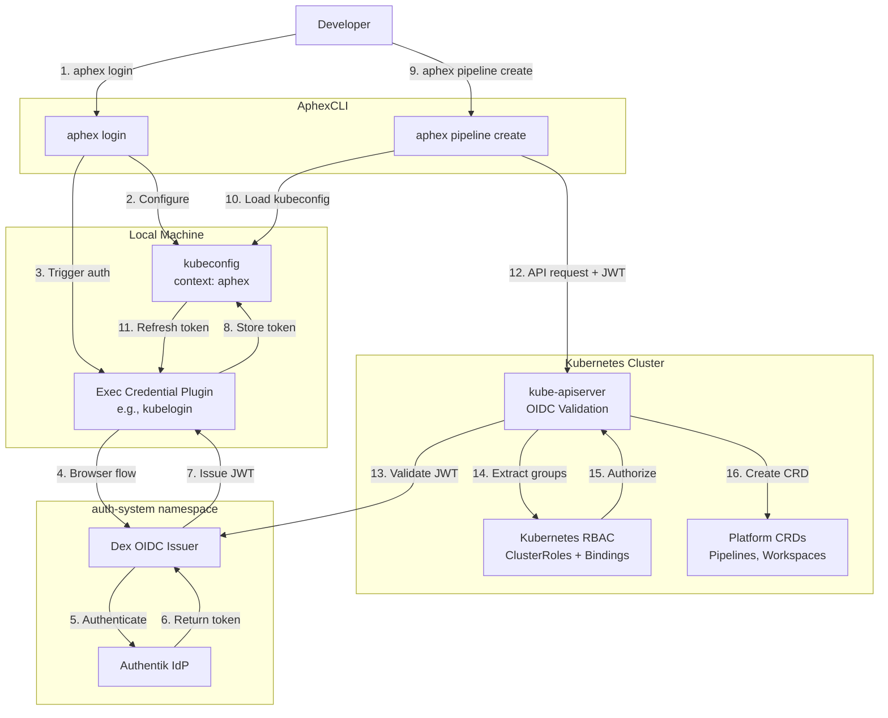
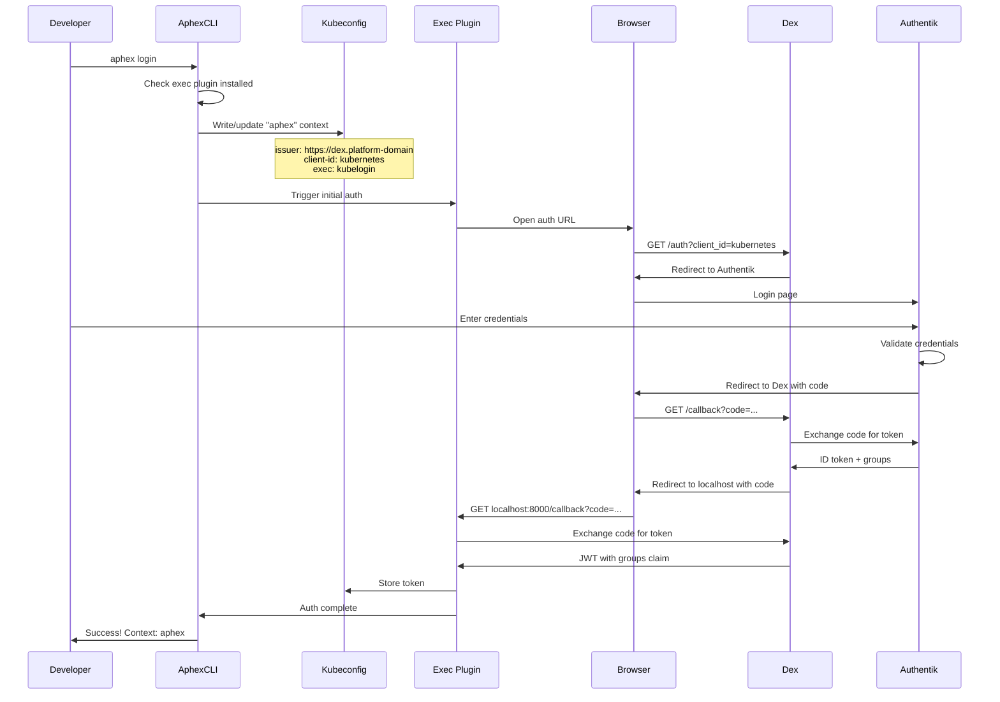
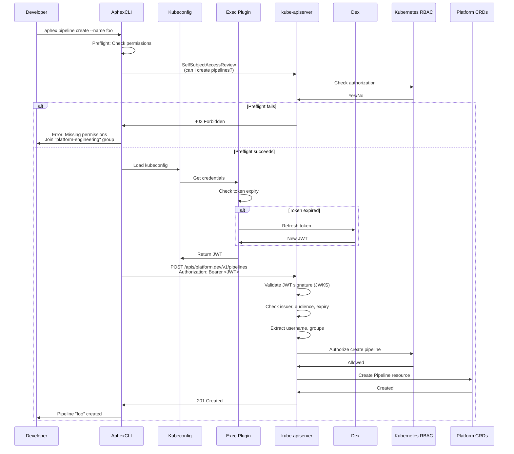
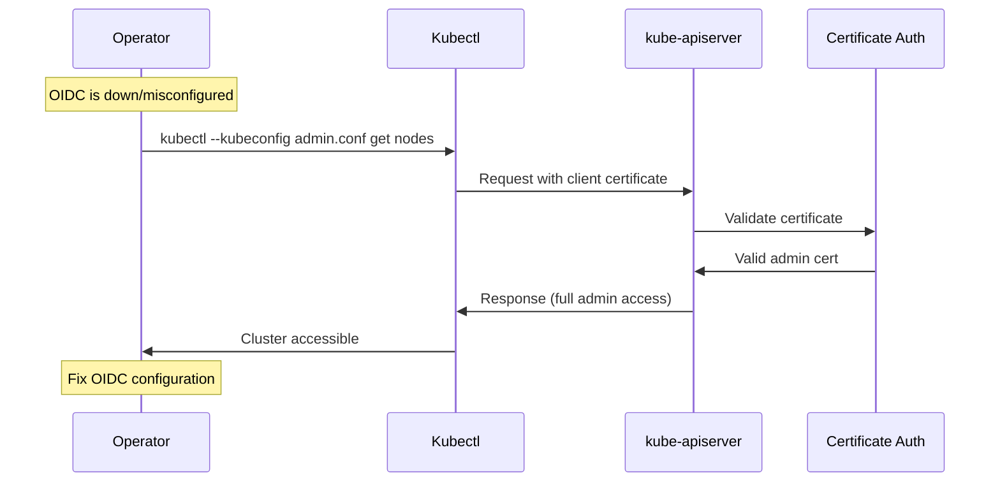

# Design Document: Kubernetes API OIDC Authentication with AphexCLI

## Overview

This design implements OIDC-based authentication for the Kubernetes API server, enabling developers to authenticate using Dex-issued tokens backed by Authentik as the identity provider. The system extends the existing Dex authentication platform to support Kubernetes API access, implementing group-based RBAC to govern access to platform CRDs and supporting resources.

The AphexCLI provides a seamless developer experience by abstracting the permissions model. Developers use `aphex login` to configure local credentials and commands like `aphex pipeline create` to interact with platform resources. The CLI translates authorization failures into actionable guidance without requiring users to understand Kubernetes RBAC internals.

**Key Capabilities:**
- Kubernetes API server trusts Dex-issued OIDC tokens
- Group-based RBAC for platform CRDs (pipelines, workspaces, etc.)
- Seamless local developer authentication via exec credential plugin
- AphexCLI abstracts permissions with preflight checks and friendly errors
- Break-glass admin access for OIDC failure recovery
- Stable OIDC contract (issuer, audience, claims) for all clients

**Architecture Philosophy:**
- Kubernetes API server validates JWT tokens from Dex (signature, issuer, audience, expiration)
- Authentik remains the source of identity and group membership
- Dex remains the single OIDC issuer for platform consumers
- RBAC authorization happens after authentication (groups claim → ClusterRoles)
- AphexCLI uses standard kubeconfig exec plugin mechanism (no custom OIDC client)
- Bootstrap configures kube-apiserver OIDC trust; GitOps manages RBAC manifests
- Break-glass access ensures operators can recover from OIDC misconfigurations

**Design Principles:**
- Minimal changes to existing Dex/Authentik infrastructure
- Leverage standard Kubernetes RBAC (no custom admission controllers)
- AphexCLI is a consumer of kubeconfig, not an OIDC implementation
- Clear ownership boundaries: Bootstrap (apiserver config) vs GitOps (RBAC)
- Fail-safe: OIDC misconfiguration does not lock out cluster admins

## Architecture

### System Components



### Component Responsibilities

**kube-apiserver (OIDC Trust):**
- Validates JWT tokens from Dex (signature via JWKS, issuer, audience, expiration)
- Extracts username from email claim
- Extracts groups from groups claim
- Passes authenticated identity to RBAC authorization layer
- Rejects tokens with invalid issuer, audience, or signature
- Maintains break-glass admin access path (certificate-based auth)

**Dex OIDC Issuer:**
- Issues JWT tokens for Kubernetes client (client_id: "kubernetes")
- Includes groups claim populated from Authentik
- Provides stable external issuer URL (https://dex.platform-domain)
- Exposes OIDC discovery endpoint (/.well-known/openid-configuration)
- Exposes JWKS endpoint for kube-apiserver to validate signatures
- Handles browser-based authentication flow with localhost redirect

**Authentik Identity Provider:**
- Manages users and group memberships
- Authenticates users during Dex login flow
- Provides groups claim to Dex for inclusion in tokens
- Remains unchanged from existing Dex authentication platform

**Kubernetes RBAC:**
- Defines ClusterRoles for platform-admins, platform-operators, platform-engineering
- Binds ClusterRoles to OIDC groups via ClusterRoleBindings
- Enforces namespace scoping (engineers limited to user-*/team-* namespaces)
- Authorizes API requests based on group membership
- Provides capability matrix for AphexCLI preflight checks

**AphexCLI:**
- Configures kubeconfig with exec credential plugin during `aphex login`
- Uses standard kubeconfig loading (client-go) for all commands
- Performs preflight authorization checks (SelfSubjectAccessReview)
- Translates 403 Forbidden errors into actionable guidance
- Guides users to request access via Authentik group membership
- Does NOT implement custom OIDC client (uses exec plugin)

**Exec Credential Plugin (e.g., kubelogin):**
- Handles interactive browser-based OIDC authentication
- Stores and refreshes tokens automatically
- Invoked by kubectl/client-go when credentials are needed
- Configured in kubeconfig with issuer URL and client ID
- Provides seamless token refresh without user intervention


### Data Flow

**Initial Authentication Flow (aphex login):**



**Resource Creation Flow (aphex pipeline create):**



**Break-Glass Access Flow:**



## Components and Interfaces

### kube-apiserver OIDC Configuration

**Configuration Method:**
The kube-apiserver OIDC configuration is cluster-type specific and must be set during cluster provisioning:

**Kind Cluster (Development):**
```yaml
# kind-cluster-config.yaml
kind: Cluster
apiVersion: kind.x-k8s.io/v1alpha4
nodes:
  - role: control-plane
    kubeadmConfigPatches:
      - |
        kind: ClusterConfiguration
        apiServer:
          extraArgs:
            oidc-issuer-url: "https://dex.platform-domain"
            oidc-client-id: "kubernetes"
            oidc-username-claim: "email"
            oidc-groups-claim: "groups"
            # If using self-signed certs, add:
            # oidc-ca-file: "/etc/kubernetes/pki/dex-ca.crt"
```

**Kubeadm Cluster:**
```yaml
# kubeadm-config.yaml
apiVersion: kubeadm.k8s.io/v1beta3
kind: ClusterConfiguration
apiServer:
  extraArgs:
    oidc-issuer-url: "https://dex.platform-domain"
    oidc-client-id: "kubernetes"
    oidc-username-claim: "email"
    oidc-groups-claim: "groups"
    # If using self-signed certs:
    # oidc-ca-file: "/etc/kubernetes/pki/dex-ca.crt"
  extraVolumes:
    # If using self-signed certs, mount CA:
    - name: dex-ca
      hostPath: /etc/kubernetes/pki/dex-ca.crt
      mountPath: /etc/kubernetes/pki/dex-ca.crt
      readOnly: true
```

**Managed Kubernetes (EKS, GKE, AKS):**
Configuration varies by provider. Example for EKS using Terraform/CDKTF:

```typescript
// EKS cluster with OIDC
const cluster = new eks.Cluster(this, 'platform-cluster', {
  // ... other config
  kubernetesNetworkConfig: {
    serviceIpv4Cidr: '10.100.0.0/16',
  },
});

// Add OIDC configuration via aws-auth ConfigMap or IAM OIDC provider
// Note: EKS uses IAM for primary auth; OIDC is secondary
// Consult provider-specific documentation
```

**Critical Configuration Rules:**
1. **Issuer URL MUST be external hostname** (https://dex.platform-domain), not cluster-internal DNS
2. **Client ID MUST match Dex static client** ("kubernetes")
3. **Username claim MUST be "email"** (or "sub" for immutable IDs)
4. **Groups claim MUST be "groups"**
5. **CA file required if Dex uses self-signed certificates**

**Break-Glass Access:**
The kube-apiserver MUST maintain certificate-based authentication for cluster admins:
- Default kubeadm/kind setup includes admin.conf with client certificate
- This certificate-based auth works even if OIDC is misconfigured
- Operators use `kubectl --kubeconfig /etc/kubernetes/admin.conf` for recovery

### Dex Kubernetes Client Configuration

**Dex ConfigMap Update:**
Add a new static client for Kubernetes to the existing Dex configuration:

```yaml
apiVersion: v1
kind: ConfigMap
metadata:
  name: dex-config
  namespace: auth-system
data:
  config.yaml: |
    issuer: https://dex.platform-domain
    storage:
      type: kubernetes
      config:
        inCluster: true
    web:
      http: 0.0.0.0:5556
    staticClients:
      # Existing clients (ArgoCD, Tekton)
      - id: argocd
        name: ArgoCD
        secret: <argocd-secret>
        redirectURIs:
          - https://argocd.platform-domain/auth/callback
      - id: tekton-dashboard
        name: Tekton Dashboard
        secret: <tekton-secret>
        redirectURIs:
          - https://tekton.platform-domain/auth/callback
      
      # NEW: Kubernetes API client
      - id: kubernetes
        name: Kubernetes API
        secret: <kubernetes-secret>
        redirectURIs:
          - http://localhost:8000/callback
          - http://localhost:18000/callback
          - http://127.0.0.1:8000/callback
          - http://127.0.0.1:18000/callback
        public: false
    
    connectors:
      - type: oidc
        id: authentik
        name: Authentik
        config:
          issuer: https://auth.platform-domain/application/o/dex/
          clientID: dex-client
          clientSecret: $AUTHENTIK_CLIENT_SECRET
          redirectURI: https://dex.platform-domain/callback
          scopes:
            - openid
            - profile
            - email
            - groups
          getUserInfo: true
          claimMapping:
            groups: groups
```

**Key Configuration Points:**
- **Client ID:** "kubernetes" (matches kube-apiserver --oidc-client-id)
- **Redirect URIs:** Localhost ports for exec plugin callback (8000, 18000 are common)
- **Public:** false (confidential client with secret)
- **Scopes:** Inherited from connector (openid, profile, email, groups)

**Secret Management:**
```bash
# Generate Kubernetes client secret
KUBERNETES_CLIENT_SECRET=$(openssl rand -base64 32)

# Store in Kubernetes Secret
kubectl create secret generic dex-kubernetes-client \
  -n auth-system \
  --from-literal=client-secret=$KUBERNETES_CLIENT_SECRET

# Reference in Dex deployment
# (Dex already has secret mounting; add new secret to volume)
```

### OIDC Claims Contract

**JWT Token Structure:**
When Dex issues a token for the Kubernetes client, it MUST include these claims:

```json
{
  "iss": "https://dex.platform-domain",
  "sub": "CgVhZG1pbhIEbW9jaw",
  "aud": "kubernetes",
  "exp": 1704153600,
  "iat": 1704067200,
  "email": "admin@platform.local",
  "email_verified": true,
  "name": "Platform Administrator",
  "groups": [
    "platform-admins",
    "platform-engineering"
  ]
}
```

**Claim Definitions:**
- **iss (Issuer):** MUST be "https://dex.platform-domain" (exact match with kube-apiserver config)
- **aud (Audience):** MUST be "kubernetes" (exact match with kube-apiserver --oidc-client-id)
- **sub (Subject):** Unique user identifier from Authentik
- **email:** User's email address (used as Kubernetes username via --oidc-username-claim)
- **groups:** Array of group strings from Authentik (used for RBAC via --oidc-groups-claim)
- **exp (Expiration):** Token expiration timestamp (Unix epoch)
- **iat (Issued At):** Token issuance timestamp (Unix epoch)

**Claim Validation by kube-apiserver:**
1. Fetch JWKS from https://dex.platform-domain/keys
2. Validate JWT signature using public key from JWKS
3. Verify iss claim matches --oidc-issuer-url exactly
4. Verify aud claim contains --oidc-client-id
5. Verify exp claim is in the future (token not expired)
6. Extract username from email claim (--oidc-username-claim)
7. Extract groups from groups claim (--oidc-groups-claim)
8. Pass authenticated identity (username + groups) to RBAC

**Claim Mapping Flow:**
```
Authentik User
  ↓ (groups: ["platform-admins", "engineering"])
Dex Connector
  ↓ (claimMapping.groups: groups)
Dex Token
  ↓ (groups: ["platform-admins", "engineering"])
kube-apiserver
  ↓ (--oidc-groups-claim: groups)
Kubernetes RBAC
  ↓ (ClusterRoleBinding subjects)
Authorization Decision
```


### Platform Groups and RBAC

**Group Definitions:**
The following groups MUST be defined in Authentik and used consistently across the platform:

1. **platform-admins:**
   - Purpose: Full platform administration
   - Permissions: Full CRUD on all platform CRDs, manage namespaces, read logs/events
   - Use case: Platform operators, SREs

2. **platform-operators:**
   - Purpose: Elevated operational access
   - Permissions: Manage team-scoped CRDs, read logs/events, troubleshoot issues
   - Use case: Team leads, senior engineers

3. **platform-engineering:**
   - Purpose: Standard developer access
   - Permissions: Create/read/update allowed CRDs in allowed namespaces
   - Use case: All developers using the platform

**ClusterRole: platform-admin**

```yaml
apiVersion: rbac.authorization.k8s.io/v1
kind: ClusterRole
metadata:
  name: platform-admin
rules:
  # Full access to platform CRDs
  - apiGroups: ["platform.dev"]
    resources: ["*"]
    verbs: ["*"]
  
  # Manage namespaces
  - apiGroups: [""]
    resources: ["namespaces"]
    verbs: ["get", "list", "watch", "create", "update", "patch", "delete"]
  
  # Read logs and events for troubleshooting
  - apiGroups: [""]
    resources: ["pods", "pods/log", "events"]
    verbs: ["get", "list", "watch"]
  
  # Manage ConfigMaps and Secrets in platform namespaces
  - apiGroups: [""]
    resources: ["configmaps", "secrets"]
    verbs: ["get", "list", "watch", "create", "update", "patch", "delete"]
  
  # Read cluster-scoped resources
  - apiGroups: [""]
    resources: ["nodes", "persistentvolumes"]
    verbs: ["get", "list", "watch"]
```

**ClusterRole: platform-operator**

```yaml
apiVersion: rbac.authorization.k8s.io/v1
kind: ClusterRole
metadata:
  name: platform-operator
rules:
  # Manage platform CRDs (full access)
  - apiGroups: ["platform.dev"]
    resources: ["*"]
    verbs: ["get", "list", "watch", "create", "update", "patch", "delete"]
  
  # Read namespaces (cannot create/delete)
  - apiGroups: [""]
    resources: ["namespaces"]
    verbs: ["get", "list", "watch"]
  
  # Read logs and events for troubleshooting
  - apiGroups: [""]
    resources: ["pods", "pods/log", "events"]
    verbs: ["get", "list", "watch"]
  
  # Read ConfigMaps and Secrets in platform namespaces
  - apiGroups: [""]
    resources: ["configmaps", "secrets"]
    verbs: ["get", "list", "watch"]
  
  # Read cluster-scoped resources
  - apiGroups: [""]
    resources: ["nodes", "persistentvolumes"]
    verbs: ["get", "list", "watch"]
```

**ClusterRole: platform-engineer**

```yaml
apiVersion: rbac.authorization.k8s.io/v1
kind: ClusterRole
metadata:
  name: platform-engineer
rules:
  # Create/read/update platform CRDs (no delete)
  - apiGroups: ["platform.dev"]
    resources: ["pipelines", "workspaces", "environments"]
    verbs: ["get", "list", "watch", "create", "update", "patch"]
  
  # Read-only for cluster-scoped resources
  - apiGroups: [""]
    resources: ["namespaces"]
    verbs: ["get", "list", "watch"]
  
  # Read pods and logs in own namespaces
  - apiGroups: [""]
    resources: ["pods", "pods/log"]
    verbs: ["get", "list", "watch"]
```

**Namespace Scoping with RoleBindings:**

Engineers are restricted to user-* and team-* namespaces using RoleBindings (not ClusterRoleBindings):

```yaml
# Example: Engineer access to user-alice namespace
apiVersion: rbac.authorization.k8s.io/v1
kind: RoleBinding
metadata:
  name: platform-engineer-alice
  namespace: user-alice
roleRef:
  apiGroup: rbac.authorization.k8s.io
  kind: ClusterRole
  name: platform-engineer
subjects:
  - kind: User
    name: alice@platform.local
    apiGroup: rbac.authorization.k8s.io
```

**Pattern A: Namespace Scoping (Recommended)**

Engineers can create CRDs only in user-* or team-* namespaces. Platform namespaces (auth-system, tekton-pipelines, argocd) are protected.

Implementation:
1. ClusterRole defines permissions (what verbs on what resources)
2. RoleBindings in user-*/team-* namespaces grant access (where)
3. No ClusterRoleBinding for platform-engineering (prevents cluster-wide access)

**ClusterRoleBindings for Admins and Operators:**

```yaml
---
apiVersion: rbac.authorization.k8s.io/v1
kind: ClusterRoleBinding
metadata:
  name: platform-admins
roleRef:
  apiGroup: rbac.authorization.k8s.io
  kind: ClusterRole
  name: platform-admin
subjects:
  - kind: Group
    name: platform-admins
    apiGroup: rbac.authorization.k8s.io

---
apiVersion: rbac.authorization.k8s.io/v1
kind: ClusterRoleBinding
metadata:
  name: platform-operators
roleRef:
  apiGroup: rbac.authorization.k8s.io
  kind: ClusterRole
  name: platform-operator
subjects:
  - kind: Group
    name: platform-operators
    apiGroup: rbac.authorization.k8s.io
```

**RBAC Validation:**
Operators can validate RBAC using kubectl auth can-i:

```bash
# Check if user can create pipelines
kubectl auth can-i create pipelines.platform.dev --as=alice@platform.local --as-group=platform-engineering

# Check if user can create pipelines in specific namespace
kubectl auth can-i create pipelines.platform.dev --as=alice@platform.local --as-group=platform-engineering -n user-alice

# Check if admin can delete namespaces
kubectl auth can-i delete namespaces --as=admin@platform.local --as-group=platform-admins
```

### AphexCLI Authentication Contract

**aphex login Implementation:**

The `aphex login` command configures local credentials for platform access:

```go
// Pseudocode for aphex login
func Login(ctx context.Context) error {
    // 1. Check if exec plugin is installed
    if !isExecPluginInstalled("kubelogin") {
        return fmt.Errorf("kubelogin not found. Install: brew install int128/kubelogin/kubelogin")
    }
    
    // 2. Load or create kubeconfig
    config, err := clientcmd.LoadFromFile(kubeconfigPath())
    if err != nil {
        config = api.NewConfig()
    }
    
    // 3. Configure "aphex" context
    config.Clusters["aphex"] = &api.Cluster{
        Server: "https://kubernetes.platform-domain:6443",
        CertificateAuthorityData: clusterCA,
    }
    
    config.AuthInfos["aphex"] = &api.AuthInfo{
        Exec: &api.ExecConfig{
            APIVersion: "client.authentication.k8s.io/v1beta1",
            Command:    "kubectl",
            Args: []string{
                "oidc-login",
                "get-token",
                "--oidc-issuer-url=https://dex.platform-domain",
                "--oidc-client-id=kubernetes",
                "--oidc-client-secret=" + clientSecret,
            },
        },
    }
    
    config.Contexts["aphex"] = &api.Context{
        Cluster:  "aphex",
        AuthInfo: "aphex",
    }
    
    config.CurrentContext = "aphex"
    
    // 4. Write kubeconfig
    if err := clientcmd.WriteToFile(*config, kubeconfigPath()); err != nil {
        return err
    }
    
    // 5. Trigger initial auth (force browser flow now)
    clientset, err := kubernetes.NewForConfig(restConfig)
    if err != nil {
        return err
    }
    
    // Make a harmless API call to trigger auth
    _, err = clientset.CoreV1().Namespaces().List(ctx, metav1.ListOptions{Limit: 1})
    if err != nil {
        return fmt.Errorf("authentication failed: %w", err)
    }
    
    // 6. Verify permissions (preflight)
    if err := verifyPermissions(clientset); err != nil {
        fmt.Println("⚠️  Warning: You are authenticated but may lack required permissions")
        fmt.Println(err.Error())
    }
    
    // 7. Print success
    fmt.Println("✓ Logged in to platform cluster")
    fmt.Println("  Context: aphex")
    fmt.Println("  Cluster: https://kubernetes.platform-domain:6443")
    fmt.Println("\nVerify with: kubectl get namespaces")
    
    return nil
}
```

**Kubeconfig Structure:**

After `aphex login`, the kubeconfig contains:

```yaml
apiVersion: v1
kind: Config
clusters:
  - name: aphex
    cluster:
      server: https://kubernetes.platform-domain:6443
      certificate-authority-data: <base64-ca-cert>
users:
  - name: aphex
    user:
      exec:
        apiVersion: client.authentication.k8s.io/v1beta1
        command: kubectl
        args:
          - oidc-login
          - get-token
          - --oidc-issuer-url=https://dex.platform-domain
          - --oidc-client-id=kubernetes
          - --oidc-client-secret=<secret>
contexts:
  - name: aphex
    context:
      cluster: aphex
      user: aphex
current-context: aphex
```

**Exec Plugin Behavior:**
1. kubectl/client-go invokes exec plugin when credentials are needed
2. Plugin checks if cached token is valid (not expired)
3. If valid, return cached token
4. If expired or missing, trigger browser-based OIDC flow
5. User authenticates via Dex → Authentik
6. Plugin receives token and caches it
7. Plugin returns token to kubectl/client-go in ExecCredential format

### AphexCLI Permissions Abstraction

**Preflight Authorization Checks:**

Before executing commands, AphexCLI performs preflight checks using SelfSubjectAccessReview:

```go
// Pseudocode for preflight check
func CheckPermissions(ctx context.Context, clientset *kubernetes.Clientset, resource, verb, namespace string) error {
    ssar := &authorizationv1.SelfSubjectAccessReview{
        Spec: authorizationv1.SelfSubjectAccessReviewSpec{
            ResourceAttributes: &authorizationv1.ResourceAttributes{
                Namespace: namespace,
                Verb:      verb,
                Group:     "platform.dev",
                Resource:  resource,
            },
        },
    }
    
    result, err := clientset.AuthorizationV1().SelfSubjectAccessReviews().Create(ctx, ssar, metav1.CreateOptions{})
    if err != nil {
        return fmt.Errorf("failed to check permissions: %w", err)
    }
    
    if !result.Status.Allowed {
        return &PermissionError{
            Resource:  resource,
            Verb:      verb,
            Namespace: namespace,
            Reason:    result.Status.Reason,
        }
    }
    
    return nil
}
```

**Friendly Error Messages:**

When authorization fails, AphexCLI translates RBAC errors into actionable guidance:

```go
// Pseudocode for error translation
func TranslateAuthError(err error) string {
    var permErr *PermissionError
    if !errors.As(err, &permErr) {
        return err.Error()
    }
    
    // Map resource + verb to required group
    requiredGroup := inferRequiredGroup(permErr.Resource, permErr.Verb)
    
    return fmt.Sprintf(`
❌ Permission Denied

You don't have permission to %s %s in namespace %s.

Required Access:
  • Join the "%s" group in Authentik
  • Contact your platform administrator to request access

Current Groups: %s

Learn more: https://docs.platform.local/access-control
`, permErr.Verb, permErr.Resource, permErr.Namespace, requiredGroup, getCurrentGroups())
}

func inferRequiredGroup(resource, verb string) string {
    // Simple heuristic based on capability matrix
    if verb == "create" && resource == "pipelines" {
        return "platform-engineering"
    }
    if verb == "delete" && resource == "namespaces" {
        return "platform-admins"
    }
    // ... more mappings
    return "platform-engineering" // default
}
```

**Example Error Output:**

```
$ aphex pipeline create --name foo

❌ Permission Denied

You don't have permission to create pipelines in namespace user-alice.

Required Access:
  • Join the "platform-engineering" group in Authentik
  • Contact your platform administrator to request access

Current Groups: []

Learn more: https://docs.platform.local/access-control
```

**Capability Matrix:**

The capability matrix documents the mapping between AphexCLI commands and required RBAC permissions:

| Command | Resource | Verb | Namespace | Required Group |
|---------|----------|------|-----------|----------------|
| `aphex pipeline create` | pipelines.platform.dev | create | user-*, team-* | platform-engineering |
| `aphex pipeline list` | pipelines.platform.dev | list | user-*, team-* | platform-engineering |
| `aphex pipeline get` | pipelines.platform.dev | get | user-*, team-* | platform-engineering |
| `aphex pipeline delete` | pipelines.platform.dev | delete | user-*, team-* | platform-operators |
| `aphex workspace create` | workspaces.platform.dev | create | user-*, team-* | platform-engineering |
| `aphex namespace create` | namespaces | create | * | platform-admins |

This matrix is used by AphexCLI for:
1. Preflight checks (SelfSubjectAccessReview)
2. Error message generation (inferRequiredGroup)
3. Documentation generation


### TLS and Certificate Management

**Dex External Access Requirements:**

For OIDC to work correctly, Dex MUST be accessible via HTTPS with valid TLS:

1. **Browser-reachable hostname:** https://dex.platform-domain (not *.svc.cluster.local)
2. **Valid TLS certificate:** Trusted by browsers and kube-apiserver
3. **Ingress configuration:** Exposes Dex service to external network

**TLS Certificate Options:**

**Option 1: Self-Signed Certificates (Development)**

```yaml
# Create self-signed certificate
apiVersion: cert-manager.io/v1
kind: Certificate
metadata:
  name: dex-tls
  namespace: auth-system
spec:
  secretName: dex-tls
  issuerRef:
    name: selfsigned-issuer
    kind: ClusterIssuer
  dnsNames:
    - dex.platform-domain
```

**kube-apiserver configuration with self-signed CA:**

```yaml
# Mount CA certificate in apiserver
apiServer:
  extraArgs:
    oidc-issuer-url: "https://dex.platform-domain"
    oidc-client-id: "kubernetes"
    oidc-username-claim: "email"
    oidc-groups-claim: "groups"
    oidc-ca-file: "/etc/kubernetes/pki/dex-ca.crt"
  extraVolumes:
    - name: dex-ca
      hostPath: /etc/kubernetes/pki/dex-ca.crt
      mountPath: /etc/kubernetes/pki/dex-ca.crt
      readOnly: true
```

**Option 2: Let's Encrypt with DNS-01 Challenge (Production)**

```yaml
# Let's Encrypt certificate
apiVersion: cert-manager.io/v1
kind: Certificate
metadata:
  name: dex-tls
  namespace: auth-system
spec:
  secretName: dex-tls
  issuerRef:
    name: letsencrypt-prod
    kind: ClusterIssuer
  dnsNames:
    - dex.platform-domain
```

**kube-apiserver configuration with Let's Encrypt:**

```yaml
# No CA file needed (Let's Encrypt is trusted by default)
apiServer:
  extraArgs:
    oidc-issuer-url: "https://dex.platform-domain"
    oidc-client-id: "kubernetes"
    oidc-username-claim: "email"
    oidc-groups-claim: "groups"
```

**Certificate Renewal:**
- cert-manager automatically renews certificates before expiration
- Dex pods automatically reload certificates when Secret is updated
- No manual intervention required

**Troubleshooting TLS Issues:**

```bash
# Verify Dex is accessible
curl -v https://dex.platform-domain/.well-known/openid-configuration

# Check certificate validity
openssl s_client -connect dex.platform-domain:443 -showcerts

# Test from kube-apiserver network
kubectl run -it --rm debug --image=curlimages/curl --restart=Never -- \
  curl -v https://dex.platform-domain/.well-known/openid-configuration
```

### Bootstrap and GitOps Ownership

**Ownership Boundaries:**

**Bootstrap Responsibilities:**
1. Configure kube-apiserver OIDC trust (cluster provisioning)
2. Ensure break-glass admin access path exists
3. Generate and create Dex Kubernetes client secret
4. Document OIDC configuration for operators

**GitOps (ArgoCD) Responsibilities:**
1. Deploy and manage Dex configuration (including Kubernetes client)
2. Deploy and manage RBAC manifests (ClusterRoles, ClusterRoleBindings, RoleBindings)
3. Deploy and manage Ingress resources for Dex
4. Sync configuration changes from Git to cluster

**Bootstrap Implementation:**

```bash
#!/bin/bash
# platform/bootstrap/bootstrap.sh

set -e

echo "=== Kubernetes API OIDC Auth Bootstrap ==="

# 1. Configure kube-apiserver OIDC trust
echo "Configuring kube-apiserver OIDC trust..."
if [ "$CLUSTER_TYPE" = "kind" ]; then
    # Kind cluster with OIDC config
    kind create cluster --config platform/bootstrap/kind-cluster-config.yaml
elif [ "$CLUSTER_TYPE" = "kubeadm" ]; then
    # Kubeadm cluster with OIDC config
    kubeadm init --config platform/bootstrap/kubeadm-config.yaml
else
    echo "Unsupported cluster type: $CLUSTER_TYPE"
    exit 1
fi

# 2. Verify break-glass access
echo "Verifying break-glass admin access..."
kubectl --kubeconfig /etc/kubernetes/admin.conf get nodes

# 3. Generate Dex Kubernetes client secret
echo "Generating Dex Kubernetes client secret..."
KUBERNETES_CLIENT_SECRET=$(openssl rand -base64 32)

# 4. Create secret in auth-system namespace
kubectl create namespace auth-system --dry-run=client -o yaml | kubectl apply -f -
kubectl create secret generic dex-kubernetes-client \
  -n auth-system \
  --from-literal=client-secret=$KUBERNETES_CLIENT_SECRET \
  --dry-run=client -o yaml | kubectl apply -f -

echo "✓ Kubernetes API OIDC auth bootstrap complete"
echo ""
echo "Next steps:"
echo "  1. ArgoCD will deploy Dex with Kubernetes client configuration"
echo "  2. ArgoCD will deploy RBAC manifests for platform groups"
echo "  3. Developers can run 'aphex login' to authenticate"
echo ""
echo "Verify OIDC configuration:"
echo "  kubectl get --raw /.well-known/openid-configuration"
```

**GitOps Workflow:**

1. **Dex Configuration Update:**
   - Developer commits change to `platform/auth/dex/configmap.yaml`
   - ArgoCD detects drift in platform-auth Application
   - ArgoCD syncs updated ConfigMap to cluster
   - Dex pod restarts with new configuration

2. **RBAC Update:**
   - Developer commits change to `platform/rbac/platform-engineer-role.yaml`
   - ArgoCD detects drift in platform-rbac Application
   - ArgoCD syncs updated ClusterRole to cluster
   - New permissions take effect immediately (no pod restart)

**Avoiding Circular Dependencies:**

The bootstrap process is designed to avoid circular dependencies:

1. **Bootstrap does NOT require OIDC to be functional**
   - Uses certificate-based auth (admin.conf) for all kubectl commands
   - Configures kube-apiserver OIDC settings but doesn't rely on them

2. **OIDC becomes available after Dex is deployed**
   - Bootstrap completes successfully even if Dex is not yet running
   - ArgoCD deploys Dex after bootstrap
   - Developers can use OIDC once Dex is healthy

3. **Break-glass access is always available**
   - Certificate-based auth works even if OIDC is misconfigured
   - Operators can fix OIDC issues using admin.conf

**Sequencing:**

```
Bootstrap
  ↓
Configure kube-apiserver OIDC (trust Dex, but Dex not required yet)
  ↓
Install ArgoCD (using certificate auth)
  ↓
Create root Application (using certificate auth)
  ↓
ArgoCD syncs platform-auth Application
  ↓
Dex deployed with Kubernetes client
  ↓
OIDC authentication available
  ↓
Developers run 'aphex login'
```

### Validation and Testing

**OIDC Discovery Validation:**

```bash
# 1. Verify Dex OIDC discovery endpoint
curl https://dex.platform-domain/.well-known/openid-configuration | jq

# Expected output:
# {
#   "issuer": "https://dex.platform-domain",
#   "authorization_endpoint": "https://dex.platform-domain/auth",
#   "token_endpoint": "https://dex.platform-domain/token",
#   "jwks_uri": "https://dex.platform-domain/keys",
#   ...
# }

# 2. Verify kube-apiserver can reach Dex
kubectl run -it --rm debug --image=curlimages/curl --restart=Never -- \
  curl -v https://dex.platform-domain/.well-known/openid-configuration

# 3. Verify JWKS endpoint
curl https://dex.platform-domain/keys | jq
```

**Authentication Validation:**

```bash
# 1. Test aphex login
aphex login

# Expected: Browser opens, authenticate via Dex → Authentik, success message

# 2. Verify kubeconfig is configured
kubectl config get-contexts
# Should show "aphex" context

# 3. Test kubectl with OIDC
kubectl get namespaces
# Should succeed if user has permissions

# 4. Inspect token claims (decode JWT)
kubectl config view --raw -o jsonpath='{.users[?(@.name=="aphex")].user.exec}' | \
  jq -r '.args | join(" ")' | \
  sh | \
  jq -R 'split(".") | .[1] | @base64d | fromjson'

# Expected output:
# {
#   "iss": "https://dex.platform-domain",
#   "aud": "kubernetes",
#   "email": "alice@platform.local",
#   "groups": ["platform-engineering"]
# }
```

**Authorization Validation:**

```bash
# 1. Test platform-admins permissions
kubectl auth can-i '*' '*' --as=admin@platform.local --as-group=platform-admins
# Expected: yes

# 2. Test platform-engineering permissions
kubectl auth can-i create pipelines.platform.dev --as=alice@platform.local --as-group=platform-engineering -n user-alice
# Expected: yes

kubectl auth can-i create pipelines.platform.dev --as=alice@platform.local --as-group=platform-engineering -n auth-system
# Expected: no (namespace scoping)

# 3. Test platform-operators permissions
kubectl auth can-i delete namespaces --as=operator@platform.local --as-group=platform-operators
# Expected: no (operators cannot delete namespaces)

kubectl auth can-i get pods --as=operator@platform.local --as-group=platform-operators -n tekton-pipelines
# Expected: yes (operators can read pods)
```

**Break-Glass Access Validation:**

```bash
# 1. Simulate Dex failure
kubectl scale deployment/dex --replicas=0 -n auth-system

# 2. Verify OIDC authentication fails
aphex login
# Expected: Error (cannot reach Dex)

# 3. Verify break-glass access works
kubectl --kubeconfig /etc/kubernetes/admin.conf get nodes
# Expected: Success (certificate auth works)

# 4. Restore Dex
kubectl scale deployment/dex --replicas=1 -n auth-system

# 5. Verify OIDC authentication works again
aphex login
# Expected: Success
```

**Group Claim Validation:**

```bash
# 1. Create test user in Authentik with specific groups
# (via Authentik UI or API)

# 2. Authenticate as test user
aphex login

# 3. Verify groups in token
kubectl config view --raw -o jsonpath='{.users[?(@.name=="aphex")].user.exec}' | \
  jq -r '.args | join(" ")' | \
  sh | \
  jq -R 'split(".") | .[1] | @base64d | fromjson | .groups'

# Expected: ["platform-engineering"] (or assigned groups)

# 4. Verify RBAC uses groups
kubectl auth can-i create pipelines.platform.dev -n user-test
# Expected: yes (if user is in platform-engineering)
```

## Data Models

### JWT Token Structure

**ExecCredential Response:**

The exec plugin returns credentials in ExecCredential format:

```json
{
  "apiVersion": "client.authentication.k8s.io/v1beta1",
  "kind": "ExecCredential",
  "status": {
    "token": "eyJhbGciOiJSUzI1NiIsImtpZCI6IjEyMyJ9...",
    "expirationTimestamp": "2024-01-15T12:00:00Z"
  }
}
```

**Decoded JWT Token:**

```json
{
  "header": {
    "alg": "RS256",
    "kid": "123"
  },
  "payload": {
    "iss": "https://dex.platform-domain",
    "sub": "CgVhbGljZRIEbW9jaw",
    "aud": "kubernetes",
    "exp": 1704153600,
    "iat": 1704067200,
    "email": "alice@platform.local",
    "email_verified": true,
    "name": "Alice Developer",
    "groups": [
      "platform-engineering"
    ]
  },
  "signature": "..."
}
```

### RBAC Subject Structure

**ClusterRoleBinding Subject:**

```yaml
subjects:
  - kind: Group
    name: platform-admins
    apiGroup: rbac.authorization.k8s.io
```

**How it works:**
1. User authenticates via Dex → Authentik
2. Token includes `groups: ["platform-admins"]`
3. kube-apiserver extracts groups from token
4. RBAC matches group "platform-admins" to ClusterRoleBinding subject
5. User receives permissions from ClusterRole "platform-admin"

### Capability Matrix Schema

**Capability Entry:**

```yaml
command: "aphex pipeline create"
resource:
  apiGroup: "platform.dev"
  resource: "pipelines"
  verb: "create"
namespaces:
  - "user-*"
  - "team-*"
requiredGroup: "platform-engineering"
description: "Create a new pipeline in user or team namespace"
```

**Usage in AphexCLI:**

```go
type Capability struct {
    Command       string
    Resource      ResourceRef
    Namespaces    []string
    RequiredGroup string
    Description   string
}

type ResourceRef struct {
    APIGroup string
    Resource string
    Verb     string
}

var CapabilityMatrix = []Capability{
    {
        Command: "aphex pipeline create",
        Resource: ResourceRef{
            APIGroup: "platform.dev",
            Resource: "pipelines",
            Verb:     "create",
        },
        Namespaces:    []string{"user-*", "team-*"},
        RequiredGroup: "platform-engineering",
        Description:   "Create a new pipeline in user or team namespace",
    },
    // ... more capabilities
}
```


## Correctness Properties

*A property is a characteristic or behavior that should hold true across all valid executions of a system—essentially, a formal statement about what the system should do. Properties serve as the bridge between human-readable specifications and machine-verifiable correctness guarantees.*

### Property 1: Token Claims Completeness

*For any* JWT token issued by Dex for the Kubernetes client, the token SHALL include all required claims: iss (matching Dex issuer URL), aud (containing "kubernetes"), email, groups, sub, exp, and iat.

**Validates: Requirements 3.1, 3.2, 3.3, 3.4, 3.5**

### Property 2: Group Claim Propagation

*For any* user with group memberships in Authentik, when that user authenticates via Dex, the issued token SHALL include a groups claim containing all of the user's Authentik group names exactly as defined in Authentik.

**Validates: Requirements 2.4, 2.5, 4.4, 24.2, 24.3**

### Property 3: RBAC Group Authorization

*For any* authenticated user with groups in their token, when the user makes an API request, the kube-apiserver SHALL apply the ClusterRole permissions corresponding to those groups via ClusterRoleBindings.

**Validates: Requirements 8.4, 8.5**

### Property 4: Namespace Scoping for Engineers

*For any* user in the platform-engineering group, the user SHALL be able to create platform CRDs in namespaces matching user-* or team-* patterns, and SHALL be denied when attempting to create CRDs in platform system namespaces (auth-system, tekton-pipelines, argocd).

**Validates: Requirements 9.2, 9.3, 22.3, 22.4**

### Property 5: Admin Full Access

*For any* user in the platform-admins group, the user SHALL have full CRUD access to all platform CRDs in all namespaces.

**Validates: Requirements 22.1**

### Property 6: Break-Glass Access Independence

*For any* cluster state where Dex is unavailable or OIDC is misconfigured, operators SHALL be able to access the cluster using certificate-based authentication (admin.conf) without requiring OIDC to be functional.

**Validates: Requirements 10.2, 10.5, 25.1, 25.2**

### Property 7: AphexCLI Kubeconfig Configuration

*For any* successful execution of `aphex login`, the kubeconfig SHALL contain a context named "aphex" configured with an exec credential plugin pointing to the Dex issuer URL and client ID "kubernetes".

**Validates: Requirements 11.2, 11.3, 11.4, 15.1, 15.2**

### Property 8: AphexCLI Preflight Authorization

*For any* AphexCLI command that creates or modifies resources, the CLI SHALL perform a SelfSubjectAccessReview preflight check before attempting the operation, and SHALL provide a friendly error message with actionable guidance if authorization fails.

**Validates: Requirements 12.1, 12.2, 12.3, 12.4, 13.4, 13.5**

### Property 9: Token Issuer Validation

*For any* JWT token presented to the kube-apiserver, the apiserver SHALL accept the token only if the iss claim exactly matches the configured --oidc-issuer-url, and SHALL reject tokens from any other issuer.

**Validates: Requirements 21.1, 21.2**

### Property 10: Token Audience Validation

*For any* JWT token presented to the kube-apiserver, the apiserver SHALL accept the token only if the aud claim contains the configured --oidc-client-id ("kubernetes"), and SHALL reject tokens with incorrect or missing audience values.

**Validates: Requirements 21.3**

### Property 11: Username and Groups Extraction

*For any* valid JWT token accepted by the kube-apiserver, the apiserver SHALL extract the username from the email claim and the groups from the groups claim, and SHALL pass this authenticated identity to the RBAC authorization layer.

**Validates: Requirements 21.4**

### Property 12: OIDC Discovery Reachability

*For any* running Dex instance, the kube-apiserver SHALL be able to successfully fetch the OIDC discovery endpoint (/.well-known/openid-configuration) and the JWKS endpoint (/keys) for token validation.

**Validates: Requirements 23.1, 23.2**

### Property 13: Dex External Accessibility

*For any* Dex deployment, the Dex issuer URL SHALL be accessible via HTTPS from developer machines with valid TLS certificates, enabling browser-based authentication flows.

**Validates: Requirements 16.1, 16.4, 19.1, 19.2**

### Property 14: Bootstrap OIDC Independence

*For any* bootstrap execution, the bootstrap process SHALL complete successfully even if Dex is not yet deployed or OIDC is not functional, using certificate-based authentication for all kubectl commands.

**Validates: Requirements 18.1**

### Property 15: OIDC Availability After Dex Deployment

*For any* Dex deployment that becomes healthy (health check returns 200) with valid TLS and correct configuration, OIDC authentication SHALL become available and developers SHALL be able to successfully authenticate using `aphex login`.

**Validates: Requirements 18.5**

### Property 16: AphexCLI Token Refresh

*For any* AphexCLI command execution with an expired token in kubeconfig, the exec credential plugin SHALL automatically refresh the token by re-authenticating with Dex, and the command SHALL succeed without manual intervention.

**Validates: Requirements 13.2**

### Property 17: AphexCLI Resource Creation

*For any* successful execution of `aphex pipeline create` with valid credentials and permissions, a Pipeline CRD instance SHALL be created in the specified namespace.

**Validates: Requirements 13.3**

### Property 18: Operator Elevated Access

*For any* user in the platform-operators group, the user SHALL have read access to pods, logs, and events in all namespaces, and SHALL have full CRUD access to platform CRDs.

**Validates: Requirements 22.2**

### Property 19: OIDC Restoration Without Restart

*For any* cluster state where OIDC was previously unavailable and then Dex becomes healthy again, the kube-apiserver SHALL immediately resume accepting valid OIDC tokens without requiring an apiserver restart.

**Validates: Requirements 25.5**

### Property 20: Single Context Per Cluster

*For any* execution of `aphex login` targeting the same cluster, the CLI SHALL create or update exactly one kubeconfig context named "aphex", and SHALL NOT create multiple contexts with different names for the same cluster.

**Validates: Requirements 15.5**

## Error Handling

### OIDC Authentication Errors

**Token Validation Failures:**
- **Symptom:** API requests fail with "Unauthorized" or "Unable to authenticate the request"
- **Causes:**
  - Token expired (exp claim in the past)
  - Invalid signature (JWKS mismatch)
  - Wrong issuer (iss claim doesn't match --oidc-issuer-url)
  - Wrong audience (aud claim doesn't contain --oidc-client-id)
- **Handling:**
  - Exec plugin automatically refreshes expired tokens
  - kube-apiserver logs detailed validation errors
  - AphexCLI detects auth failures and suggests re-running `aphex login`
- **Recovery:**
  ```bash
  # Re-authenticate to get fresh token
  aphex login
  
  # Verify token claims
  kubectl config view --raw -o jsonpath='{.users[?(@.name=="aphex")].user.exec}' | \
    jq -r '.args | join(" ")' | sh | \
    jq -R 'split(".") | .[1] | @base64d | fromjson'
  ```

**Dex Unreachable:**
- **Symptom:** `aphex login` fails with "cannot reach issuer" or "connection refused"
- **Causes:**
  - Dex pod not running
  - Ingress misconfigured
  - TLS certificate invalid
  - DNS resolution failure
- **Handling:**
  - AphexCLI provides clear error: "Cannot reach Dex at https://dex.platform-domain"
  - Suggests checking Dex pod status and Ingress configuration
- **Recovery:**
  ```bash
  # Check Dex pod status
  kubectl get pods -n auth-system -l app=dex
  
  # Check Dex logs
  kubectl logs -n auth-system -l app=dex
  
  # Verify Dex is accessible
  curl -v https://dex.platform-domain/.well-known/openid-configuration
  
  # Check Ingress
  kubectl get ingress -n auth-system dex
  ```

**Groups Claim Missing:**
- **Symptom:** User can authenticate but has no permissions
- **Causes:**
  - User not assigned to any groups in Authentik
  - Dex connector not configured to request groups scope
  - Authentik not including groups in token
- **Handling:**
  - AphexCLI detects empty groups and provides guidance
  - Suggests checking Authentik group membership
- **Recovery:**
  ```bash
  # Verify user groups in Authentik UI
  # Add user to appropriate group (platform-engineering, etc.)
  
  # Re-authenticate to get updated token
  aphex login
  
  # Verify groups in token
  kubectl config view --raw -o jsonpath='{.users[?(@.name=="aphex")].user.exec}' | \
    jq -r '.args | join(" ")' | sh | \
    jq -R 'split(".") | .[1] | @base64d | fromjson | .groups'
  ```

### RBAC Authorization Errors

**Permission Denied:**
- **Symptom:** API requests fail with "Forbidden" or "User cannot create resource"
- **Causes:**
  - User not in required group
  - ClusterRoleBinding missing or misconfigured
  - Namespace scoping prevents access
- **Handling:**
  - AphexCLI translates 403 errors into friendly messages
  - Suggests joining required group
  - Provides link to access control documentation
- **Recovery:**
  ```bash
  # Check current permissions
  kubectl auth can-i create pipelines.platform.dev -n user-alice
  
  # Check which groups are required
  kubectl get clusterrolebinding platform-engineering -o yaml
  
  # Add user to required group in Authentik
  # Re-authenticate
  aphex login
  ```

**Namespace Access Denied:**
- **Symptom:** Engineer can create resources in user-alice but not in auth-system
- **Causes:**
  - Namespace scoping policy restricts engineers to user-*/team-* namespaces
  - No RoleBinding exists for the target namespace
- **Handling:**
  - AphexCLI detects namespace restriction and explains the policy
  - Suggests using allowed namespaces or requesting elevated access
- **Recovery:**
  ```bash
  # List allowed namespaces
  kubectl get namespaces -l type=user
  
  # Create resource in allowed namespace
  aphex pipeline create --name foo -n user-alice
  
  # For platform namespace access, request platform-operators or platform-admins group
  ```

### Break-Glass Access Errors

**OIDC Completely Broken:**
- **Symptom:** All OIDC authentication fails, developers cannot access cluster
- **Causes:**
  - Dex pod crashed and won't restart
  - Authentik database corrupted
  - Certificate expired
- **Handling:**
  - Operators use break-glass access (admin.conf)
  - Fix OIDC infrastructure using certificate auth
  - Developers wait for OIDC to be restored
- **Recovery:**
  ```bash
  # Operator: Use break-glass access
  kubectl --kubeconfig /etc/kubernetes/admin.conf get pods -n auth-system
  
  # Fix Dex/Authentik issues
  kubectl --kubeconfig /etc/kubernetes/admin.conf logs -n auth-system -l app=dex
  
  # Restart Dex if needed
  kubectl --kubeconfig /etc/kubernetes/admin.conf rollout restart deployment/dex -n auth-system
  
  # Verify OIDC works
  curl https://dex.platform-domain/.well-known/openid-configuration
  
  # Developers: Re-authenticate
  aphex login
  ```

### TLS Certificate Errors

**Certificate Expired:**
- **Symptom:** Browser shows "Certificate expired" or curl fails with SSL error
- **Causes:**
  - cert-manager failed to renew certificate
  - Certificate manually created and not renewed
- **Handling:**
  - cert-manager automatically renews certificates 30 days before expiration
  - If renewal fails, cert-manager logs errors
- **Recovery:**
  ```bash
  # Check certificate status
  kubectl get certificate -n auth-system dex-tls
  
  # Check cert-manager logs
  kubectl logs -n cert-manager -l app=cert-manager
  
  # Force certificate renewal
  kubectl delete certificate -n auth-system dex-tls
  # cert-manager will recreate it
  
  # Verify new certificate
  openssl s_client -connect dex.platform-domain:443 -showcerts | openssl x509 -noout -dates
  ```

**Self-Signed Certificate Not Trusted:**
- **Symptom:** kube-apiserver logs "x509: certificate signed by unknown authority"
- **Causes:**
  - --oidc-ca-file not configured
  - CA certificate file missing or incorrect
- **Handling:**
  - kube-apiserver rejects all OIDC tokens
  - Operators must reconfigure apiserver with correct CA
- **Recovery:**
  ```bash
  # Extract Dex CA certificate
  kubectl get secret -n auth-system dex-tls -o jsonpath='{.data.ca\.crt}' | base64 -d > dex-ca.crt
  
  # Copy to apiserver host
  scp dex-ca.crt control-plane:/etc/kubernetes/pki/dex-ca.crt
  
  # Update apiserver configuration with --oidc-ca-file
  # (Requires cluster restart for Kind/kubeadm)
  
  # Verify apiserver can validate tokens
  kubectl logs -n kube-system kube-apiserver-* | grep oidc
  ```

## Testing Strategy

**Dual Testing Approach:**

This feature requires both unit tests and property-based tests to ensure comprehensive coverage:

- **Unit tests:** Verify specific examples, edge cases, and error conditions
- **Property tests:** Verify universal properties across all inputs
- Both are complementary and necessary for comprehensive coverage

**Unit Testing:**

Unit tests focus on specific scenarios and edge cases:

1. **Configuration Validation:**
   - Verify kube-apiserver OIDC flags are set correctly
   - Verify Dex ConfigMap contains Kubernetes client
   - Verify ClusterRoles have correct permissions
   - Verify ClusterRoleBindings map groups correctly

2. **AphexCLI Behavior:**
   - Test `aphex login` creates kubeconfig context
   - Test preflight checks detect missing permissions
   - Test error messages are friendly and actionable
   - Test capability matrix lookups

3. **Error Handling:**
   - Test behavior when Dex is unreachable
   - Test behavior when token is expired
   - Test behavior when groups claim is missing
   - Test break-glass access when OIDC fails

**Property-Based Testing:**

Property tests verify universal correctness properties across many generated inputs:

1. **Token Claims Properties:**
   - Property 1: Token claims completeness
   - Property 2: Group claim propagation
   - Property 9: Token issuer validation
   - Property 10: Token audience validation
   - Property 11: Username and groups extraction

2. **RBAC Properties:**
   - Property 3: RBAC group authorization
   - Property 4: Namespace scoping for engineers
   - Property 5: Admin full access
   - Property 18: Operator elevated access

3. **AphexCLI Properties:**
   - Property 7: Kubeconfig configuration
   - Property 8: Preflight authorization
   - Property 16: Token refresh
   - Property 17: Resource creation
   - Property 20: Single context per cluster

4. **System Resilience Properties:**
   - Property 6: Break-glass access independence
   - Property 14: Bootstrap OIDC independence
   - Property 15: OIDC availability after Dex deployment
   - Property 19: OIDC restoration without restart

**Property Test Configuration:**

- Minimum 100 iterations per property test
- Each property test references its design document property
- Tag format: **Feature: kubernetes-api-oidc-auth, Property {number}: {property_text}**

**Testing Tools:**

- **Property-based testing library:** Choose based on implementation language
  - Go: [gopter](https://github.com/leanovate/gopter) or [rapid](https://github.com/flyingmutant/rapid)
  - Python: [Hypothesis](https://hypothesis.readthedocs.io/)
  - TypeScript: [fast-check](https://github.com/dubzzz/fast-check)
- **Kubernetes testing:** [client-go](https://github.com/kubernetes/client-go) with fake clientsets
- **OIDC testing:** Mock Dex/Authentik responses for unit tests

**Integration Testing:**

End-to-end integration tests verify the complete authentication flow:

1. **Full Authentication Flow:**
   - Start with clean cluster
   - Run `aphex login`
   - Verify browser opens and authentication succeeds
   - Verify kubeconfig contains valid token
   - Verify kubectl commands work

2. **RBAC Enforcement:**
   - Authenticate as different users (admin, operator, engineer)
   - Verify each user has correct permissions
   - Verify namespace scoping works correctly

3. **Break-Glass Recovery:**
   - Stop Dex pod
   - Verify OIDC authentication fails
   - Verify certificate auth still works
   - Restart Dex
   - Verify OIDC authentication works again

**Test Environment:**

- Use Kind cluster for local testing
- Use ephemeral namespaces for isolation
- Clean up resources after each test
- Mock external dependencies (Authentik) where possible
